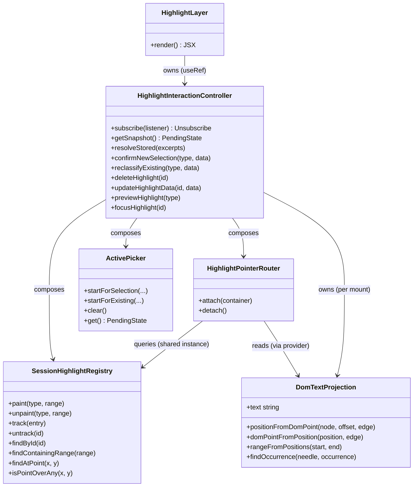

# Template Excerpt Highlighting — Spec

Status: covers the DOM-based capture/resolution model and the client-side
interaction layer (creation, click/activate, delete). Not yet integrated
into Eivo.

## Problem

Given a template's raw MDX (`def.content[].body`), let a user select text
in the rendered output and classify it (plain highlight, note, discuss
with EiBot), see that highlight appear instantly, and have it persist and
re-render correctly on the next visit — without mutating the template
itself.

## Architecture: one representation

Everything operates against the **rendered DOM** — the representation the
user actually selects from. The server renders the template plainly
(`renderTemplate` in `lib/render-template.ts`: `evaluate()` +
`remark-gfm`, nothing else); stored excerpts arrive as data alongside the
body and are resolved **client-side**, by the same machinery that paints
newly created highlights.

The design's core invariant:

> **One projection function, two call sites.** Capture slices the excerpt
> out of a projection of the DOM; resolution searches for it in a
> projection of the same DOM built by the same function. A match is
> byte-identical by construction — cross-type spans (heading→paragraph,
> table cells, prose→code) resolve through the same mechanism as any
> other span.

Every highlight, stored or just created, is a live `Range` painted via
the CSS Custom Highlight API and tracked in the registry. There is one
kind of highlight and one code path for activate, delete, update, and
hover.

## Constraints

- Templates are immutable post-authoring — a stored excerpt either
  resolves on every visit, deterministically, or it never will.
- Excerpts can span any rendered structure: inline formatting, block
  boundaries, table cells and rows, list items, blockquotes, and code
  blocks — there are no per-type branches anywhere.
- Component roots (exercises, diagrams) are hard boundaries, declared
  via the `data-opaque-component` attribute stamped by the component
  wrapper (ContentKit's job in the real integration). Their content is
  invisible to the layer; selections may span *over* them but never
  anchor *into* them.
- An excerpt that fails to resolve is silently skipped — present but
  approximate is never acceptable; absent and honest is.
- Never use `selection.toString()` for anything — its whitespace rules
  (tabs between table cells, browser-specific newlines) are outside our
  control. All text reading goes through the projection.
- Storage is out of scope (in-memory array behind `/api/excerpts` here).

## `DomTextProjection` (`lib/dom-text-projection.ts`)

The single text-truth primitive. Constructed from a container element, it
walks the container's text nodes (TreeWalker) and produces:

- `text` — the flat projected string
- an internal per-character map back to the source `(textNode, offset)`

Build rules, in order of application per text node:

1. **Skip rule.** Text inside a `data-opaque-component` subtree is
   skipped entirely, as is text under non-rendered tags
   (`script`/`style`/`noscript`/`template`). Skipping boundary content is
   what makes stored excerpts immune to widget-internal state — a
   selection spanning over an exercise captures no text from it, so the
   widget rendering differently later cannot break resolution.
2. **Whitespace mode.** A node whose computed `white-space` is
   preformatted (`pre*`, `break-spaces`) contributes its characters
   verbatim, each mapped. Otherwise whitespace runs collapse to a single
   space (mapped to the run's first character), including runs spanning
   node boundaries. Leading and trailing whitespace of the projection is
   dropped.
3. **Block separator.** When the nearest block-level ancestor (computed
   `display` not inline-like) changes between consecutive text nodes, one
   unmapped separator space is inserted — this is what makes
   heading→paragraph, cell→cell, and item→item excerpts contiguous and
   deterministic. Computed-style checks fall back to tag lists only when
   the environment returns empty computed values (jsdom, in tests).

Queries — the same mapping run in both directions, so no caller
reimplements either:

- **`positionFromDomPoint(node, offset, edge)`** — maps a DOM boundary
  point (as produced by a selection `Range`) to a projected position,
  by binary search over the mapped characters using
  `Range.comparePoint`. `edge` disambiguates points sitting *between*
  projected characters (block separators, collapsed runs): a `'start'`
  boundary maps forward to the first projected character at or after the
  point; an `'end'` boundary maps to just past the last projected
  character strictly before it. Without this, an end boundary at a table
  cell's edge would swallow the following separator into the excerpt.
- **`domPointFromPosition(position, edge)`** — the inverse: `'start'`
  points at the position's own character (skipping forward past
  unmapped separators), `'end'` points just past the character at
  `position - 1` (skipping backward).
- **`rangeFromPositions(start, end)`** — builds a live `Range` for the
  projected span `[start, end)` via the above.
- **`findOccurrence(needle, occurrence)`** — locates the occurrence-th
  (0-based) match of `needle` in `text`.

## Capture (`HighlightPointerRouter.onMouseUp`)

1. Non-collapsed selection inside the container — else nothing.
2. If the selection sits entirely inside an existing tracked highlight
   (a double-click's "select the word" arrives here too), clear the
   native selection and route to activation instead — one shared path
   with `onClick`.
3. **Eligibility gate**: if either endpoint is anchored inside a
   `data-opaque-component` subtree, silent no-op — no popup, native
   selection left alone (the user may just be copying text or using the
   widget). Spanning fully over a boundary component is allowed.
4. Map both boundary points into the projection (`'start'`/`'end'`
   edges), slice: `excerpt = text.slice(start, end)`; `occurrence` =
   count of `excerpt` in `text` before `start`
   (`countOccurrencesBefore`).
5. → `onNewSelection` → picker → `confirmNewSelection(type, data)` →
   `registry.paint` (instant, before any network) + `StoreClient.create`
   → `registry.track` with the returned id.

The excerpt *is* a slice of the projection — resolution is exact by
construction, cross-type or not.

## Resolution (per template instance, on mount)

`HighlightLayer`'s mount effect: `controller.attach(container)` (which
builds the instance's projection) then `controller.resolveStored(excerpts)`:

1. For each stored excerpt, in store order:
   `findOccurrence(excerpt.excerpt, excerpt.occurrence)` — skip silently
   if absent.
2. **Overlap rejection**: skip a match whose projected interval
   intersects an already-accepted one — earlier-created excerpts take
   priority. This is a capacity limit, not overlap support: the newer
   excerpt stays in storage but doesn't render.
3. `rangeFromPositions` → `registry.paint` + `registry.track`.

Resolution is **idempotent**: it resets the registry (unpainting and
untracking everything from any previous pass) before resolving, so
re-running it replaces rather than stacks — double-invoked mount effects
(React StrictMode) and any future re-resolution are safe by
construction. `detach` performs the same reset, so no painted state
survives an unmount. Resolution runs once per mount. The rendered template is static after
mount (boundary components may mutate internally, but their text is
outside the projection), so no re-resolution trigger exists or is
needed. Under lazy loading (the planned book model — placeholders
filled as they approach the viewport), "on mount" simply happens per
template whenever its content arrives; the layer holds no state outside
the instance and has no opinion about when mounting happens.

## Client-side interaction layer

### Composition

`HighlightLayer` is a thin shell — construction, DOM ref, the generated
`<style>` block, and JSX. All logic lives in
`HighlightInteractionController`, which owns the projection and composes
three collaborators, each owning exactly one invariant:



**What each piece is for:**

- **`SessionHighlightRegistry`** — every highlight is a `Range` painted
  via the CSS Custom Highlight API with no DOM element of its own, so
  something has to remember it and keep the paint in sync.
  `paint`/`unpaint` apply or remove the visual; `track`/`untrack`
  remember or forget; `findById`/`findContainingRange`/`findAtPoint`/
  `isPointOverAny` locate one by id, by a range it contains, by a click
  position, or for cursor hover — scoped to one template instance.
  Stored and just-created highlights land here identically; the registry
  is the *only* record of what's highlighted.
- **`ActivePicker`** — holds whichever popup is on screen right now, if
  any: "new selection, waiting for a type" or "existing highlight
  clicked, waiting for reclassify/delete." Never both; starting one
  clears the other.
- **`HighlightPointerRouter`** — owns attaching/detaching the three DOM
  listeners (`mouseup`, `click`, `mousemove`) and translating raw events
  into semantic callbacks (`onNewSelection`, `onHighlightActivated`),
  including the capture math against the projection (read through a
  provider function — the controller owns the projection's lifecycle).
- **`HighlightInteractionController`** — the one object `HighlightLayer`
  talks to. Exposes `subscribe`/`getSnapshot` (React's
  `useSyncExternalStore` contract) so React owns rendering while the
  controller owns state — no `useState` for interaction state in the
  component.

The controller never captures `onCreateHighlight`/`onDeleteHighlight`
directly. `HighlightLayer` keeps a plain `callbacksRef` object,
reassigned by property access every render (stable identity, current
contents), and the controller reads through it — immune to stale
closures.

### Painting

`::highlight()` only paints with a matching stylesheet rule, so
`HighlightLayer` renders one generated `<style>` block —
`::highlight(hl-<instanceKey>-<typeId>) { background-color: <color>; }`
— one rule per type per instance (the `instanceKey` prefix keeps two
templates on one page from overwriting each other's groups).

`cursor` isn't a supported `::highlight()` property, so a `mousemove`
listener does the point-in-rect check and mutates
`container.style.cursor` directly — deliberately not React state.

### Popup positioning

Picker and dialog positions are **viewport coordinates**, consumed by
`position: fixed` elements **portaled to `document.body`**. Rendering
popups in place with document coordinates breaks under two conditions the
layer must not assume away: content inside an inner scroll container
(where `window.scrollY` is not the scroll), and ancestors with paint
containment — `content-visibility: auto` implies it — which both become
the containing block for absolutely-positioned descendants and clip
anything painted outside their box. Portals only render while a popup is
pending, so server rendering is unaffected.

### Previews

`previewHighlight(type)` paints the pending selection as feedback while
the picker composes (e.g. the note dialog). Previews are tracked and
cleared on **every** exit from the pending state — cancel, confirm
(replaced by the real paint), a new selection, or an activation — a
preview is feedback, never a mark.

### Click semantics

Every click (or double-click arriving through `mouseup`) on a tracked
highlight calls the type's `onActivate` if present (a side effect: open
EiBot, show a note editor), then independently decides whether to also
show the fallback picker based on the return value — `true` suppresses
it (the consumer's UI is a complete replacement, including its own
delete); `false`/void shows it (delete is always reachable there).
`activateOnCreate` (per-type opt-in) governs whether `onActivate` also
fires immediately after creation — `discuss` sets it, `note` doesn't
(it composes its content through the picker before `onSelect` fires).

### Focus

`focusHighlight(id)` scrolls a resolved highlight into view and blinks
it — the range is unpainted/repainted in its **own type group**, so the
emphasis never shows a foreign color (a note stays note-colored while
being pointed at). A new focus supersedes a blink in progress, settling
to painted first. Returns `false` when the id isn't tracked (content not
yet resolved, or the excerpt was dropped), so callers may retry after
resolution. `HighlightLayer` exposes it through an optional `handleRef`
prop (`HighlightLayerHandle`) for consumers that navigate to highlights
from outside the layer — the book reader's bookmarks panel is the
consumer.

### Delete / update

One path each: `deleteHighlight(id)` → `registry.unpaint` + `untrack` +
`onDeleteHighlight(id, instanceKey)`; `updateHighlightData(id, data)`
mutates the tracked entry. `instanceKey` is explicit in the delete
callback because the caller may need it independent of any implementor's
closure — e.g. to invalidate a per-template render or excerpt cache.

### Data model

```ts
interface BookmarkExcerpt {
  id: string;
  excerpt: string;      // a slice of the projection, verbatim
  occurrence: number;   // 0-based, counted in the projection's prefix
  type: string;         // key into the consumer's HighlightTypeConfig registry
  data?: AnyData;       // type-specific payload (note text, discuss session id, ...)
}

type BookmarkTemplateExcerpt = BookmarkExcerpt & { templateId: string };
```

`HighlightLayer` and everything below it only ever see `BookmarkExcerpt`
— template-agnostic. `BookmarkTemplateExcerpt` exists only at the
implementor boundary (`app/page.tsx` narrows before passing down;
`EivoTemplateHighlighter`'s `StoreClient` re-attaches `templateId` when
persisting). `selection`'s `data` is unused; `note`'s is
`{ note: string }`; `discuss`'s holds an EiBot session id — an external
reference, not embedded content.

Excerpts are scoped per template instance end to end: projection root,
occurrence counting, registry, `::highlight()` rules, and storage all
against one template. `{ body, excerpts }` travel together from the
backend.

## Testing

`scripts/test-projection.ts` (`npm test`, jsdom) covers the build rules
(collapsing, preformatted mode, block separators, boundary skipping,
non-rendered tags) and full capture→resolve round trips —
heading→paragraph, mid-bold partial selections, same-row and cross-row
table spans, blockquote→paragraph, list→paragraph, prose→code-block,
boundaries inside `link > em`, spanning over a boundary component,
occurrence disambiguation, and boundary points inside collapsed runs.
Every round trip asserts the resolved position equals the captured one —
the symmetry invariant, checked literally.

## Known limitations

- **Overlapping comments** are out of scope — see overlap rejection
  under Resolution.
- **Reclassifying an existing highlight's type isn't persisted** — the
  client contract supports it (`onSelect` with `existing` set); nothing
  wires it to a `PATCH` on `type` yet.
- **Non-content text is not yet filtered** beyond boundary subtrees and
  non-rendered tags — decoration text a component renders inline (line
  numbers, copy-button captions, `aria-hidden` labels) would currently
  project. Planned approach: skip `aria-hidden="true"` subtrees plus
  finer-grained boundary stamps on decoration wrappers, pending a
  verification pass over real renderer output (Code Hike).
- **The pointer-event flow and Custom Highlight API painting** are not
  covered by the jsdom suite and require verification in a real browser.

## Open follow-ups

- Non-content text filtering (above) — next design step.
- Persist type reclassification.
- Real-browser verification of the pointer-event flow and painting.
