# Introduction to Eivo

Eivo is a **cloud-native**, **AI-powered platform** designed to deliver
immersive educational Experiences. These Experiences provide structured
learning content, interactive practice in development environments, and
comprehensive evaluation---underpinned by a modular architecture and
adaptive AI.

The platform's **cloud-native architecture** utilizes a **modular
monolithic design** to ensure a high-performance, maintainable
foundation. This approach allows for the dynamic provisioning of
isolated learning environments at scale, leveraging cloud infrastructure
for elastic resource management while maintaining internal logical
boundaries.

Integrated **AI capabilities** leverage this stable environment to
deliver personalized educational experiences. By processing data in
real-time, the AI generates on-demand content and adapts pedagogical
paths to meet individual learner needs---functionality that traditional
educational technology cannot support.

## For Learners

Learners interact with Experiences built on the platform. Through these
Experiences, they access educational materials including text, code,
images, and interactive elements. They build skills through practice
exercises---working individually through unlimited exercises or using
automated spaced repetition for memorization.

Assessment measures understanding through evaluations. Timed competitive
tests provide immediate scoring, while extended project-based
assessments allow learners to develop substantial work, receiving
comprehensive AI-powered feedback on their approach and execution.
AI-powered guidance adapts to individual needs throughout the learning
journey.

The platform's functional roadmap expands these capabilities into a
**collaborative ecosystem**. Planned features will allow learners to
join classes and cohorts to learn alongside others, communicate with
instructors and peers, and participate in group activities. This social
layer is designed to connect learners with similar interests and goals,
complemented by advanced progress tracking and peer-based leaderboards.

## For Creators (Vision & Roadmap)

The platform's evolution includes the development of a comprehensive
**Creator Suite**, designed to empower educators with advanced authoring
and administration tools. The vision for this suite centers on
**AI-collaborative authoring**, where creators will work iteratively
with Large Language Models to generate learning materials that combine
LLM capabilities with human expertise. This will enable the rapid design
of interactive exercises, coding challenges, and custom assessment
criteria.

Future administrative tools will allow creators to organize learner
groups, assign targeted content, and provide high-level oversight. The
roadmap focuses on providing creators with **comprehensive analytics**
to monitor individual and class progress, identify struggling learners,
and adapt instructional strategies based on real-time performance data.

# Functional Specification

The platform is organized into three functional layers. Applications
(Experiences and Platform Tools) provide user-facing products.
Capabilities define what users do. Cross-Functional Services provide
supporting functionality by interfacing with the underlying
infrastructure. Applications compose Capabilities and leverage
Cross-Functional Services to create complete products.

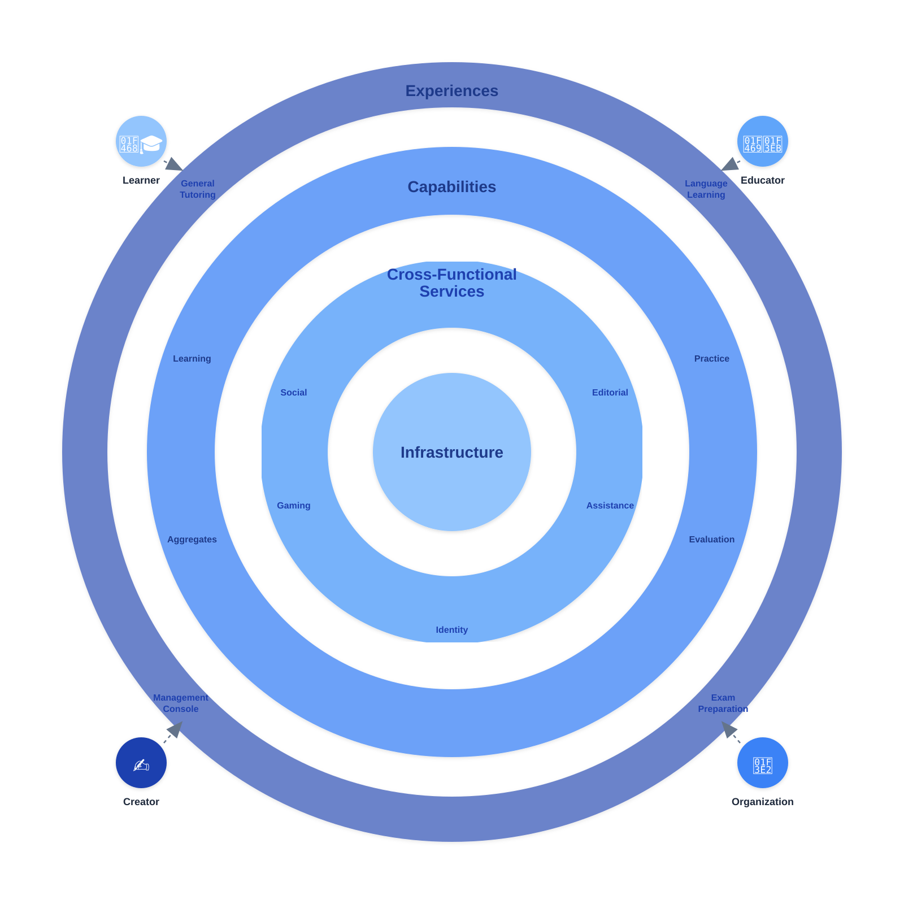

## Capabilities

The platform is organized into functional areas called Capabilities that
define what users do: Aggregates, Learning, Practice, and Evaluation.
These capabilities leverage Cross-Functional Features---Editorial,
Assistance, Social, Gaming, and Identity---to provide the building
blocks from which cohesive user experiences are composed.

### Aggregates

Aggregates provide the organizational structure for educational content
within the platform. They function as containers that group related
learning materials, activities, and assessments into cohesive units such
as courses, syllabi, lessons, or thematic collections.

#### Organizational Model

Aggregates support hierarchical organization similar to a directory
structure. An aggregate can contain other aggregates, creating nested
relationships that reflect the natural organization of educational
content. For example, a course aggregate might contain module
aggregates, which in turn contain lesson aggregates.

#### Descriptive Metadata

Each aggregate includes multiple levels of descriptive content:

- **Short descriptions**: Brief summaries for navigation and preview
  contexts

- **Long descriptions**: Comprehensive explanations providing detailed
  information about the aggregate's content and purpose

- **Tooltips**: Contextual help text that appears on hover or
  interaction

All descriptive content supports internationalization, allowing the same
aggregate structure to serve multiple languages and locales.

#### Tagging System

Aggregates can be tagged with custom metadata for categorization,
filtering, and discovery. Tags enable flexible organization beyond the
hierarchical structure, allowing content to be classified by difficulty
level, topic, skill area, or any custom taxonomy relevant to the
educational context.

#### Content Composition

Aggregates serve as the glue connecting different capabilities. A single
aggregate can reference learning materials, practice activities, and
evaluation challenges, creating a complete learning experience. For
instance, a lesson aggregate might include interactive learning
material, followed by practice activities, and conclude with a challenge
for evaluation.

### Learning

Learning provides instructional content that introduces concepts and
knowledge to learners. This capability delivers educational
materials---text, code, diagrams, images, and interactive
elements---that form the foundation of understanding within structured
learning paths.

#### Content Organization

Learning materials exist as individual units within the aggregate
hierarchy. A lesson aggregate typically contains one or more learning
materials, each covering a specific topic or concept. The aggregate
structure creates the learning path by organizing materials in sequence.

#### Content Types

Learning materials support:

- Text content with rich formatting

- Code blocks with syntax highlighting

- Embedded images and diagrams

- Interactive code examples that learners can modify and execute

- Coding exercises with validation and feedback

- Inline knowledge checks (multiple choice, fill-in-the-blank)

#### Material Structure

Each learning material has:

- Title and description (short/long with i18n support)

- Content body (text, code, media, interactive elements)

- Tags for categorization and search

- Version tracking for content updates

#### Internationalization

Learning materials support multiple languages. The same content can be
stored and delivered in different languages, with the platform serving
the appropriate language version based on learner preferences or locale
settings.

### Practice

Practice provides hands-on activities that allow learners to apply and
reinforce what they've learned. This capability supports two fundamental
categories: Trial-Based Practice for active, interactive exercises with
validation, and Mnemonic Practice for passive memorization through
repeated review.

#### Trial-Based Practice

Trial-Based Practice is the foundational functionality for exercises
requiring correct/incorrect validation. It supports both
single-participant sessions (Gym) and group sessions (Playroom),
providing session management, exercise sequencing, and result
verification.

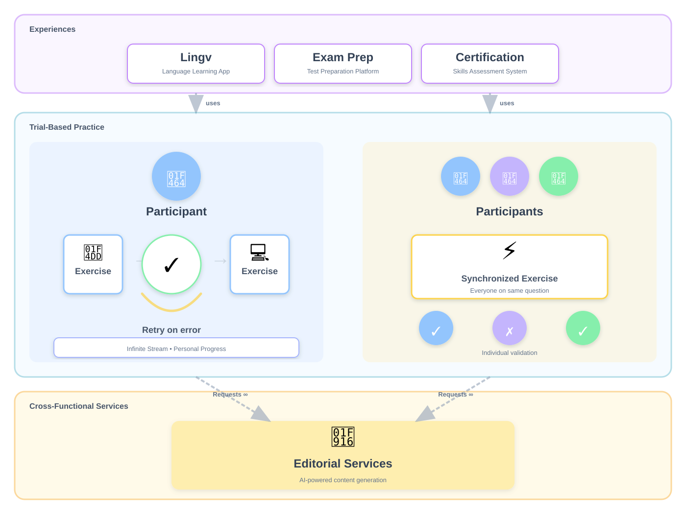

##### Exercise Structure

Each trial-based exercise consists of:

- **Exercise Statement**: The specific problem, question, or task
  instructions presented to the learner.

- **Hints and Guidance**: Contextual support made available when errors
  are detected.

- **Validation Logic**: The structured criteria used by the system to
  verify the submission.

- **Success Criteria**: The defined threshold for completing the
  activity.

Exercises can be pre-authored or generated as a Structured Data Object
by Editorial Services.

##### Validation and Feedback

Validation in Trial-based practice is a direct comparison between the
learner's entry and the required solution. The system validates learner
submissions against the logic provided in the **Structured Data
Object**---it is binary: correct or incorrect.

Validation methods vary by exercise type:

- Automated test execution for coding exercises

- Answer comparison for quiz activities

Each incorrect validation increments the session's error count. When the
accumulated errors reach the configured maximum error threshold, the
session terminates.

##### Trial-Based Features

Two user-facing features are built on trial-based practice
functionality. Both Gym and Playroom leverage the same core business
logic---exercise streaming, binary validation, error tracking, and
session management---but present different user experiences: Gym for
individual practice with personal pacing, and Playroom for group
practice with synchronized progression.

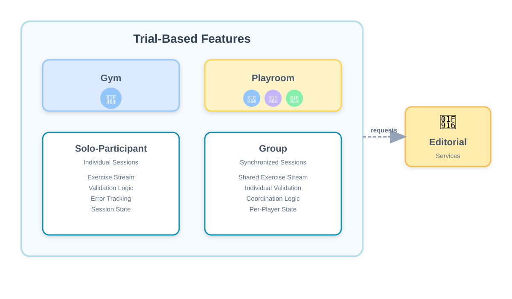

###### *Gym*

**Gym** delivers solo trial experiences where learners work through an
unlimited sequence of exercises. Each session is personal to the
individual learner.

Session characteristics:

- Exercises are presented one at a time

- Learners receive immediate validation and feedback

- Failed attempts allow retry until correct (or session limits are
  reached)

- Sessions can be configured with optional constraints: maximum errors
  allowed, time limits; and for coding exercises, visibility of test
  cases

Activities include coding exercises with automated validation, quiz
activities with fill-in-the-blank and multiple choice questions.

###### *Playroom*

**Playroom** delivers group trial experiences where learners work
through exercises together in real-time. Multiple participants join a
shared session and progress through the same sequence of exercises
simultaneously.

Session characteristics:

- All participants work on the same exercise at the same time

- Real-time visibility of everyone's progress through the session

- Sessions are configured with a specific number of exercises and
  optional time constraints

- The session host can choose to participate or moderate

- At session completion, results show participants ordered by number of
  correct answers

Playroom creates a shared learning environment where multiple learners
engage with the same content together, with natural peer accountability
and shared progression through the material.

#### Mnemonic Practice

Mnemonic practice provides the foundational functionality for passive
memorization through repeated review. This includes scheduling
algorithms, retention tracking, and adaptive review interval
calculations based on learner performance.

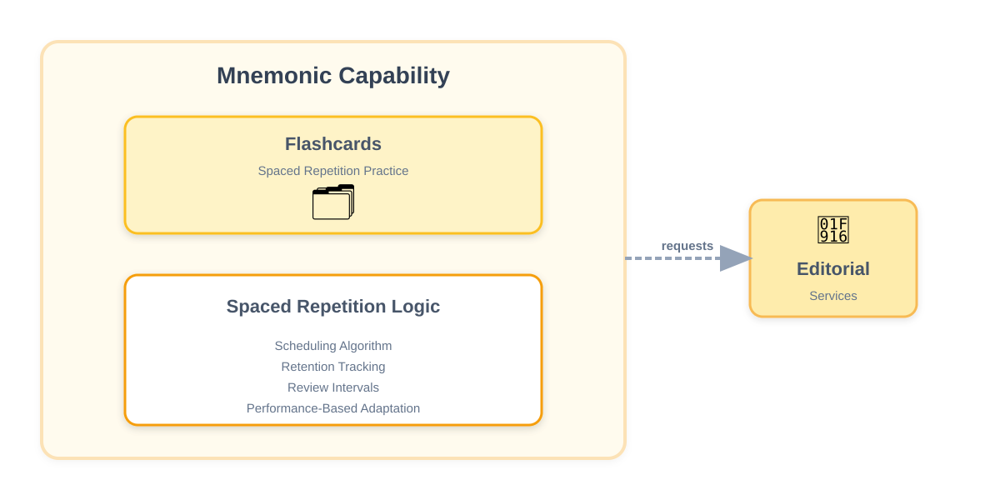

##### Mnemonic-Based Features

###### *Flashcards*

**Flashcards** is built on mnemonic practice functionality and delivers
memorization experiences where learners review content through spaced
repetition. The system presents cards for review and adapts scheduling
based on performance.

Session characteristics:

- Cards are presented one at a time with a **Recall Cue** and the
  corresponding **Solution**.

- Learners self-assess their recall before revealing the answer

- The system schedules subsequent reviews based on performance ratings

- Review intervals adapt to individual retention patterns (cards showing
  poor retention appear more frequently)

- Sessions can be configured with: number of cards per session, new
  cards vs. review cards ratio, and review scheduling algorithm
  parameters

Cards can be pre-authored and stored in the content system, or generated
as a **Structured Data Object** by Editorial Services.

#### Spaces

Spaces provide persistent, open-ended practice environments where learners experiment and build skills without defined objectives or evaluation. Unlike trial-based exercises that validate correctness, Spaces offer sandbox environments for hands-on exploration where learners can freely create, modify, and test their work.

##### Space Formats

Spaces support multiple practice formats tailored to different learning domains. Programming spaces provide development environments for code experimentation. Writing spaces offer composition environments for creative work. Conversation spaces enable language practice through interactive scenarios. Each format provides the appropriate tools and context for its domain while maintaining the same core principles: persistence, freedom to experiment, and no evaluation.

##### Programming Spaces

Programming spaces provide development environments with configured runtimes, tools, and resources for code experimentation. These include environments for specific frameworks (React, Spring), languages (Python, JavaScript), or technical domains. Programming spaces are the only format currently implemented.

###### Lifecycle

Programming spaces persist for extended periods, allowing learners to return multiple times and build substantial work incrementally.

The space lifecycle operates continuously:

When a learner activates a space, they gain access to the configured environment with necessary tools and resources. All examples from Learning materials within the containing aggregate are extracted and copied into a dedicated directory, providing ready-to-use content that demonstrates concepts or serves as starting points.

During the work period, learners have complete freedom to experiment. They can examine and execute examples, modify them to test variations, or create entirely new content. The environment remains active and accessible between sessions, preserving all work and modifications. This persistence enables iterative development—learners can try approaches, leave and return later, and continue building without losing progress.

Programming spaces operate without submission or evaluation. There are no deadlines, no correctness validation, no assessment criteria. The space exists purely as a practice environment where learners explore and build skills through hands-on work.

###### Configuration

Programming spaces are configured with specific parameters:

Environment configuration determines the runtime context, available tools, and technical capabilities. This includes language runtimes, installed packages, development tools, and file system structure.

Resource constraints define limits on CPU allocation, memory usage, storage capacity, and concurrent processes. These constraints ensure fair resource distribution across learners while providing sufficient capacity for meaningful practice.

Duration specifies how long the space remains active. Programming spaces typically persist for extended periods, with learners able to return and continue work throughout this duration.

###### Integration with Learning

Learning materials embed examples using Example tags. These examples render inline within the Learning material for reference and are extracted during space activation. When a learner activates a programming space, all examples from the aggregate's Learning materials are copied into the space environment, making them available for execution and modification.

Learning materials can reference programming spaces directly, enabling learners to transition from instructional content to hands-on practice.

##### Content Generation

Editorial Services generate space configurations and Learning materials with embedded examples as part of the aggregate authoring process. Space generation produces configurations with predefined parameters specifying environment settings and resource constraints. Learning material generation includes inline examples—complete, executable content that serves as reference implementations and starting points for experimentation.

### Evaluation

Evaluation measures learner achievement through structured assessment
activities. The platform supports quiz-based activities for rapid
assessment and project-based activities for comprehensive skill
demonstration.

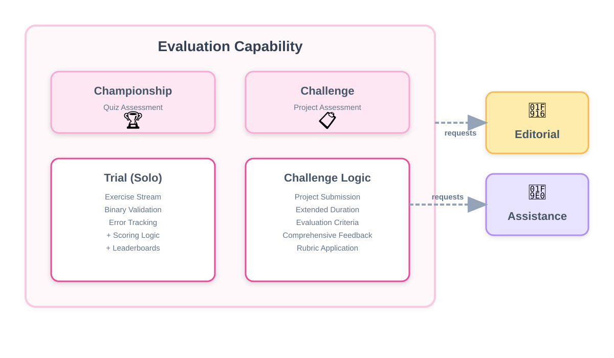

#### Quiz-Based Activities

##### Championship

A championship is an evaluation session where learners complete a set of
quiz exercises within a stipulated time. At the end of the session, the
system produces a score based on performance. These scores are
maintained in a leaderboard, allowing comparison across all
participants.

Championships support three exercise types:

- **Fill-in-the-blank** and **multiple-choice** questions test knowledge
  through direct questions with predefined answer options or short text
  responses.

- **Programming** exercises require writing code that passes automated
  test cases. The system validates submitted code against these tests to
  determine correctness.

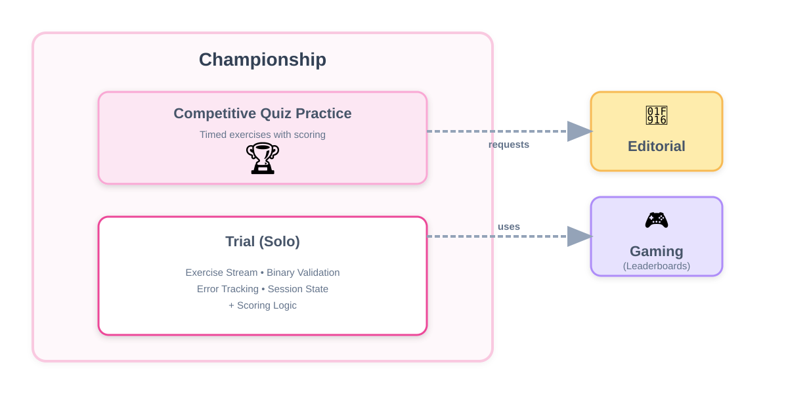

###### *Championship Configuration*

Championships are configured with predefined parameters before
participants begin. Multiple configuration sets are defined, each with
different parameter values.

Configuration parameters include:

- Session duration (total time to complete all exercises)

- Time limit per exercise

- Maximum incorrect submissions allowed

For programming exercises, additional parameters are available:

- Whether code testing is permitted before submission

- Number of test attempts allowed per exercise

- Whether test cases are visible to participants

These parameter sets can serve different purposes depending on how the
championship is organized. One example is creating difficulty levels---a
set with generous time limits and unlimited testing for beginners,
another with strict time limits and no testing for experts. Other uses
might organize parameter sets by topic, participant group, or any other
categorization relevant to the evaluation context.

Leaderboards display results and can be organized by parameter set or
other categories to enable meaningful performance comparison.

#### Project-Based Activities

##### Challenges

Challenges evaluate learners through substantial work developed over
extended periods, focusing on depth of understanding and quality of
approach rather than rapid completion. Unlike quiz-based activities that
use automated validation, Challenges are evaluated through AI-powered
analysis that provides comprehensive critique on learner work.

###### *Challenge Formats*

**Writing challenges** require text composition within approximate word
count limits. These include essays, analytical reports, or technical
explanations. The word count provides scope guidance without strict
enforcement. Submissions are evaluated on argumentation, clarity, depth
of analysis, and effective communication of ideas.

**Programming challenges** require developing substantial applications
or systems---like todo tools, CRUD applications, etc . Unlike
Championship programming exercises that validate through automated test
execution, programming Challenges are evaluated through qualitative
analysis of code quality, architectural decisions, design patterns, and
problem-solving approach. The submitted code doesn't need to be
functionally complete or production-ready; the evaluation focuses on
demonstrating sound technical judgment, appropriate use of language
features, code organization, and understanding of software design
principles.

###### *Challenge Structure and Lifecycle*

Each challenge defines duration, evaluation criteria, and required
deliverables. Duration typically spans days or weeks, providing time to
develop thoughtful, polished work.

The challenge lifecycle follows a clear progression:

When a challenge opens, learners gain access to the development
environment or workspace. For programming challenges, this includes the
configured development environment with necessary tools and resources.
For writing challenges, this provides the composition workspace.

During the work period, learners develop their solutions with complete
freedom to iterate, test, and refine. Programming environments remain
active and accessible, allowing learners to run code, experiment with
approaches, and validate their work locally. Writing workspaces enable
drafting, revision, and refinement. This working phase is
exploratory---learners can try different approaches and improve their
solutions continuously.

Submission is a deliberate, single action that finalizes the work for
evaluation. Learners choose when to submit before the deadline, but
submission is irreversible. Once submitted, no further changes are
possible. This makes submission a significant decision---learners must
determine when their work adequately demonstrates their capabilities.

Deadlines are enforced strictly with no grace period. Work not submitted
by the deadline cannot be evaluated.

###### *Challenge Configuration*

Challenges are configured with specific parameters before learners
begin:

Duration determines the available work period, typically spanning
multiple days or weeks depending on challenge scope and complexity.

Evaluation criteria define the dimensions on which work will be
assessed. For programming challenges, criteria might include code
organization and clarity, architectural soundness, design pattern
application, problem-solving approach, and documentation quality. For
writing challenges, criteria might include argument structure and
coherence, depth of analysis, use of evidence, and communication
effectiveness.

Required deliverables specify what learners must submit. Programming
challenges define the expected project structure, necessary files, and
any documentation requirements. Writing challenges specify format and
approximate length.

###### *Evaluation and Feedback*

After submission, learners receive comprehensive feedback generated
through AI-powered analysis. For writing challenges, this includes
assessment of argument strength, structural effectiveness, clarity of
expression, and depth of engagement with the topic. For programming
challenges, feedback addresses code quality, architectural decisions,
design choices, implementation approach, and problem-solving
methodology.

The feedback identifies both strengths and areas for improvement with
specific, actionable guidance. Rather than a simple score, learners
receive detailed critique that explains what worked well, what could be
improved, and why certain approaches are more effective than others.

### Orchestrating the Ecosystem: From Intent to Action

The individual Capabilities described above provide the domain-specific
logic and specialized environments for the user. However, for these
capabilities to function as dynamic, AI-powered features, they rely on a
shared operational logic. This logic acts as the connective tissue that
allows a Capability to call upon Cross-Functional Services (detailed in
the next section) to translate raw intelligence into actionable
software.

By merging the "what" (Capabilities) with the "how" (Services), the
platform ensures that generative intelligence is not an isolated
utility, but a deeply embedded engine driving every user interaction
with precision and technical stability.

#### Structured Intent & Execution

The system functions as a translation engine that converts human intent
into machine-executable logic. By ensuring the AI speaks the same
structural language as the platform, this mechanism transforms raw
generative models into functional "software engineers" capable of
driving every interaction within the ecosystem.

#### The Bridge Between Intent and Action

To ensure AI intelligence is never stranded as unstructured text, every
interaction is funneled through a strict four-stage execution flow that
guarantees technical reliability:

- Contextual Assembly (The Logic Pack): The Capability initiates the
  process, while Cross-Functional Services perform the gathering of the
  System Prompt, User Prompt, Schema, and Context. This ensures the AI
  never starts with a blank slate; it starts with a complete blueprint
  of the platform's rules and the user's specific situation.

- Structural Synthesis (Produce): The LLM Provider processes the intent
  and produces a Structured Data Object. This is the critical transition
  where "AI thought" becomes Platform Input. By enforcing a strict
  Schema, the platform guarantees that the AI outputs machine-readable
  data rather than unpredictable prose.

- System Ingestion (Ingest): The Capability-based functionality ingests
  the Structured Data Object. This is where the translation is realized:
  the system understands exactly what needs to happen because the data
  is formatted specifically for its consumption. It automatically
  interprets logic, configures system states, and triggers
  functionality.

- Functional Delivery (Deliver): The process culminates in a functional
  Experience. Whether the goal is a real-time assessment, a personalized
  hint, or a new piece of content, the outcome is indistinguishable from
  a hard-coded system feature because it was driven by the execution of
  the AI's structured data.

#### Strategic Value

- The Capability as the Primary Executor: The system receives and
  actions a structured command rather than interpreting ambiguous text,
  making AI-driven features as stable as traditional software.

- Unified Operational Standard: This same mechanism powers all AI
  interactions across the platform, from content creation to complex
  evaluations.

- Elimination of Technical Friction: Because the process produces a
  format the system inherently understands, there is no need for
  specialized "glue code" to connect AI outputs to the platform's core
  features.

## Cross-Functional Services

Cross-functional services operate across the platform's core
capabilities rather than serving as standalone activities. While
capabilities like Learning, Practice, and Evaluation represent distinct
types of learner engagement, cross-functional features provide
supporting functionality that applies throughout these activities.

The platform provides five cross-functional features: Editorial enables
AI-powered content creation for learning materials, exercises, and
assessments. Assistance provides personalized AI guidance during any
learner interaction. Social supports group organization and
collaboration. Gaming adds competitive mechanics and motivational
elements. Identity manages authentication and access control.

### 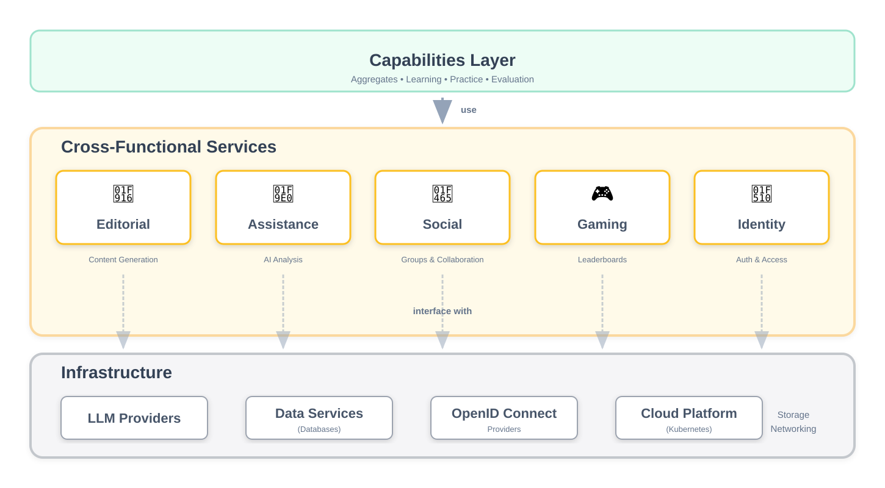

### Editorial Services

Editorial Services enable AI-powered content creation throughout the
platform, generating educational materials across all capabilities.

#### Content Generation

The service generates three primary content types:

- **Instructional Content** includes explanatory text, code
  demonstrations, worked examples, and interactive learning elements
  with inline exercises, executable code samples, and multimedia
  components.

- **Practice Content** includes quiz questions (multiple choice,
  fill-in-the-blank), coding exercises with validation criteria, problem
  statements with hints, and flashcard prompt-answer pairs, generated as
  individual items or complete exercise sets.

- **Assessment Content** includes championship exercise collections,
  challenge specifications with requirements and success criteria,
  evaluation rubrics, and development environment configurations for
  coding assessments.

#### Capability Integration

*Learning* uses Editorial to generate instructional materials,
explanatory content, and interactive elements. *Practice* uses Editorial
to generate exercise sets for trial-based activities and prompt-answer
pairs for mnemonic practice. *Evaluation* uses Editorial to create
championship exercise collections and challenge specifications with
evaluation criteria.

### Assistance (Vision & Roadmap)

Assistance provides AI-powered intelligence that analyzes learner work
and activity to enable personalized guidance throughout the platform.

#### Analysis Capabilities

Assistance analyzes learner submissions including written work and code,
evaluating quality, correctness, requirements adherence, and approach.
It processes learner activity history across the platform---performance
patterns, struggle areas, progress trajectories, and learning
behaviors---to build understanding of individual learner characteristics
and current context.

#### Guidance and Feedback

Based on analysis, Assistance produces detailed feedback highlighting
strengths and identifying improvement areas with actionable guidance. It
generates responses tailored to learner level and context, adapting
communication style and explanation complexity based on individual
characteristics and demonstrated understanding.

#### Capability Integration

Evaluation uses Assistance to analyze challenge submissions and generate
comprehensive feedback on learner work.

### Social (Vision & Roadmap)

Social manages participant presence within the platform---activity
history, progress state, performance metrics, group memberships, and
interactions. Rather than just facilitating connections between people,
Social maintains the comprehensive profile of each participant's
engagement with the system, whether as learners working through content,
instructors guiding groups, or organizers managing educational delivery.

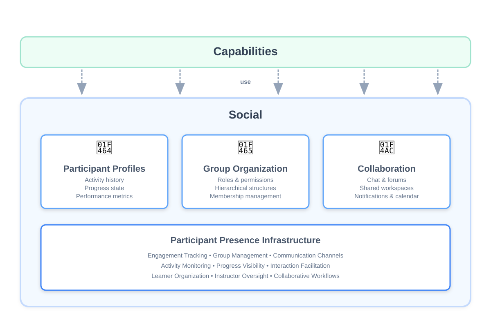

#### Participant Profiles and Activity

Social tracks activity across all platform capabilities. For learners:
completion status for learning materials and activities, scores and
performance data from practice and evaluation sessions, progress through
aggregates and learning paths, time spent and engagement patterns, and
achievement milestones. For instructors and organizers: groups managed,
content created or assigned, learner interactions and guidance provided,
and moderation activity. This comprehensive activity record enables
participants to monitor their own engagement and provides instructors
visibility into both individual learner advancement and collective group
progress.

#### Group Organization

Social provides flexible group structures that can model any type of
participant organization. Groups are defined with configurable roles and
permissions---traditional educational groups might include student and
instructor roles, while other contexts might define peer groups without
hierarchical roles, collaborative teams with specialized roles, or
communities organized around shared interests. The infrastructure
supports hierarchical nesting where groups can contain subgroups,
enabling complex organizational structures. Role definitions determine
capabilities within each group---access to content, ability to moderate,
permission to evaluate others, authority to manage group
membership---allowing the platform to accommodate diverse scenarios from
formal classroom instruction to informal learning communities.

#### Collaboration Infrastructure

Social enables participant interaction through multiple channels:
real-time chat for synchronous conversations, forums for asynchronous
discussions, shared workspaces for group activities, announcement and
notification systems, and calendar integration for scheduled activities.
The infrastructure supports peer review workflows, group assignments
requiring collaborative work, and instructor-learner communication.

#### Capability Integration

Practice uses Social for group Playroom sessions and tracking session
performance across participants. Evaluation uses Social for group-based
championships, collaborative challenge assessments, and leaderboard
rankings. Learning uses Social to track content consumption and
completion across all participants.

### Gaming (Vision & Roadmap)

Gaming provides competitive and motivational infrastructure across
platform activities, adding engagement mechanisms to learning, practice,
and evaluation.

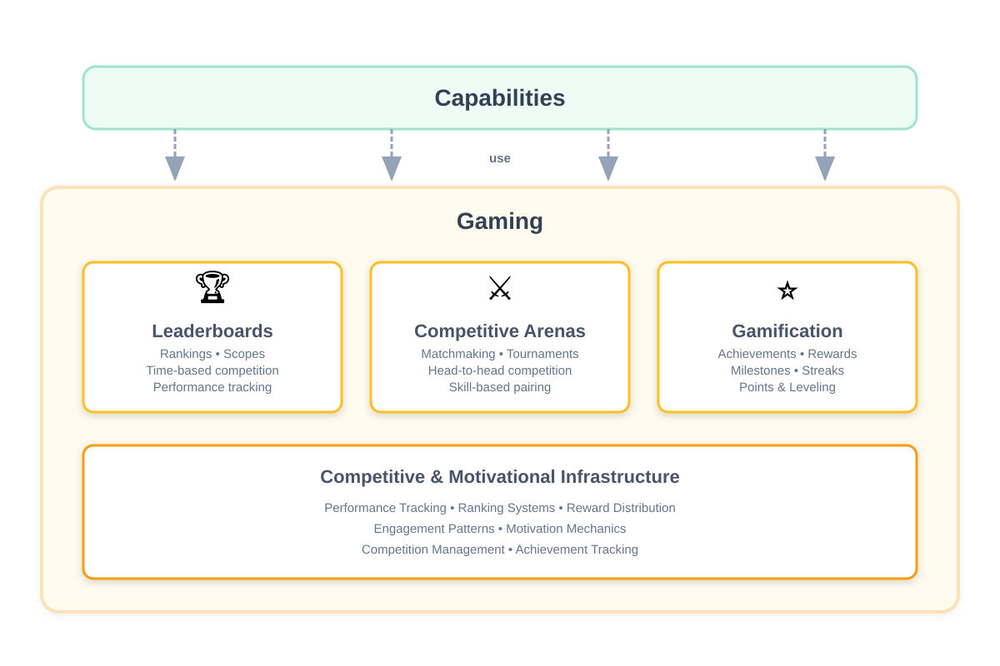

#### Leaderboards

Leaderboards rank learners based on performance across activities:
championship scores and rankings, practice session performance, overall
progress metrics, and time-based competitions (daily, weekly, all-time).
Rankings can be scoped to specific groups or span the entire platform,
enabling both localized competition within classes and global
performance comparison.

#### Competitive Arenas

Arenas provide structured competitive spaces where learners engage in
direct competition: head-to-head matchmaking, tournament-style events
with bracket progression, timed challenge competitions, and skill-based
pairing systems. Arenas organize competitive activities with defined
rules, match formats, and outcome determination.

#### Gamification Mechanics

Gaming provides motivational infrastructure including achievement
tracking and reward systems, progress measurement with milestone
recognition, activity streak monitoring for consistency incentives, and
point accumulation with leveling systems. These mechanics can be
configured and combined to create engagement patterns tailored to
specific learning contexts and learner motivations.

#### Capability Integration

Evaluation uses Gaming for championship leaderboards that rank
competitive assessment performance. Practice uses Gaming for Playroom
session rankings and competitive mechanics during group trials. Social
integrates with Gaming to enable group-based competitions and team
leaderboards.

### Identity

Identity manages authentication and authorization across the platform,
controlling access and protecting user data.

#### Authentication

Identity verifies user identity through credential validation, session
management, multi-factor authentication support, and single sign-on
integration. The service maintains authenticated sessions and ensures
only authorized users access the system.

#### Authorization

Identity controls what authenticated users can access and perform
through role-based access control (learner, educator, administrator),
resource-level permissions for courses, groups, and content,
action-based permissions (create, read, update, delete), and
context-specific access based on group membership or enrollment status.
Authorization policies enforce access restrictions throughout the
platform.

#### Capability Integration

Experiences, capabilities and cross-functional services use Identity for
user authentication and authorization checks. Social uses Identity to
enforce role-based permissions within groups and manage member access.
Evaluation and Practice use Identity to associate activity and
performance data with authenticated users. Aggregates use Identity to
determine content visibility based on user permissions and context.

## Experiences

Experiences are end-user products built from the platform's capabilities
and cross-functional features. This is fundamental to the platform's
architecture---capabilities and cross-functional features provide the
building blocks; experiences combine them into complete products for
specific audiences and purposes.

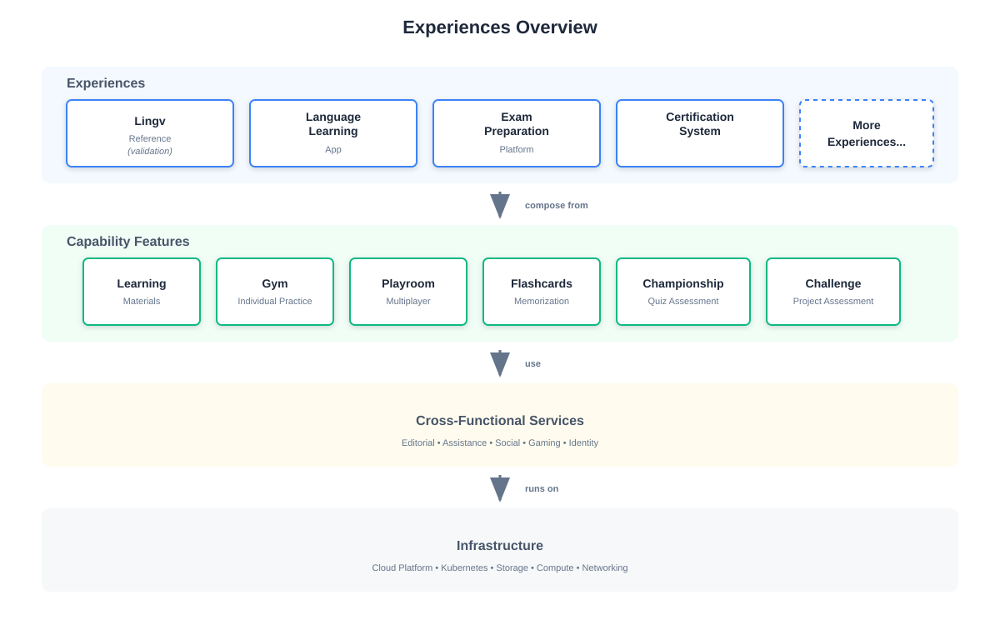

### Experience Diversity

Using the platform's building blocks, several types of experiences can
be created tailored to different needs and populations. A general
tutoring application emphasizes Learning materials with extensive
Practice through Gym and Flashcards, incorporating competition through
Playroom sessions. An exam preparation platform focuses on Evaluation
through Championships and Challenges, with Practice for skill
reinforcement. A technical certification system centers on
Challenge-based assessment with prerequisite Learning paths and Practice
validation.

These examples represent just a few possibilities---by composing
capabilities and cross-functional features in novel ways, even more
powerful and innovative educational experiences can be created.

#### Integrated Authoring

Experiences can incorporate authoring capabilities, enabling end users
to create content within the product. An experience might allow users to
generate interactive tutorials on topics they're interested in, or
create custom practice sets, leveraging Editorial Services as part of
the user-facing functionality.

### Lingv

Lingv is a web-based reference implementation validating how
capabilities and cross-functional features compose into a complete
experience.

#### Interface Design

Lingv uses a capability-based features navigation where users access
Learning, Gym, Playroom, and Challenges directly as primary entry
points rather than navigating through course hierarchies. This validates
that capabilities function as independent, composable units.

#### Implementation

Lingv provides direct access to Learning materials, Gym session
configuration and execution, Playroom session hosting and
participation, and Challenges submission with evaluation.

#### Integration

Lingv integrates Identity for authentication and session management,
Editorial Services for content generation, the Assistance service for
challenges evaluation, and Gaming for leaderboards and competitive
rankings.

The implementation demonstrates that platform architecture
works---capabilities operate independently while composing into coherent
experiences. Lingv can evolve from a validation tool into a full product
tailored to specific learning domains.

## Platform Tools

This category encompasses applications that support platform operations,
serving creators, instructors, and administrators. Unlike experiences
which serve learners directly, platform tools provide functionality for
creating and curating learning materials, organizing learners, and
overseeing educational delivery.

Unlike experiences which vary by domain and audience, platform tools are
typically universal---one Management Console can serve all deployments,
a content generation application can handle most authoring needs.

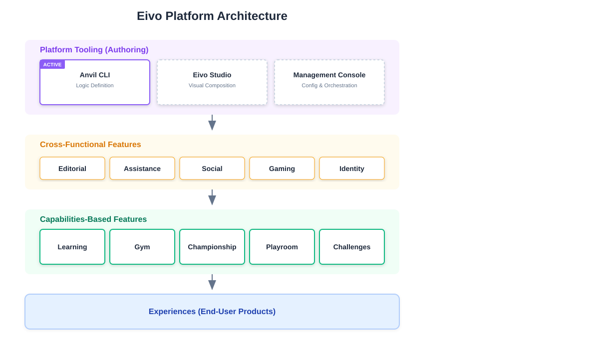

### Anvil CLI (Current Implementation)

Content development and validation currently utilize **Anvil**, a
command-line interface that serves as Eivo's reference implementation
and technical test bed. Anvil provides the functional environment to
test AI-powered content generation. It allows for the programmatic
verification of learning materials and evaluation logic before they are
integrated into the core platform.

### Eivo Studio (Vision & Roadmap)

**Eivo Studio** is envisioned as a dedicated, web-based authoring suite
for the creation of educational content. It will transition the
capabilities currently tested in Anvil into a collaborative, high-level
interface designed for content creators.

- **AI-Collaborative Authoring**: Creators will work iteratively with
  Large Language Models to generate text, interactive code challenges,
  and complex evaluation criteria.

- **Experience Design**: A visual environment for configuring the
  pedagogical flow, integrating multi-modal materials, and setting up
  challenges based on project-based assessments.

### Management Console (Vision & Roadmap)

The **Management Console** will serve as the administrative and
operational hub for the platform. While Eivo Studio focuses on building
content, the Management Console is designed for orchestrating the
learner journey and overseeing platform activity.

- **Cohort & Group Orchestration**: Tools to organize learners into
  classes, assign specific material, and manage enrollment lifecycles.

- **Operational Analytics**: High-level dashboards providing real-time
  data on individual and group progress, allowing for the identification
  of learning gaps.
