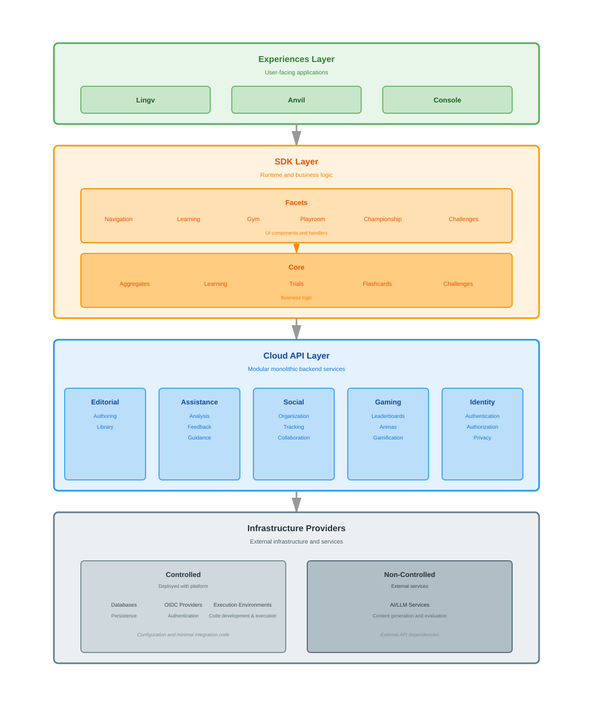
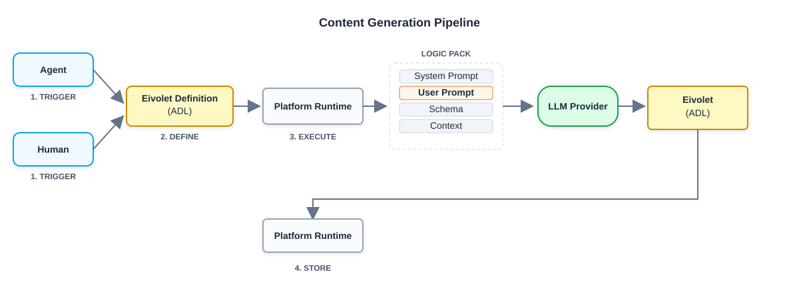
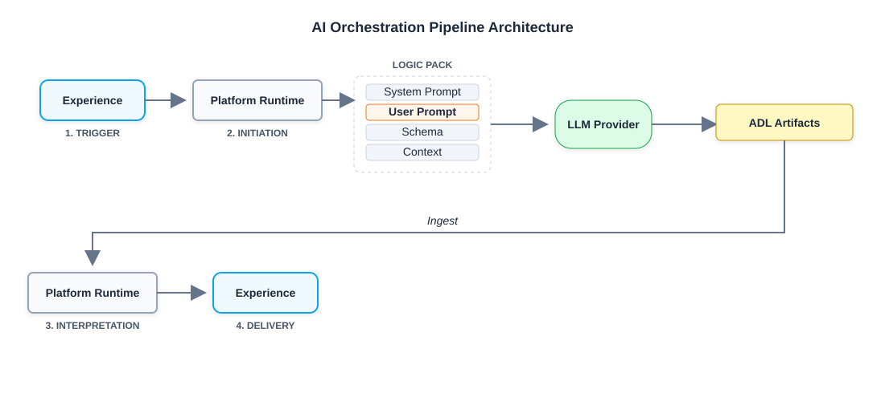

# Architectural Principles

Eivo is built on the following foundational principles that guide its
design and implementation.

## Layered Design

The platform follows a three-layer design:

- **Experiences**: User-facing applications
- **SDK**: Runtime and business logic layer
- **Cloud**: Backend services and APIs

## Multiple Experiences

By leveraging the SDK, the platform enables the creation of multiple
experiences (applications) tailored to different objectives. Each
experience can provide unique interfaces and workflows while sharing the
same underlying capabilities and infrastructure.

## Modular Design

The platform is organized into functional modules that provide distinct
capabilities. Each module encapsulates a specific domain of
functionality, such as content management, user interactions, or
identity services. This modular approach enables independent
development, testing, and scaling of different platform capabilities.

## Multi-Tenancy

The platform uses namespaces to provide logical data partitioning across
all components. This enables multiple organizations or user groups to
share infrastructure while maintaining isolated content, artifacts, and
resources.

## Cloud-Native Infrastructure

Built on Kubernetes, the platform leverages cloud-native patterns for
scalability, resilience, and operational efficiency. Infrastructure
components include operators for dynamic environment provisioning and
service orchestration.

## Extensibility

The platform is designed to accommodate evolving requirements and new
capabilities. Components can be extended or replaced without disrupting
core functionality, enabling the platform to adapt to different
educational contexts and use cases.

# High Level Overview

The platform follows a three-layer architecture that separates user
experiences from business logic and backend services. Each layer has
distinct responsibilities and clear interfaces for communication.

## Layers

### Experiences and Platform tools

The Experiences and Platform tools layer contains user-facing
applications built on the platform. Each experience provides a complete
interface tailored to specific user needs and workflows. Lingv serves as
a reference implementation and test bed for a capability-first
navigation. Anvil serves as a reference implementation and test bed for
content creation functionality . Console will enable instructors to
manage and monitor learning activities.
Experiences are independent applications that share the same underlying
SDK and Cloud APIs. This allows multiple experiences to coexist while
maintaining consistent functionality and reducing duplicated
implementation effort.

### SDK

The SDK layer provides the runtime and business logic that experiences
use to interact with platform capabilities. It consists of two
sub-layers:

**Facets** provides high-level APIs for building user interfaces,
including Navigation (aggregate-based browsing), Learning (material
presentation), and practice/evaluation activities (Gym, Playroom,
Championship, Challenges). Facets handles UI components, user
interactions, and state management. Experiences are built using Facets
APIs.

**Core** implements the business logic beneath Facets. It provides APIs
for Aggregates (content organization), Learning (material delivery),
Trials (session execution), Flashcards (spaced repetition), and
Challenges (evaluation workflows). Core handles data validation,
business rules, and orchestration. The Facets SDK uses the Core APIs to
execute functionality, and Core calls Cloud APIs to manage service
orchestration and platform state.

### Cloud API

The Cloud API layer provides backend services through a modular
monolithic architecture. Each module encapsulates a distinct domain and
exposes APIs consumed by the SDK layer.

- **Editorial** manages AI-powered content generation through two
  components: Authoring creates educational materials with AI
  assistance, and Library stores and manages created content.
- **Assistance** provides AI-powered analysis and guidance for learner
  work through Analysis (evaluating submissions), Feedback (generating
  comprehensive critiques), and Guidance (personalized support and
  explanations).
- **Social** supports group-based learning through Organization
  (managing courses, groups, and roles) and Collaboration (enabling
  communication among participants).
- **Gaming** adds competitive and motivational elements through
  Leaderboards (ranking performance), Arenas (competitive spaces), and
  Gamification (achievement and reward systems).
- **Identity** controls platform access through Authentication
  (verifying users), Authorization (controlling permissions).

### Interactions

Experiences are built using SDK Facets APIs to render UI and handle user
interactions. Facets calls SDK Core APIs to execute business logic. Core
calls Cloud APIs to manage service orchestration and platform state.
Each layer communicates through well-defined interfaces, allowing
independent development and testing of components at different levels.

#  The AI Pipeline

The platform leverages two distinct AI pipelines, each serving a different purpose. The Content Generation Pipeline transforms educational specifications into content artifacts. The Runtime AI Pipeline delivers dynamic interactions to learners during active sessions.

## Content Generation Pipeline

Triggered by a human or agent, this pipeline transforms an Eivolet Definition into a complete library of educational content artifacts stored for platform consumption.

1. **Trigger** — A human author or agent initiates content generation.
2. **Define** — An Eivolet Definition (ADL) specifies the generation workflow, models, prompts, schemas, and contexts.
3. **Execute** — The Platform Runtime assembles the Logic Pack and coordinates with the LLM Provider to generate content.
4. **Store** — The Platform Runtime ingests the generated Eivolet (ADL) and persists it to the Library.

### Pipeline Components

| Component | Function |
| :---- | :---- |
| Agent | An AI-driven process that autonomously triggers and guides content generation workflows. |
| Eivolet Definition | An ADL artifact that specifies the generation workflow, models, prompts, schemas, and contexts. |
| System Prompt | Static foundational instructions defining the generation behavior (The "How"). |
| User Prompt | The specific content generation request (The "What"). |
| Schema | The technical contract defining the structure of the generated output. |
| Context | Shared data available across all prompts during generation. |
| Eivolet | The ADL artifact produced by the LLM containing the generated educational content library. |
| Platform Runtime (Executor) | Assembles the Logic Pack and coordinates with the LLM Provider to execute generation. |
| Platform Runtime (Archiver) | Ingests the generated Eivolet and persists it to the Library. |

## Runtime AI Pipeline

Triggered by a learner interaction within an experience, this pipeline delivers dynamic content on demand.

1. **Trigger** — A learner interaction within an experience requires a dynamic response.
2. **Execute** — The Platform Runtime assembles the Logic Pack (System Prompt, User Prompt, Schema, Context) and submits it to the LLM Provider.
3. **Interpret** — The Platform Runtime ingests the Structured Data Object (YAML) returned by the LLM.
4. **Deliver** — The experience receives the interpreted result and presents it to the learner.

### Pipeline Components

  | Component | Function |
| :---- | :---- |
| Experience | The user-facing entry point and final delivery state. |
| System Prompt | Static foundational instructions (The "How"). |
| Prompt | The specific task request (The "What"). |
| Schema | The technical contract for the output structure. |
| Context | Data used for rendering and contextualizing the interaction. |
| ADL Artifacts | The technical intermediate representation that bridges AI output to platform input. |
| Platform Runtime | The high-level execution environment grouping the SDKs and Services. |