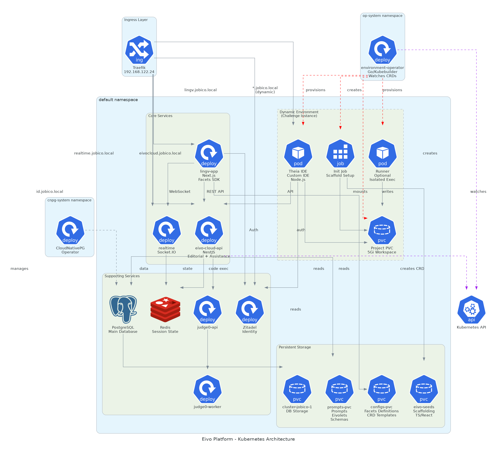
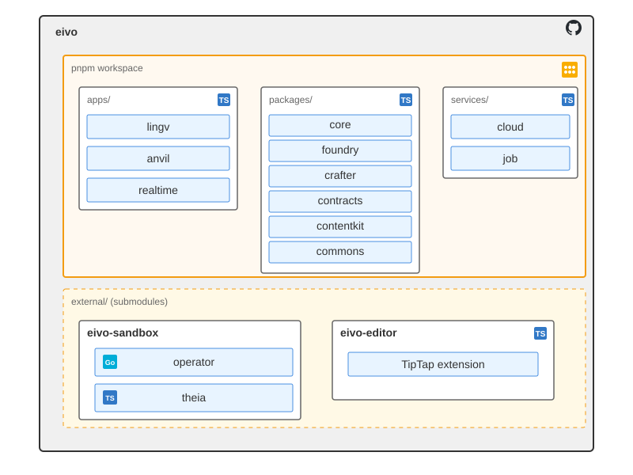

# Infrastructure

## Kubernetes Architecture

The Eivo platform runs on Kubernetes. Core services handle application
logic and user interfaces, while support services provide databases,
authentication, and code execution. The Environment Operator dynamically
provisions isolated coding environments for programming challenges.



## Cloud Platform

Core application services providing backend logic, frontend interface,
real-time communication, and dynamic environment provisioning.

- **Cloud API**: NestJS monolith containing Editorial and Assistance
  modules. Provides REST APIs for content generation and learner
  feedback.

- **Lingv**: Next.js application providing the learner-facing web
  interface. Implements Facets SDK for navigation and Core SDK for
  business logic.

- **Realtime Services**: Socket.IO service enabling real-time
  communication for multiplayer Playroom sessions.

- **Environment Operator**: Kubernetes operator that provisions and
  manages isolated coding environments for programming challenges.

## Support Services

Infrastructure services providing data storage, authentication, and code
execution capabilities.

- **PostgreSQL**: Main relational database managed by **CloudNativePG**
  operator. Stores user data, content metadata, social information, and
  gaming data.

- **Redis**: In-memory data store for session state, trial sessions, and
  challenge progress. Provides fast access to transient application
  state.

- **Zitadel**: Identity and authentication provider. Handles user
  authentication via OpenID Connect and JWT token generation.

- **Judge0**: Code execution service for programming exercises. Executes
  learner-submitted code in isolated containers and returns test
  results.

# Development

## Introduction

The Eivo platform code is organized across three repositories linked
through **git submodules**:

- **eivo** is the main monorepo containing all TypeScript code organized
  as a PNPM workspace. It includes frontend applications, backend
  services, SDKs, and shared libraries. External repositories are linked
  as git submodules under the external/ directory for coordinated
  development and deployment.

- **eivo-sandbox** contains the Environment Operator (Go) and Theia IDE
  customization (TypeScript). The operator manages Kubernetes-based
  coding environments, while the Theia customization provides the
  web-based IDE with platform integration.

- **eivo-editor** contains the TipTap rich text editor extension used
  for challenge essay submissions. Built following TipTap's extension
  patterns and tooling conventions.

## Eivo



The eivo repository is located at <https://github.com/andrescosta/eivo>.
It is a monorepo managed with PNPM workspaces. Code is organized into
`apps/`, `packages/`, and `services/` directories.

TypeScript configuration uses `tsconfig.json` for development and type
checking, and `tsconfig.build.json` for builds. A root configuration
provides base compiler options that individual projects extend and
customize.

### Build and Deployment

Applications and services are built locally within the monorepo rather
than inside Docker containers. The build process compiles TypeScript
code locally, then copies the resulting artifacts into Docker images.
This approach leverages the monorepo's shared dependency resolution and
workspace references during compilation.

Each deployable project (lingv, anvil, realtime, job, cloud) provides a
Makefile with standardized commands:

- `make build` - Compile locally and create tagged Docker image

- `make push` - Push image to registry

- `make deploy` - Apply Kubernetes manifests

- `make refresh` - Restart pods to pull latest image

- `make all` - Build, push, and deploy in sequence

- `make update` - Build, push, and refresh running pods

A root Makefile orchestrates these commands across all projects,
allowing `make all` or `make update` at the repository root to execute
the corresponding command for every deployable project.

### Apps

#### Lingv

Next.js reference implementation demonstrating platform capabilities.
Contains Facets SDK implementation and integrates Core SDK for business
logic.

**Dependencies:**

| Type | Packages |
| --- | --- |
| **Internal** | `@eivo/sdk`, `@eivo/commons`, `@eivo/contentkit`, `@eivo/contracts`, `@eivohq/eivoeditor` |
| **External** | `next` (web framework), `react` (UI library), `next-auth` (authentication), `socket.io-client` (real-time), `ioredis` (Redis client), `next-mdx-remote-client` (MDX), `@code-hike` (code highlighting), `zod` (validation), `ky` (HTTP client), `mustache` (template engine) |


**Build:**

| Aspect | Description |
| --- | --- |
| **Bundler** | **Next.js (webpack)**: standalone mode for Kubernetes deployment, standard mode for local development |
| **Commands** | `pnpm dev`: development server<br>

<br>`pnpm build`: production build<br>

<br>`pnpm start`: run built application |
| **Publishing** | Not published — deployed to Kubernetes |


#### Anvil

NestJS CLI tool for content generation. Provides command-line interface
for interacting with Editorial Services and managing eivolets.

**Dependencies:**

| Type | Packages |
| --- | --- |
| **Internal** | `@eivo/crafter`, `@eivo/foundry`, `@eivo/core` |
| **External** | `@nestjs/core` (framework core), `nest-commander` (CLI framework), `axios` (HTTP client) |

---

**Build:**

| Aspect | Description |
| --- | --- |
| **Bundler** | NestJS CLI with TypeScript compiler |
| **Commands** | `pnpm build`: production build <br/> `pnpm app:*`: content generation and platform management |
| **Publishing** | Not published — internal tool |

#### Realtime

Socket.IO service providing real-time communication for multiplayer
features. Handles WebSocket connections and state synchronization for
Playroom sessions.

**Dependencies:**

| Type | Packages |
| --- | --- |
| **Internal** | `@eivo/core`, `@eivo/commons`, `@eivo/contentkit`, `@eivo/contracts` |
| **External** | `socket.io` (WebSocket server), `socket.io-client` (WebSocket client), `jsonwebtoken` (JWT authentication), `jwks-rsa` (JWT key management), `argon2` (password hashing) |

**Build:**

| Aspect | Description |
| --- | --- |
| **Bundler** | TypeScript compiler with dual output (server and worker) |
| **Commands** | `pnpm build`: production build<br/>`pnpm build:server`: compile server<br/>`pnpm build:worker`: compile worker<br/>`pnpm dev`: development mode<br/>`pnpm start`: run server |
| **Publishing** | Not published — deployed to Kubernetes |

### Packages

#### Core SDK

TypeScript library implementing platform business logic and
orchestrating interactions with Cloud API modules. Provides APIs for
Aggregates, Learning, Trials, Flashcards, and Challenges.

**Dependencies:**

| Type | Packages |
| :--- | :--- |
| **Internal** | `@eivo/commons`, `@eivo/contentkit`, `@eivo/contracts` |
| **External** | `ky` (HTTP client), `class-transformer` (object transformation), `argon2` (password hashing), `fast-glob` (file pattern matching), `unique-names-generator` (name generation) |

**Build:**

| Aspect | Description |
| :--- | :--- |
| **Bundler** | TypeScript compiler |
| **Commands** | `pnpm build`: production build<br>`pnpm build:bundle`: bundled build |
| **Publishing** | Published as `@eivohq/eivosdk` to GitHub npm registry |

#### Foundry

Core generation orchestrator that produces content artifacts based on
Eivolet Definitions. Core component of Editorial Services that
coordinates with Crafter to execute LLM-based generation workflows using
configured models, prompts, and contexts.

**Dependencies:**

| Type | Packages |
| :--- | :--- |
| **Internal** | `@eivo/core`, `@eivo/contracts`, `@eivo/crafter`, `@eivo/commons` |
| **External** | `fast-glob` (file pattern matching), `js-yaml` (YAML processing), `mime-types` (MIME type detection) |

**Build:**

| Aspect | Description |
| :--- | :--- |
| **Bundler** | TypeScript compiler |
| **Commands** | `pnpm build`: production build |
| **Publishing** | Not published — internal package |

#### Crafter

Platform-level generation library providing multi-provider LLM
integration. Implements schema-based generation with Zod validation and
Mustache templating for prompts. Supports object, tree, text, and image
generation across multiple LLM providers.

**Dependencies:**

| Type | Packages |
| :--- | :--- |
| **Internal** | `@eivo/core`, `@eivo/contracts`, `@eivo/commons` |
| **External** | `ai` (Vercel AI SDK), `@ai-sdk/google` (Google provider), `@ai-sdk/openai` (OpenAI provider), `@openrouter/ai-sdk-provider` (OpenRouter provider), `zod` (schema validation), `zodex` (Zod extensions), `mustache` (template engine), `fast-glob` (file pattern matching), `js-yaml` (YAML processing) |

**Build:**

| Aspect | Description |
| :--- | :--- |
| **Bundler** | TypeScript compiler |
| **Commands** | `pnpm build`: production build |
| **Publishing** | Not published — internal package |

#### Contracts

Shared data structures and serialization infrastructure. Provides
TypeScript representations of YAML artifact specifications, DTOs for API
communication, and core domain models with validation and transformation
logic.

**Dependencies:**

| Type | Packages |
| :--- | :--- |
| **Internal** | `@eivo/commons` |
| **External** | `class-transformer` (object transformation), `js-yaml` (YAML processing), `reflect-metadata` (metadata reflection) |

**Build:**

| Aspect | Description |
| :--- | :--- |
| **Bundler** | TypeScript compiler |
| **Commands** | `pnpm build` - production build |
| **Publishing** | Not published - internal package |

#### ContentKit

Content rendering and editing library providing MDX rendering with
CodeHike for enhanced code presentation. Includes server-side rendering
via next-mdx-remote-client and client-side code editor components using
CodeMirror.

**Dependencies:**

| Type | Packages |
| :--- | :--- |
| **Internal** | None |
| **External** | next-mdx-remote-client - MDX rendering codehike - code highlighting and components @uiw/react-codemirror - code editor react - UI library next - framework integration remark-gfm - GitHub Flavored Markdown unified - content processing zod - schema validation |

**Build:**

| Aspect | Description |
| :--- | :--- |
| **Bundler** | TypeScript compiler with multiple entry points (client, render, models) |
| **Commands** | `pnpm build` - production build |
| **Publishing** | Not published - internal package |

#### Commons

Shared utilities library providing foundational functionality across the
platform. Includes cryptography, Kubernetes client wrapper, OIDC
integration, Redis queue implementation, collections, YAML utilities,
and extended data types.

**Dependencies:**

| Type | Packages |
| :--- | :--- |
| **Internal** | None |
| **External** | @kubernetes/client-node - Kubernetes API ioredis - Redis client jsonwebtoken - JWT handling jwks-rsa - JWT key management argon2 - password hashing class-transformer - object transformation fast-glob - file pattern matching js-yaml - YAML processing async-mutex - concurrency control ulid - unique identifiers |

**Build:**

| Aspect | Description |
| :--- | :--- |
| **Bundler** | TypeScript compiler with multiple entry points (k8s, oidc, redis, yaml, stores, types, collections, utils, serial, environment) |
| **Commands** | `pnpm build` - production build |
| **Publishing** | Not published - internal package |

### Services

#### Cloud

Cloud API is a NestJS modular monolith containing Editorial and
Assistance modules. Provides REST APIs for content generation, learner
feedback, and platform data access.

**Dependencies:**

| Type | Packages |
| :--- | :--- |
| **Internal** | `@eivo/core`, `@eivo/commons`, `@eivo/contracts`, `@eivo/crafter`, `@eivo/foundry`, `@eivo/ctl` |
| **External** | @nestjs/core - framework core @nestjs/typeorm - ORM integration typeorm - database ORM pg - PostgreSQL client ioredis - Redis client @nestjs/jwt - JWT authentication jwks-rsa - JWT key management ky - HTTP client zod - schema validation class-transformer - object transformation class-validator - validation decorators |

**Build:**

| Aspect | Description |
| :--- | :--- |
| **Bundler** | NestJS CLI with TypeScript compiler |
| **Commands** | pnpm build - production build pnpm dev - development mode pnpm start - run application |
| **Publishing** | Not published - deployed to Kubernetes |

#### Job

Kubernetes initialization job that sets up development environments for
coding challenges. Copies scaffolding templates, configures workspace
structure, and prepares the environment before learner interaction.

**Dependencies:**

| Type | Packages |
| :--- | :--- |
| **Internal** | `@eivo/core`, `@eivo/commons` |
| **External** | dotenv - environment configuration |

**Build:**

| Aspect | Description |
| :--- | :--- |
| **Bundler** | TypeScript compiler with webpack bundling |
| **Commands** | pnpm build - production build pnpm bundle - webpack bundle pnpm start - run job |
| **Publishing** | Not published - deployed to Kubernetes |

# External

External submodules provide integration points with third-party services
and tools used by the platform.

## Eivo-Sandbox

The eivo-sandbox repository is located at
<https://github.com/andrescosta/eivo-sandbox>. It provides Kubernetes
infrastructure components for provisioning and managing isolated
development environments for coding challenges, containing the
Environment Operator and customized Theia IDE.

### Components

#### operator

Generic Kubernetes operator that provisions ephemeral development
environments for coding challenges. Built with Kubebuilder, it watches
for Environment custom resources, provisions infrastructure (compute,
storage, networking, IDE), monitors environment health, and executes
automatic cleanup when environments expire.

**Dependencies:**

| Type | Packages |
| :--- | :--- |
| **Internal** | None |
| **External** | kubebuilder - operator framework controller-runtime - K8s controller client-go - K8s client |

**Build:**

| Aspect | Description |
| :--- | :--- |
| **Tooling** | Kubebuilder framework with Go compiler |
| **Commands** | make build - Build operator binary make docker-build IMG= - Build container image make docker-push IMG= - Push image to registry make deploy IMG= - Deploy to cluster make manifests - Generate CRDs make install - Install CRDs |
| **Deployment** | Deployed as Deployment in Kubernetes cluster, watches for Environment CRDs |

#### theia

Extended version of Eclipse Theia IDE with platform-specific extensions
for coding challenges. Integrates Core SDK, provides custom menu options
for challenge operations, file submission capabilities, and platform
authentication. Embedded in experiences via iframe.

**Dependencies:**

| Type | Packages |
| :--- | :--- |
| **Internal** | @eivo/core - business logic @eivo/commons - shared utilities @eivo/contracts - data structures |
| **External** | @theia/core - IDE framework @theia/filesystem - file operations @theia/terminal - terminal integration @theia/git - Git integration @theia/monaco - code editor express - web server socket.io - real-time updates |

**Build:**

| Aspect | Description |
| :--- | :--- |
| **Bundler** | Theia build system (webpack-based), generates browser and electron applications |
| **Commands** | make build - Build Theia application make start - Run Theia application make docker - Build Docker image make push - Push image to registry make deploy - Deploy to Kubernetes make all - Build, docker, push, deploy make clean - Clean build artifacts make logs - Show Kubernetes logs make status - Show Kubernetes status |
| **Deployment** | Deployed as containerized application in provisioned environments, accessible via ingress |

## Eivo-Editor

The eivo-editor repository is located at
<https://github.com/andrescosta/eivo-editor>. It provides a custom
TipTap extension for rich text editing in writing challenges, enabling
learners to compose essays and written responses with formatting
capabilities.

### Components

#### TipTap extension

Custom TipTap editor extension providing rich text editing capabilities
for writing challenges. Supports formatting (bold, italic, headings,
lists), word count tracking, and auto-save functionality for draft
persistence.

**Dependencies:**

| Type | Packages |
| :--- | :--- |
| **Internal** | None |
| **External** | @tiptap/core - editor framework @tiptap/starter-kit - basic extensions @tiptap/react - React integration prosemirror - document model |

**Build:**

| Aspect | Description |
| :--- | :--- |
| **Bundler** | TypeScript with standard build tooling |
| **Commands** | pnpm build - Build extension pnpm dev - Development mode pnpm watch - Watch mode |
| **Publishing** | From `packages/editor` directory: `pnpm publish` to private GitHub npm registry |

# Operations

## Global Build and Deployment

The platform provides a root Makefile for orchestrating cloud
infrastructure deployment. This Makefile is specifically designed for
building Docker images, pushing to registries, and deploying to
Kubernetes - not for local development of the TypeScript monorepo.

**For local monorepo development**, use PNPM commands (`pnpm build`,
`pnpm dev`) or interact with individual projects directly through their
package.json scripts.

**For cloud infrastructure deployment**, the root Makefile coordinates
containerization and Kubernetes operations across all deployable
components.

### Root Makefile Operations

**Global Operations:**

- `make build-all` - Builds all Docker images
- `make push-all` - Pushes all images to registry
- `make deploy-all` - Deploys all components to Kubernetes
- `make refresh-all` - Refreshes running pods with updated images
- `make db-all` - Executes database operations for all modules
- `make sync` - Syncs configs and prompts to the cluster
- `make platform-init` - Complete platform initialization (infrastructure + database + sync + deployment)
- `make all` - Complete pipeline: build, push, deploy

**Selective Operations:**

- `make build-<component>` - Builds specific component image (e.g., `build-lingv`, `build-operator`)
- `make push-<component>` - Pushes specific component image
- `make deploy-<component>` - Deploys specific component to Kubernetes
- `make refresh-<component>` - Refreshes running pods for specific component
- `make db-<module>` - Executes database operations for specific module (e.g., `db-social`, `db-gaming`)
- `make <component>-all` - Builds, pushes, deploys specific component

**Infrastructure Operations:**

- `make init-database` - Creates database instance and base configuration
- `make init-storage` - Sets up persistent volumes and storage
- `make init-secrets` - Configures required secrets and credentials
- `make init-all` - Complete infrastructure initialization

**Database Operations:**

- `make db-social` - Creates/updates Social module schema
- `make db-gaming` - Creates/updates Gaming module schema
- `make db-identity` - Creates/updates Identity module schema
- `make db-all` - Executes database operations for all modules requiring persistence

**Sync Operations:**

- `make sync-configs` - Uploads platform configuration to persistent volume (challenge configs, facet specs, CRD templates)
- `make sync-configs-recreate` - Same as `sync-configs`, but deletes and recreates the PVC first
- `make sync-prompts` - Uploads LLM prompts to persistent volume
- `make sync-prompts-recreate` - Same as `sync-prompts`, but deletes and recreates the PVC first
- `make sync` - Syncs configs and prompts
- `make sync-recreate` - Syncs configs and prompts, recreating both PVCs first

**Deployable Components:**

- Apps: lingv, anvil, realtime
- Services: cloud, job
- Submodules: operator, theia

### Orchestration Pattern

The root Makefile delegates to component-specific Makefiles. For
monorepo components (apps, services), it invokes their deployment
Makefiles. For submodules (eivo-sandbox, eivo-editor), it navigates into
external/ and invokes their Makefiles.

Example delegation:

**build-lingv**:
cd apps/lingv && make build
**refresh-cloud**:
cd services/cloud && make refresh
**db-social**:
cd services/cloud && make db-social
**sync-configs**:
cd sync/configs && ./setup.sh
**sync-prompts**:
cd sync/prompts && ./setup.sh

### Deployment Sequencing

The root Makefile enforces deployment order to ensure proper
initialization:

1.  **Infrastructure**: Database instance, Redis, storage volumes (PVCs), secrets
2.  **Sync**: Configuration files, LLM prompts
3.  **Database Schemas**: Social, Gaming, Identity module schemas
4.  **Core Services**: Cloud API, Realtime server
5.  **Operators**: Environment Operator
6.  **Applications**: Lingv, Anvil
7.  **Support Components**: Theia IDE, Job containers

The `platform-init` target orchestrates this complete sequence, creating
a fully functional platform from scratch.

### Refresh Operation

The `refresh` targets rebuild the image, push to registry, and trigger a
pod restart in Kubernetes to pull the updated image. This enables rapid
iteration during development without full redeployment:

make refresh-lingv # Rebuild, push, restart Lingv pods

make refresh-cloud # Rebuild, push, restart Cloud API pods

### Database Management

Database operations can be executed individually or collectively:

make db-social # Update Social module schema only

make db-all # Update all module schemas

make platform-init # Full platform setup including all database operations

Each module's database operations (migrations, schema updates, seed
data) are encapsulated in their respective Makefiles and invoked by the
root Makefile.

### Configuration Management

Environment-specific configuration (registry URLs, namespaces, image
tags, resource limits, database connection strings, PVC names) is
centralized and propagated to component Makefiles through environment
variables or included configuration files.

## Sync

Sync populates persistent volumes with the configuration and prompts
required for platform operation. It has two functions, config
deployment and prompts deployment, each implemented as a shell script
that manages PVC creation and file uploads.

### Sync Architecture

**Location**: `sync/`

**Structure**:

```text
sync/  
├── configs/  
│   ├── manifests/  
│   │   ├── populator.yaml       # Pod spec for copying files  
│   │   └── pvc.yaml             # PVC definition  
│   └── setup.sh                 # Config deployment script  
└── prompts/  
    ├── manifests/  
    │   ├── populator.yaml       # Pod spec for copying files  
    │   └── pvc.yaml             # PVC definition  
    └── setup.sh                 # Prompts deployment script
```

### Config Deployment

**Script**: `sync/configs/setup.sh`

**Source Directory**: `/configs` (root level)

**Purpose**: Uploads platform configuration files to persistent volume
for runtime consumption by Cloud API and SDK components.

**Content**:

- **Challenge configurations**: Environment commands, config files, and
  CRD templates for environment provisioning\
- **Facet specifications**: Navigation framework definitions for all
  capabilities (challenge, championship, gym, learning, playroom)

**Operation**:

1.  Applies PVC manifest from `sync/configs/manifests/pvc.yaml`
    (created if missing, left untouched otherwise)\
2.  Applies populator pod manifest from
    `sync/configs/manifests/populator.yaml`\
3.  Populator pod copies files from `/configs` directory to PVC\
4.  Verifies upload completion\
5.  Cleans up populator pod

Run the script with `--recreate` (or use the `*-recreate` Makefile
target) to delete and recreate the PVC first, discarding any existing
content before the fresh copy.

### Prompts Deployment

**Script**: `sync/prompts/setup.sh`

**Source Directory**: `/prompts` (root level)

**Purpose**: Uploads LLM prompts to persistent volume for content
generation by Editorial Services.

**Content**:

- LLM generation prompts for Editorial Services\
- Assistance evaluation prompts\
- Content generation templates

**Operation**:

1.  Applies PVC manifest from `sync/prompts/manifests/pvc.yaml`
    (created if missing, left untouched otherwise)\
2.  Applies populator pod manifest from
    `sync/prompts/manifests/populator.yaml`\
3.  Populator pod copies files from `/prompts` directory to PVC\
4.  Verifies upload completion\
5.  Cleans up populator pod

Run the script with `--recreate` (or use the `*-recreate` Makefile
target) to delete and recreate the PVC first, discarding any existing
content before the fresh copy.

### Sync Execution

Sync is invoked through the root Makefile:

make sync-configs \# Upload configurations and facet specs, reusing the PVC

make sync-configs-recreate \# Same, but delete and recreate the PVC first

make sync-prompts \# Upload LLM prompts, reusing the PVC

make sync-prompts-recreate \# Same, but delete and recreate the PVC first

make sync \# Upload configs and prompts, reusing both PVCs

make sync-recreate \# Same, but delete and recreate both PVCs first

Each target delegates to the appropriate `setup.sh` script; the
`-recreate` variants pass `--recreate` through to it.

### PVC Management

Sync creates PVCs with standardized naming:

- Configs: `configs-pvc`\
- Prompts: `prompts-pvc`

PVCs persist across pod restarts, ensuring configuration and prompts
remain available. To update synced content, re-run sync - the
populator pod will overwrite existing files while preserving the PVC.
