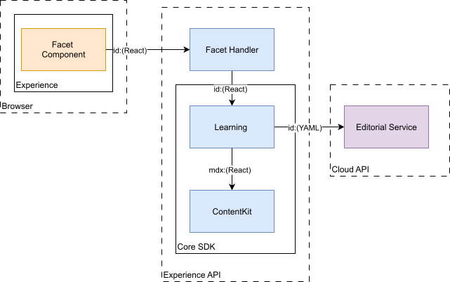
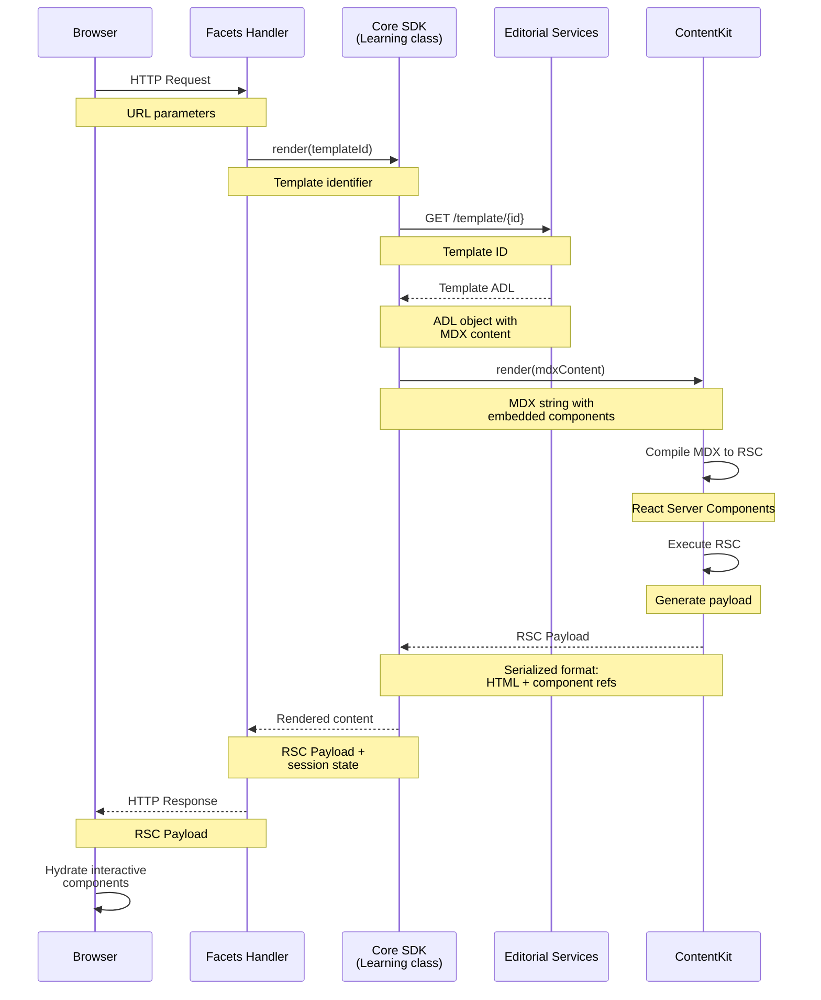
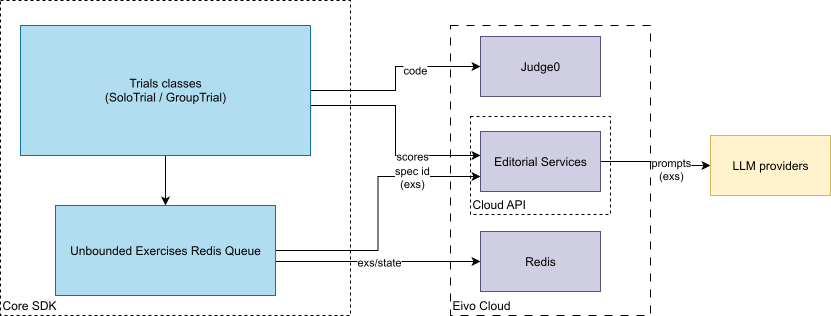
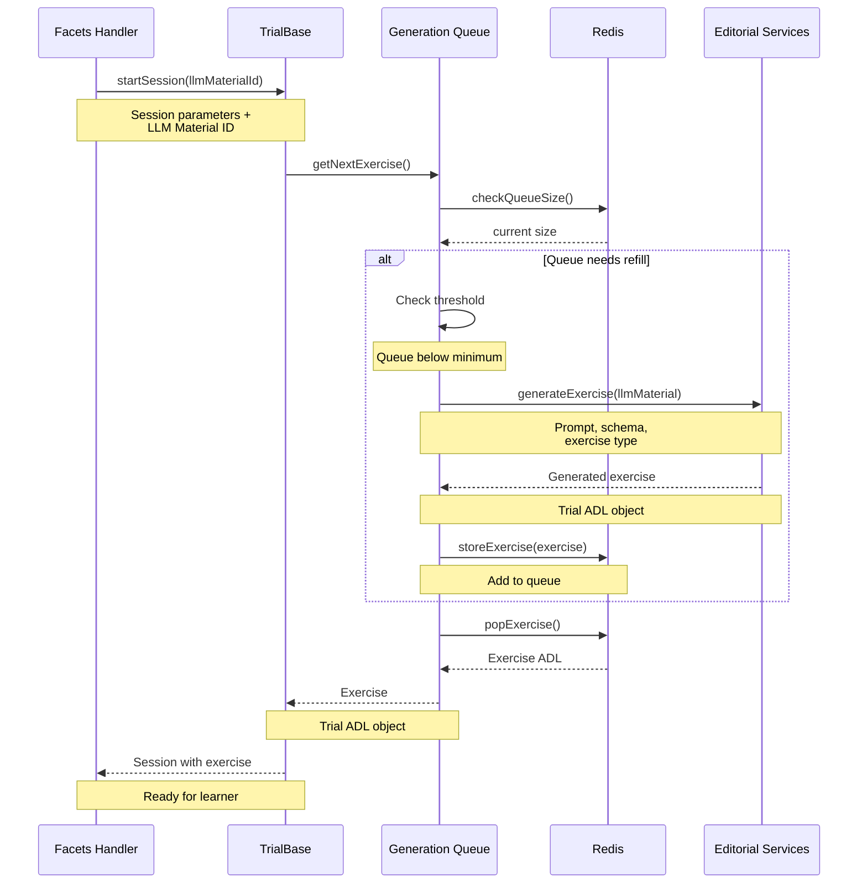
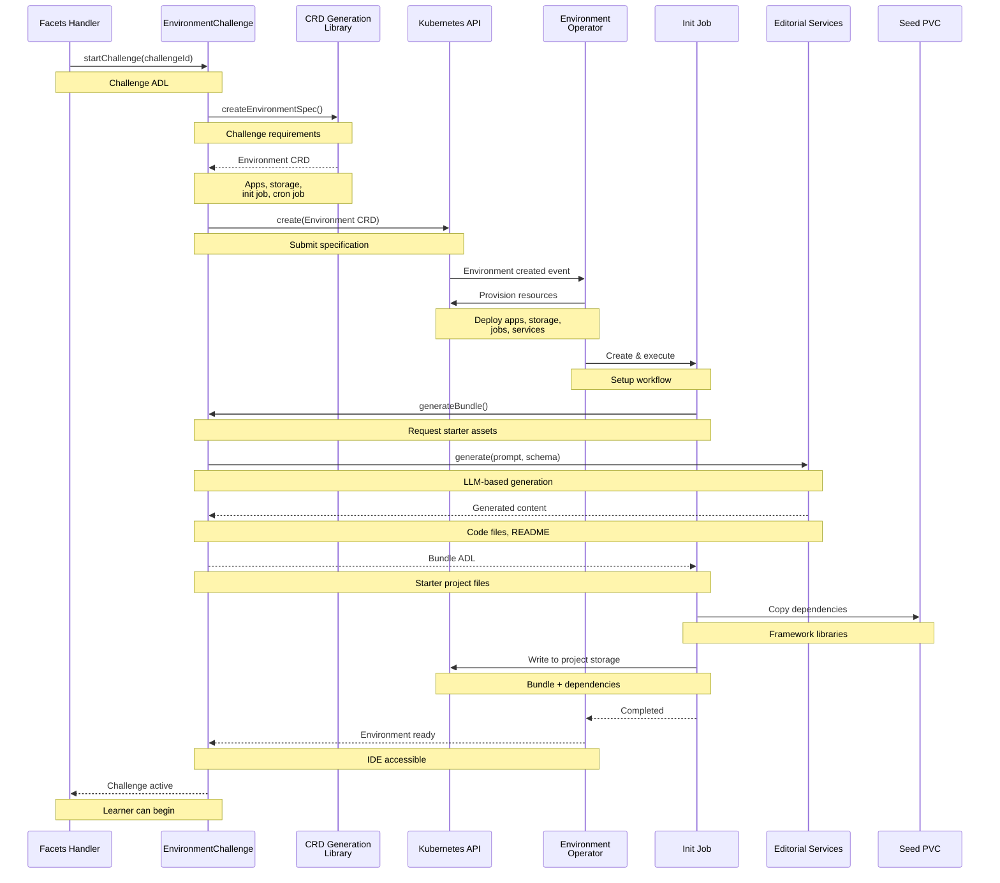
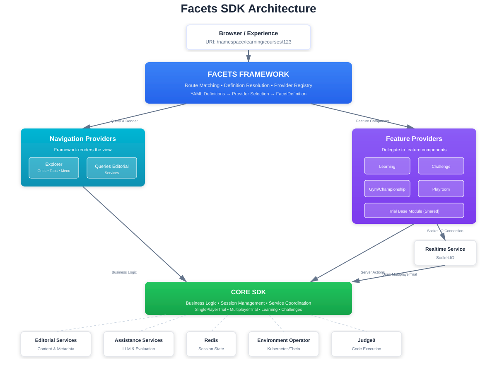
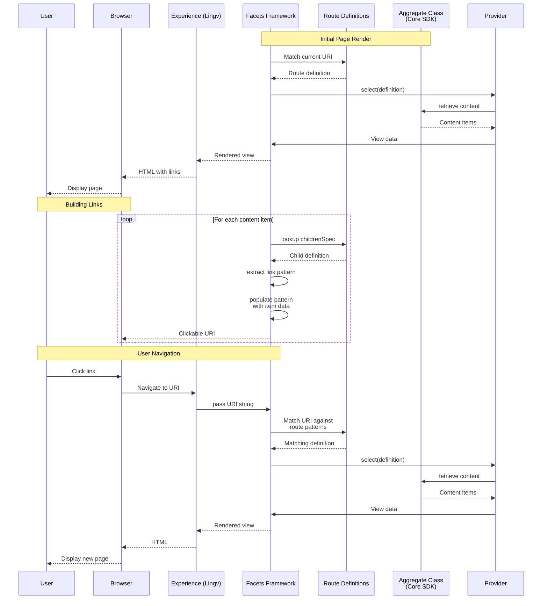
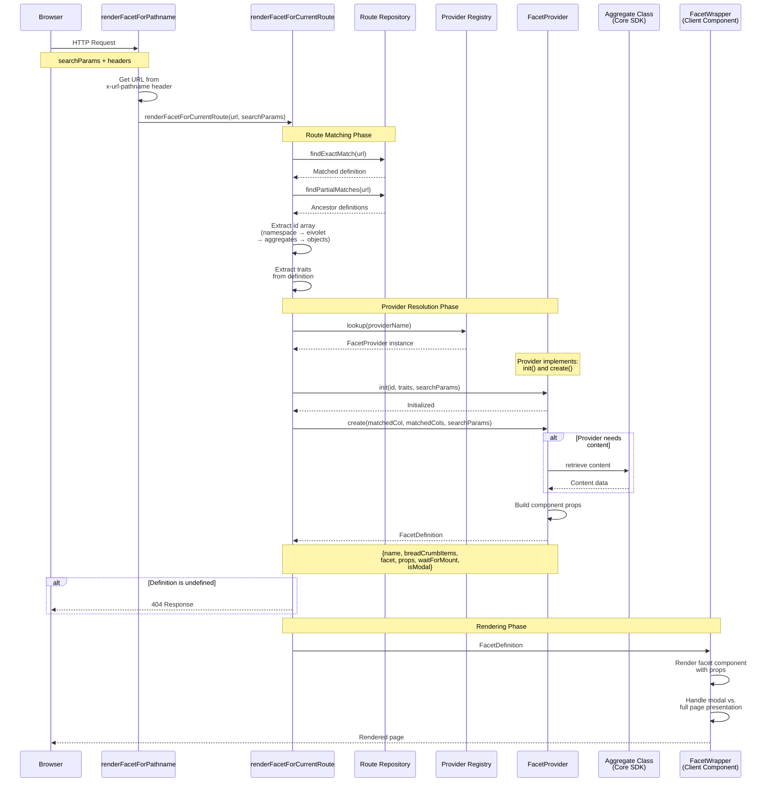
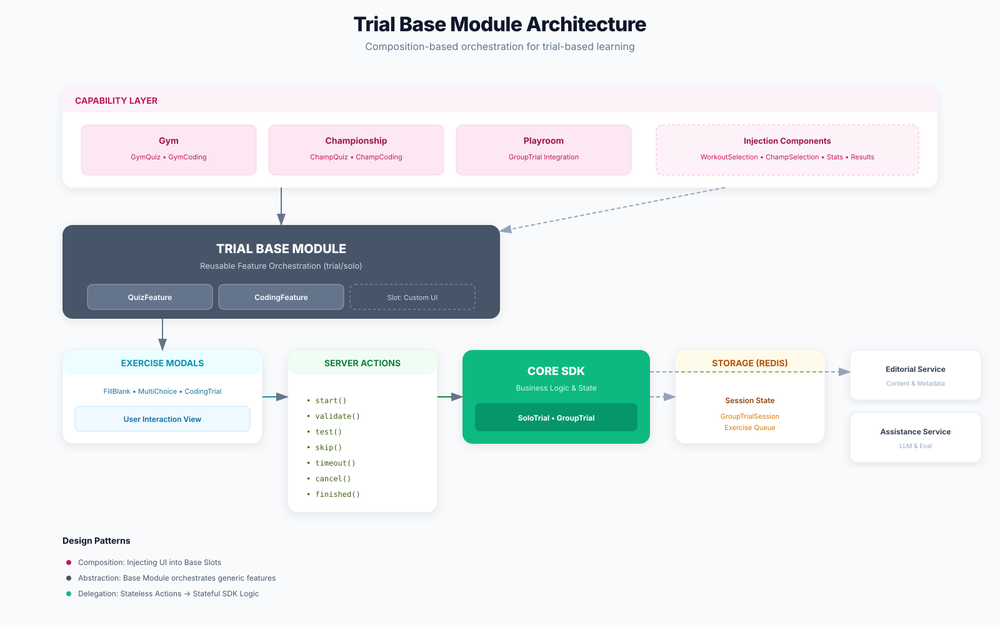

# Core SDK

The TypeScript-based Core SDK provides experience-agnostic business
logic and content rendering for learning capabilities. It is consumed by
Facets backend handlers to implement platform functionality.

This component provides:

- **Business logic**: Capability execution rules and workflows

- **Content processing**: Retrieves and processes content artifacts
  (Aggregates, Templates, LLM Material)

- **Content rendering**: Transforms content artifacts into renderable
  structures

- **State management**: Session state and data management

## Learning

The Learning class is central to the Core SDK, providing the complete
implementation of the Learning capability. It delivers access to
rendered instructional material while tracking learner progress through
the content and maintaining the state of all interactions with
**embedded exercises**.



### Template Artifact

A key ingredient to the Learning capability is the content to present to
the user. This is defined in the system by a Template spec. This spec is
an ADL object containing markdown content with embedded interactive
elements like exercises, diagrams, and code challenges. For instance, an
Eivolet that teaches French language will have a lesson template that
might include explanatory paragraphs about greetings, example dialogues,
and fill-in-the-blank exercises throughout.

Templates support multiple languages, storing content variants for
different cultures. The Learning class selects the appropriate variant
based on learner preferences.

``` yaml
model: template  
metadata:  
 name: greetingsIntroductionsLesson  
 namespace: lingv  
 kinds:  
   - lesson  
labels:  
 - culture: en-US  
   title: 'Lesson: Greetings and Introductions'  
   overview: >-  
    A foundational lesson on how to greet people and introduce yourself in  
    French.  
   tooltip: Greetings and Introductions Lesson  
   tags:  
     - lesson  
     - french  
 - culture: es  
   title: 'Lección: Saludos y Presentaciones'  
   overview: >-  
    Una lección fundamental sobre cómo saludar a la gente y presentarse en  
    francés.  
   tooltip: Lección Saludos y Presentaciones  
   tags:  
     - lección  
     - francés  
def:  
 type: lesson  
 format: markdown  
 content:  
   - culture: en-US  
     body: >-  
      ## Unit 1: Greetings and Introductions  
      ### Introduction  
      Welcome to your first French lesson! Learning how to greet people and  
      introduce yourself is fundamental to any conversation. Mastering these  
      basic phrases will build your confidence and open doors to communication  
    …

      ### Interactive Exercise: Greetings and Introductions  
      <FillBlankMultiExercise name="Unit 1: Greetings and Introductions-ex1">  
       <Statement>  
         {`This is a short exercise to practice greetings and introductions in French. Complete the sentences with the correct words.

         Person A: Bonjour ! Je [Fill:name1] Marie. Et vous ?  
         Person B: Je [Fill:name2] Paul. [Fill:greeting1] !

         Person A: Comment [Fill:question1] tu ?  
         Person B: Je [Fill:name3] bien, [Fill:phrase1].

         Person A: [Fill:phrase2] ! Je dois y aller.  
         Person B: [Fill:farewell1]. À bientôt !`}  
       </Statement>  
       <Solutions>  
         <Solution name="name1">  
           <Tip>Verb 's'appeler' conjugated for 'Je' (I)</Tip>  
           <Answer>m'appelle</Answer>  
         </Solution>  
         <Solution name="name2">  
           <Tip>Verb 's'appeler' conjugated for 'Je' (I)</Tip>  
           <Answer>m'appelle</Answer>  
         </Solution>  
         <Solution name="greeting1">  
           <Tip>A common greeting for the evening</Tip>  
           <Answer>Bonsoir</Answer>  
         </Solution>  
         <Solution name="question1">  
           <Tip>Verb 's'appeler' conjugated for 'tu' (you informal)</Tip>  
           <Answer>t'appelles</Answer>  
         </Solution>  
         <Solution name="name3">  
           <Tip>Verb 'aller' conjugated for 'Je' (I)</Tip>  
           <Answer>vais</Answer>  
         </Solution>  
         <Solution name="phrase1">  
           <Tip>A polite response to 'How are you?'</Tip>  
           <Answer>merci</Answer>  
         </Solution>  
         <Solution name="phrase2">  
           <Tip>An informal way to say 'Hi'</Tip>  
           <Answer>Salut</Answer>  
         </Solution>  
         <Solution name="farewell1">  
           <Tip>A common farewell</Tip>  
           <Answer>Au revoir</Answer>  
         </Solution>  
       </Solutions>  
      </FillBlankMultiExercise>

      ### Continue Learning

      To further enhance your French skills, explore these resources:  
…  
   - culture: es  
     body: >-  
      ## Unidad 1: Saludos y Presentaciones

      ### Introducción

      ¡Bienvenido a tu primera lección de francés! Aprender a saludar a la  
      gente y a presentarte es fundamental para cualquier conversación.  
    …

      ### Ejercicio Interactivo: Saludos y Presentaciones

      <FillBlankMultiExercise name="Unit 1: Greetings and Introductions-ex1">  
       <Statement>  
         {`Este es un breve ejercicio para practicar saludos y presentaciones en francés. Completa las oraciones con las palabras correctas.

         Persona A: Bonjour ! Je [Fill:name1] Marie. Et vous ?  
         Persona B: Je [Fill:name2] Paul. [Fill:greeting1] !

         Persona A: Comment [Fill:question1] tu ?  
         Persona B: Je [Fill:name3] bien, [Fill:phrase1].

         Persona A: [Fill:phrase2] ! Je dois y aller.  
         Persona B: [Fill:farewell1]. À bientôt !`}  
       </Statement>  
       <Solutions>  
         <Solution name="name1">  
           <Tip>Verbo 's'appeler' conjugado para 'Je' (Yo)</Tip>  
           <Answer>m'appelle</Answer>  
         </Solution>  
         <Solution name="name2">  
           <Tip>Verbo 's'appeler' conjugado para 'Je' (Yo)</Tip>  
           <Answer>m'appelle</Answer>  
         </Solution>  
         <Solution name="greeting1">  
           <Tip>Un saludo común para la tarde/noche</Tip>  
           <Answer>Bonsoir</Answer>  
         </Solution>  
         <Solution name="question1">  
           <Tip>Verbo 's'appeler' conjugado para 'tu' (tú informal)</Tip>  
           <Answer>t'appelles</Answer>  
         </Solution>  
         <Solution name="name3">  
           <Tip>Verbo 'aller' conjugado para 'Je' (Yo)</Tip>  
           <Answer>vais</Answer>  
         </Solution>  
         <Solution name="phrase1">  
           <Tip>Una respuesta educada a '¿Cómo estás?'</Tip>  
           <Answer>merci</Answer>  
         </Solution>  
         <Solution name="phrase2">  
           <Tip>Una forma informal de decir 'Hola'</Tip>  
           <Answer>Salut</Answer>  
         </Solution>  
         <Solution name="farewell1">  
           <Tip>Una despedida común</Tip>  
           <Answer>Au revoir</Answer>  
         </Solution>  
       </Solutions>  
      </FillBlankMultiExercise>

      ### Continuar Aprendiendo  
      Para mejorar aún más tus habilidades en francés, explora estos recursos:  
    …
```

#### Template Rendering

The Learning class renders these templates using **ContentKit**.
ContentKit processes the template's MDX content (markdown with embedded
React components), compiling it into React Server Components. These
components execute on the server and generate an **RSC Payload**---a
serialized format that encodes both rendered HTML and references to
client-side interactive components. When this payload reaches the
browser, React hydrates the interactive elements---exercises, diagrams,
and code challenges---while the instructional content remains as static
HTML. The result is a complete learning experience: server-rendered
content combined with functioning interactive components.

The diagram below shows a simplified high-level flow of template
rendering, from initial request through template retrieval, ContentKit
processing, and final payload delivery to the browser.




#### ContentKit

ContentKit is a shared package providing markdown rendering and
interactive component functionality across the platform. It supplies:

- MDX rendering engine using **next-mdx-remote-client/rsc** for
  server-side compilation of markdown with React component embedding\
- Interactive component library (FillBlankMultiExercise,
  ProgrammingExercise, Diagram, MnFlashcard)

### Interactive Component Support

The Learning class provides the backend functionality for all
interactive components embedded in templates. When learners interact
with exercises or code challenges, the class handles validation, state
management, and feedback generation.

For example, with embedded exercises, the Learning class validates
learner responses against expected answers, tracks completion status and
progress through the content, and generates immediate feedback for each
submission.

### Integration

Facets handlers call the Learning class with a **material** identifier
that references the **namespace**, **eivolet** and **template** to use.
The class retrieves template artifacts, renders them through ContentKit,
and returns structured output containing instructional content and
interactive components ready for display in experience pages.

## Trials

The Trials classes implement exercise-based learning activities with
binary evaluation (correct/incorrect) and immediate feedback. These
classes manage exercise sessions where learners respond to various
exercise types---fill-in-the-blank questions, multiple choice,
programming exercises---and receive instant evaluation results. The
system supports both individual practice sessions and real-time
collaborative group activities through a class hierarchy built on a
common foundation.

### TrialBase

The **TrialBase** class is an abstract base class in the Core SDK that
defines the foundation for **trial-based learning activities**. It
provides the core implementation for exercise sessions with binary
evaluation (correct/incorrect) and immediate feedback, tracking learner
attempts and maintaining session state throughout the learning process.
Session state could be persisted in **Redis**, enabling state recovery
and supporting distributed session management. Two concrete
implementations extend this base: **SoloTrial** for individual learning
and **GroupTrial** for real-time collaborative sessions.



#### Trial Artifacts

A key component of the Trials capability is the trial specification that
defines the exercise. This is an ADL object containing the exercise
statement, expected answer, and feedback parameters. The answer format
depends on the exercise type---text strings for fill-in-the-blank, test
cases with input and expected output for programming exercises, selected
options for multiple choice. For instance, an Eivolet teaching
vocabulary might have trial exercises for word translations, verb
conjugations, or fill-in-the-blank sentences.

```yaml
model: exercise
metadata:
  extra:
    archetype: fill_blank
def:
  statement: Je [answer] très heureux.
  answer: suis
  tip: Use 'être' in first person singular.
```

#### Trial Sessions

The Trials class receives session configuration from the Facets handler
and manages exercise sessions accordingly. Each session handles learner
attempts, evaluates responses against expected answers defined in the
trial ADL object, and provides immediate binary feedback---correct or
incorrect. Sessions track all attempts, maintaining the complete history
of learner interactions with the exercise.

Sessions can be configured with parameters that control behavior and
constraints:

- **Total duration**: Overall time limit for the session

- **Max number of errors**: Maximum incorrect answers before termination
  (SoloTrial only)

- **Time per exercise**: Individual exercise time constraints

- **Exercise validation**: Answer validation logic for different
  exercise types

##### Programming Exercise Configuration

For coding exercises, the class provides specialized configuration to
control the development and testing workflow:

- **Test case visibility**: Whether to show test cases used for
  validation

- **Pre-submission execution**: Allow code execution before submitting
  final answer

- **Testing attempts**: Number of times code can be tested before
  submission

#### Exercises Evaluation

The trial-based classes evaluate each **learner response**, comparing it
against the expected answer defined in the trial specification.
Evaluation produces binary results (correct/incorrect) with immediate
feedback. The class maintains attempt counts, success rates, and session
progress as learners work through the exercises.

Programming exercises are evaluated using **Judge0**, an external code
execution and validation service that runs submitted code against test
cases and returns execution results.

#### Dynamic Exercise Generation

##### LLM Material for trials

Trial sessions can operate with exercises generated dynamically using
**LLM Material** specifications. An LLM Material is an ADL object that
defines the parameters for AI-based exercise generation---the prompt for
content generation, the schema for the expected output structure, and
the exercise type. Instead of using pre-authored trial ADL objects with
fixed exercises, the system uses LLM Material specifications to generate
fresh exercises on-demand during active sessions.

``` yaml
model: llmmaterial  
metadata:  
 name: frenchA1GreetingsFillBlankExercises  
 namespace: lingv  
 kinds:  
   - exercise  
   - fill_blank  
labels:  
 - culture: en-US  
   title: French A1 Greetings & Introductions - Fill in the Blank  
   overview: >-  
    Fill-in-the-blank exercises to practice basic French greetings,  
    introductions, and common courtesy phrases.  
   tooltip: French Fill-in-the-Blank Exercises  
   tags:  
     - french  
     - a1  
 - culture: es  
   title: Francés A1 Saludos y Presentaciones - Rellenar huecos  
   overview: >-  
    Ejercicios de rellenar huecos para practicar saludos básicos,  
    presentaciones y frases de cortesía comunes en francés.  
   tooltip: Ejercicios de rellenar huecos en francés  
   tags:  
     - francés  
     - a1  
def:  
 type: exercise  
 schema: fill_blank_schema  
 prompts:  
   - >-  
    Create 3 distinct fill-in-the-blank exercises for French A1 beginners  
    focusing on greetings and introductions. Each exercise should consist of  
    2-3 short, contextual paragraphs with 5-9 blanks. Blanks should test  
    knowledge of common greetings (Bonjour, Bonsoir, Salut), farewells (Au  
    revoir, À bientôt), introductions (Je m'appelle, Comment vous  
    appelez-vous/t'appelles-tu), and courtesy phrases (Merci, S'il vous plaît,  
    De rien, Pardon). Ensure the context is natural and the vocabulary is  
    appropriate for A1 level. Include helpful tips for each blank.  
   - >-  
    Generate a set of 3 fill-in-the-blank exercises for elementary French  
    learners (A1). The exercises should cover dialogues for meeting someone,  
    asking names, and saying goodbye. Use simple sentence structures and  
    common A1 vocabulary. Each exercise should have 5-9 blanks embedded within  
    natural, short paragraphs. Provide a tip for each blank.  
   - >-  
    Develop 3 fill-in-the-blank exercises for French A1 learners focusing on  
    the unit 'Greetings and Introductions'. The exercises should be practical,  
    simulating real-life conversations. Blanks should test conjugations of  
    'être' and 's'appeler' in context, as well as essential phrases like  
    'Enchanté', 'S'il vous plaît', and 'Merci'. Ensure clear context and  
    provide a hint for each missing word.
```

##### Generation Flow

During an active trial session, learners work through a series of
exercises. The trial class retrieves each exercise from a generation
queue stored in Redis. This queue pre-buffers exercises to ensure
immediate availability when learners request the next question or coding
problem. The queue monitors its own inventory level. When the number of
buffered exercises falls below a threshold, the queue automatically
requests Editorial Services to generate additional exercises. Editorial
Services orchestrates LLM-based content creation through the Foundry
Engine, using the LLM Material specification (prompt, schema, exercise
type) to produce new trial ADL objects. These generated exercises are
added to the Redis queue, maintaining a steady supply for the ongoing
session. The following diagram illustrates this flow at a high level,
showing how the trial class, generation queue, Redis storage, and
Editorial Services coordinate to provide continuous exercise
availability.


### SoloTrial

SoloTrial implements the Trials capability for individual learning
sessions. It is mainly used to create experiences where a single user
participates in activities, it powers capabilities like **Gym** and
**Championship** where learners work independently through exercise
sets. The class implements all TrialBase functionality for individual
sessions, including error limits that terminate sessions when learners
exceed the maximum allowed incorrect answers.

### GroupTrial

GroupTrial implements the Trials capability for collaborative real-time
sessions. Used to create experiences where multiple users participate
simultaneously, it powers the **Playrooms** capability where learners
compete or collaborate in shared exercise sessions.

The class implements all base Trials functionality with additional group
features:

- **Session Participant Management**: Tracks all active participants and
  their individual progress throughout the session. Maintains the list
  of active participants, tracks individual progress and state, and
  handles participant join/leave events.

- **Session Leaderboard**: Maintains real-time competitive rankings for
  the duration of the session. Updates scores and positions as
  participants complete exercises, providing competitive feedback during
  active sessions.

### Guardians

Trial sessions use guardian classes to enforce rules and manage access.
The **GroupTrialGuardian** monitors session state during trials,
tracking metrics like error counts and elapsed time. It enforces
termination conditions defined in the session parameters---maximum
errors allowed, total duration limits, and other constraints that
determine when a session should end.

For group sessions, the **GroupTrialSessionGuardian** controls session
access by validating passcodes. When learners attempt to join a group
session, this guardian compares the provided passcode against the
session's original code, allowing or denying entry based on the match.

### Integration

Facets handlers call the Trials classes with trial identifiers and
learner responses. The classes retrieve trial specifications, evaluate
the responses, update session state, and return evaluation results with
feedback ready for display in experience pages.

## Challenges

The Challenges classes provide the implementation for extended multi-day
assignment activities. These classes manage comprehensive workflows from
content generation through evaluation and feedback, supporting various
assignment types through a class hierarchy.

### Lifecycle

Challenges progress through a multi-stage lifecycle:

1.  **Generation**: Creates challenge content (statement, requirements,
    evaluation criteria) using Editorial Services from Cloud API

2.  **Acceptance**: Validates generated challenge structure, supports
    regeneration workflow if needed

3.  **Preparation**: Type-specific setup (environment provisioning for
    coding, draft initialization for writing)

4.  **Active Period**: Learners work on their submissions over multiple
    days

5.  **Submission**: Receives and validates submissions

6.  **Evaluation**: Sends submissions to Assistance Services from Cloud
    API for LLM-based analysis and feedback generation

### Challenge Specifications

Challenges are defined by Challenge ADL objects that contain the
complete assignment definition---statement, requirements, evaluation
criteria, time constraints, and type-specific parameters. For writing
challenges, this includes word count limits and formatting requirements.
For environment challenges, this specifies the infrastructure type,
required assets, and submission requirements.

``` yaml
model: challenge  
metadata:  
  name: french_a1_essay  
  extra:  
    archetype: writing  
def:  
  duration: 7d  
  statement: >-  
   Compose a 200-word essay in French about yourself or activities.  
  evaluation:  
    prompt: >-  
     Evaluate grammar, vocabulary, and organization. Provide feedback.  
    criteria:  
      words:  
        min: 150  
        max: 250
```

#### Dynamic Challenge Generation

Challenges can be generated dynamically using **LLM Material**
specifications. An LLM Material is an ADL object that defines the
parameters for AI-based challenge generation---the prompt for content
creation, the schema for the expected output structure, and the
challenge type. Instead of using pre-authored Challenge ADL objects, the
system uses LLM Material specifications to generate tailored challenges
on-demand during the generation phase of the lifecycle.

``` yaml
model: llmmaterial  
metadata:  
 name: react_component_challenge_generator  
 namespace: lingv  
 kinds:  
   - challenge  
   - programming  
 extra:  
   traits:  
     progLang: typescript  
     platform: react  
     runtime: node  
labels:  
 - culture: en-US  
   title: React Component Challenge Generator (TS)  
   overview: >-  
    Generates extended programming challenges focusing on practical React  
    development using TypeScript, involving component state, prop passing, and  
    structural design.  
   tooltip: React TS Challenges  
   tags:  
     - react  
     - typescript  
     - challenge  
     - programming  
     - component-design  
def:  
 type: challenge  
 schema: programming_challenge_schema  
 prompts:  
   - >-  
    Generate a programming challenge that requires the user to build a  
    reusable, functional React component using TypeScript. The challenge  
    should focus on defining and passing strongly-typed props via a TypeScript  
    interface and rendering dynamic content based on those props. Include  
    requirements for component structure, file organization, and clear  
    evaluation criteria for type correctness and functional requirements.  
   - >-  
    Design a multi-day coding challenge for a beginner React/TypeScript user  
    that involves two connected components (a parent and a child). The  
    challenge must require lifting state up to the parent component and  
    passing handler functions down to the child component as props, ensuring  
    all interactions and state updates are correctly typed using TypeScript  
    interfaces.  
   - >-  
    Create a React programming challenge that requires the user to render a  
    dynamic list of objects (e.g., a list of users or products). The solution  
    must utilize the map function to iterate over data, ensure proper usage of  
    the 'key' prop for list items, and manage the underlying data structure  
    using a `useState` hook with a defined TypeScript array type. Evaluation  
    should assess list rendering, key usage, and type safety.
```

Challenge generation is performed through **Editorial Services** from
Cloud API, which orchestrates LLM-based content creation using the
Foundry Engine. Generated challenges are returned as Challenge ADL
objects conforming to their respective type specifications, ready to
enter the acceptance phase of the lifecycle.

The ChallengeBase class and its subclasses consume Challenge ADL objects
regardless of their origin, providing a consistent interface for both
pre-authored and dynamically generated challenges.

### ChallengeBase

ChallengeBase is the abstract base class implementing core challenge
functionality for individual learners. It provides foundational
lifecycle management---generation, acceptance, timing, submission
handling, and evaluation coordination---that all challenge types share.

### WritingChallenge

**WritingChallenge** extends **ChallengeBase** for text-based
assignments---essays, reports, creative writing. The class manages draft
persistence in **Redis** throughout the challenge duration.

Learners compose their work through a **rich text editor** component
that **Facets** provides to experiences. The component offers formatting
capabilities (bold, italic, headings, lists), word count tracking, and
auto-save functionality. As learners write, content continuously syncs
to the **WritingChallenge** class, which stores drafts in the storage.

When learners submit, the class validates basic criteria (word count
requirements, content presence), then sends the text to **Assistance
Services** from Cloud API for evaluation against challenge criteria.
Assistance Services generate comprehensive feedback that the class
stores and makes available to learners.

### EnvironmentChallenge

**EnvironmentChallenge** extends **ChallengeBase** for assignments
requiring provisioned infrastructure **environments**. The class is
generic, supporting any environment type---development environments,
database systems, data analysis platforms, infrastructure simulations.
The class manages environment provisioning, project initialization, and
file-based submissions regardless of the specific infrastructure
configuration.

After challenge generation, the class uses **Editorial Services** from
Cloud API to generate environment-specific assets. For a web development
challenge, this might be TypeScript configurations, build tools, and
starter components. For a data science challenge, this could be Jupyter
notebooks, datasets, and Python libraries. For a database challenge,
this might be schema definitions and seed data.

The class uses the **CRD Generation Library** to create an Environment
specification matching the challenge requirements, then submits it to
Kubernetes where the **Environment Operator** provisions the
infrastructure. (See Environment Provisioning System section for
infrastructure details.)

#### Seed Data Management

Challenge environments require pre-populated dependencies and framework
files to provide learners with a functional starting point. The platform
uses **Seed PVCs** (Persistent Volume Claims) to store these common
assets---framework libraries, build tools, language runtimes, and
boilerplate configurations organized by technology stack.

During environment provisioning, the initialization Job copies the
appropriate seed files from the Seed PVC into the project's persistent
storage. For example, a React/TypeScript challenge copies Node.js
modules, TypeScript compiler configurations, and React dependencies from
the `eivo-seeds` PVC. This approach enables fast environment
initialization by avoiding repeated downloads of large dependency
packages, while ensuring all environments start with consistent, tested
foundation files.

Seed data is organized by technology stack and environment type, with
separate directories for different frameworks and runtime versions.
Platform administrators maintain and update seed data independently of
individual challenges, allowing dependency updates to propagate across
all future challenge environments.

#### Coding Challenges

For coding challenges, the class provisions development environments
with integrated IDEs. The class creates an Environment CRD specifying
the IDE application, language runtimes, persistent storage for the
project, and an initialization Job.

The Environment Operator creates this initialization Job, which executes
the project setup workflow. The Job calls the Challenge class to
generate a **Bundle**---an ADL object containing the starter code files
and README.md that bootstrap the project. The Job then copies framework
dependencies and libraries from a seed PVC into the project's persistent
storage. This initialization Job completes the entire environment setup
before learners access the IDE.

Learners write code in the IDE, which runs as a containerized
application in the provisioned Kubernetes environment. The IDE provides
a complete development experience---code editor, terminal, file
explorer. Experiences embed the IDE as an iframe, giving learners direct
access while maintaining the experience's overall interface. All work
persists to the environment's storage throughout the challenge duration.

##### React/TypeScript Challenges

For web development challenges teaching React and TypeScript,
environments are configured with Theia IDE and Node.js runtimes. The
initialization Job generates a Bundle containing React component
templates, TypeScript configurations, and build tool setups, then copies
the Node.js ecosystem dependencies from the seed PVC.

#### Challenge Environment Provisioning Flow

The following diagram shows the high-level flow of environment
provisioning, from challenge initiation through resource creation,
starter asset generation, and final environment readiness. This is a
simplified representation of the orchestration between
EnvironmentChallenge, the Environment Operator, and the initialization
workflow.



#### Environment Operations

EnvironmentChallenge can execute predefined commands within the
environment's pods---installing dependencies, running builds, executing
tests, or performing any setup required during the challenge lifecycle.
The class uses **Commands ADL objects** matched to the environment's
archetype and traits to retrieve the appropriate command sequences for
each operation.

Commands ADL objects define standard operations (initialize, compile,
run, runTest) with their command-line sequences. The class substitutes
environment-specific variables (like project directory paths) into these
commands before executing them within the environment's containers. This
capability works across any environment type, enabling
environment-specific operations tailored to each technology stack.

#### Submission and Evaluation

When learners submit their work, the class collects files from the
environment's persistent storage. For coding challenges, this includes
source code, configurations, and assets. For data challenges, this might
include analysis results and notebooks. The complete submission is sent
to **Assistance Services** from Cloud API for evaluation, which analyzes
the work against challenge criteria and generates comprehensive
**feedback**.

#### Environment Lifecycle Management

The class manages the environment throughout the challenge duration. The
Environment Operator creates a CronJob alongside the environment that is
scheduled to execute at the challenge expiration time, using
`kubectl delete environment` to remove all provisioned resources.

#### Integration

Facets handlers call the Challenges classes to manage challenge
workflows. WritingChallenge handles text assignments with Redis-backed
draft storage and text submission. EnvironmentChallenge handles coding
projects with environment provisioning, asset generation through
Editorial Services, pod command execution, and file-based submission.
Both coordinate evaluation through Assistance Services, returning
results and feedback to handlers for display in experience pages.

## Flashcard

[WIP]

# Environment Provisioning System

The platform provides infrastructure for provisioning complex learning
environments required by certain learning activities. An environment is
a provisioned set of infrastructure resources---compute, storage,
services, tools---that learners interact with to complete learning
objectives.

### What Environments Are

Environments are isolated infrastructure configurations tailored to
specific learning needs. Simple challenges---writing assignments,
essays, reports---require only a text editor to compose and submit their
work. However, many learning activities require actual infrastructure
provisioning.

Consider these examples:

- A web development challenge requires a Node.js runtime, package
  manager, development server, and database to build and test an
  application

- A data analysis exercise needs a Jupyter notebook environment with
  Python libraries, datasets, and visualization tools

- A DevOps challenge requires multiple containers, orchestration tools,
  and CI/CD pipelines

- A database course needs a running database instance where learners
  execute queries and observe results

- A cloud infrastructure course requires actual cloud resources where
  learners deploy and configure services

These scenarios demand provisioned infrastructure that learners can work
within---complete environments, not just editors.

### Environment Operator

The Environment Operator is a generic Kubernetes operator that manages
learning environment lifecycles. The operator provides a flexible
Environment CRD that defines infrastructure provisioning capabilities.

#### CRD Capabilities

The Environment CRD is a comprehensive specification providing
fine-grained control over environment infrastructure. The CRD structure:

``` yaml
apiVersion: sandbox.eivo.ca/v1  
kind: Environment  
metadata:  
 name: [environment-id]  
 namespace: [namespace]  
 labels:  
   eivo: v1  
   humanId: [human-readable-id]  
spec:  
 cleaner:  
   serviceAccountName: [cleaner-service-account]  
   schedule: [cron-schedule]  
   timeZone: [timezone]  
   expirationString: [expiration-datetime]  
   image: [kubectl-image]  
 project:  
   name: [project-name]  
   projectDirSize: [storage-size]  
   projectDir: [mount-path]  
 initJob:  
   commands: [initialization-commands]  
   supportMount: [volume-mounts]  
   spec: [job-specification]  
 app:  
   image: [container-image]  
   ingressPort: [port]  
   command: [startup-command]  
   imagePullSecrets: [registry-secrets]  
   ports: [port-configurations-with-hostnames]  
   serviceAccountName: [service-account]  
   podSecurityContext: [pod-security-settings]  
   containerSecurityContext: [container-security-settings]  
   resources: [resource-limits]  
   env: [environment-variables]  
   extraVolumes: [additional-volumes]  
 runner:  
   image: [runner-image]  
   ports: [port-configurations-with-hostnames]  
   command: [runner-command]  
   args: [runner-arguments]  
   resources: [resource-limits]
```

The CRD provides detailed configuration for:

**App Deployment**: The primary application that learners interact
with---an IDE for coding challenges, a database management tool for
database assignments, or a Jupyter environment for data analysis tasks.
Complete deployment configuration including container image, startup
commands, port mappings with ingress hostnames, resource requests and
limits, security contexts (user/group permissions, filesystem
restrictions), service accounts, and environment variables for runtime
configuration. For Theia environments, this deploys the IDE with Node.js
runtimes, configures authentication integration, and exposes both the
IDE interface and debug ports through separate ingresses.

**Storage Configuration**: Specifies persistent storage including size
and mount paths. The project directory stores learner work and persists
throughout the environment lifecycle. Additional volume mounts support
temporary storage, configuration directories, and shared seed data.

**Initialization Job**: Defines a complete Kubernetes Job specification
that prepares the environment. The job can mount support volumes for
accessing seed files, execute multiple commands (copying starter code,
setting file permissions), and access platform services (Cloud API,
Redis) through environment variables.

**Runner Deployment**: Provisions an optional execution pod with its own
resource limits, networking, and ingress configuration. Runners provide
isolated execution contexts when the App environment cannot or should
not execute user code directly.

**Cleaner (TTL)**: Specifies environment expiration through a cron
schedule with timezone support. The operator creates a CronJob that
automatically deletes all environment resources at the specified time,
preventing resource accumulation.

**Accessory Services (planned)**: Will support deployment of auxiliary
infrastructure like PostgreSQL databases, Redis caches, or message
queues required by specific challenges.

The operator watches for Environment custom resources, provisions the
specified infrastructure, monitors environment health, and executes
cleanup when environments expire.

##### Example: React/TypeScript Development Environment

The following CRD demonstrates a complete environment configuration for
React/TypeScript coding challenges. This environment deploys Theia IDE
with **Node.js** runtimes, configures persistent storage for project
files, initializes the workspace with starter code and dependencies, and
sets up automatic cleanup. This template is used by the Challenges class
when provisioning environments for web development learning activities.

``` yaml
group: sandbox.eivo.ca  
version: v1  
kind: Environment  
plural: environments  
metadata:  
 name: puny04n92  
 namespace: default  
 labels:  
   eivo: v1  
   humanId: puny  
spec:  
 cleaner:  
   serviceAccountName: environment-cleaner  
   schedule: 47 15 12 1 *  
   timeZone: Canada/Eastern  
   expirationString: 1/12/2026, 3:47:36 PM  
   image: k8s.gcr.io/kubectl:v1.30.1  
 project:  
   name: puny04n92  
   projectDirSize: 5Gi  
   projectDir: /workspace/project  
 initJob:  
   commands:  
     - >-  
      cp -a /mnt/files/environments-seeds/links/ts-rect-node/.  
      /workspace/project  
     - chown -R 1000:1000 /workspace/project  
   supportMount:  
     mount:  
       name: filesdir  
       mountPath: /mnt/files  
     volume:  
       name: filesdir  
       persistentVolumeClaim:  
         claimName: eivo-seeds  
   spec:  
     spec:  
       template:  
         spec:  
           imagePullSecrets:  
             - name: reg-cred-secret  
           containers:  
             - name: init-container  
               image: reg.jobico.local/lingv-environment-job:latest  
               imagePullPolicy: Always  
               serviceAccountName: environment-poweruser  
               env:  
                 - name: PROJECT_DIR  
                   value: /workspace/project  
                 - name: KV_STORE_HOST  
                   value: redis.default  
                 - name: KV_STORE_PORT  
                   value: '6379'  
                 - name: EIVO_API  
                   value: http://eivo-cloud-api.default  
                 - name: CHALLENGE_ID  
                   value: >-  
                    environment:challenge:iAnTAkkOURlHnM4-Ha3Gi4PiRgw:99963cd7-57c3-4600-8d77-76c250cf76a7  
                 - name: USER_ID  
                   value: '346401111538401314'  
                 - name: NAMESPACE  
                   value: default  
           restartPolicy: OnFailure  
       backoffLimit: 3  
 app:  
   image: reg.jobico.local/lingv-environment-ide:latest  
   ingressPort: 80  
   command:  
     - npm  
     - run  
     - start:browser  
   imagePullSecrets:  
     - reg-cred-secret  
   ports:  
     - port:  
         containerPort: 3003  
         protocol: TCP  
         name: http  
       hostname: apppuny04n92.jobico.local  
     - port:  
         containerPort: 3000  
         protocol: TCP  
         name: debhttp  
       hostname: debapppuny04n92.jobico.local  
   serviceAccountName: environment-poweruser  
   podSecurityContext:  
     runAsUser: 1000  
     runAsGroup: 1000  
     fsGroup: 1000  
   containerSecurityContext:  
     readOnlyRootFilesystem: true  
     allowPrivilegeEscalation: false  
   resources:  
     requests:  
       memory: 1Gi  
       cpu: 500m  
     limits:  
       memory: 2Gi  
       cpu: 1500m  
   env:  
     - name: HOME  
       value: /home/theia  
     - name: JWKS_URI  
       value: https://id.jobico.local/oauth/v2/keys  
     - name: JWT_ISSUER  
       value: https://id.jobico.local  
     - name: JWT_AUDIENCE  
       value: '346403198690459683'  
     - name: USE_MOCK  
       value: 'false'  
     - name: KV_STORE_HOST  
       value: redis.default  
     - name: KV_STORE_PORT  
       value: '6379'  
     - name: EIVO_API  
       value: http://eivo-cloud-api.default  
   extraVolumes:  
     - mount:  
         name: evaldir  
         mountPath: /mnt/eval  
       volume:  
         name: evaldir  
         persistentVolumeClaim:  
           claimName: challenge-eval  
     - mount:  
         name: tmp-volume  
         mountPath: /tmp  
       volume:  
         name: tmp-volume  
         emptyDir:  
           medium: Memory  
     - mount:  
         name: theia-config-volume  
         mountPath: /home/theia/.theia  
       volume:  
         name: theia-config-volume  
         emptyDir:  
           medium: Memory  
     - mount:  
         name: seeds  
         mountPath: /mnt/seeds  
         readOnly: true  
       volume:  
         name: seeds  
         persistentVolumeClaim:  
           claimName: eivo-seeds  
 runner:   
   image: node:18  
   ports:  
     - port:  
         name: http  
         containerPort: 3000  
         protocol: TCP  
       hostname: runnerpuny04n92.jobico.local  
   command:  
     - /bin/sh  
   args:  
     - '-c'  
     - tail -f /dev/null  
   resources:  
     requests:  
       memory: 512Mi  
       cpu: 250m  
     limits:  
       memory: 1Gi  
       cpu: 1000m
```

#### CRD Generation Library

The **CRDForge** class is a TypeScript package that renders Environment
CRD specifications from templates. During initialization, the class
loads CRD Templates from the filesystem and builds a registry organized
by archetype and traits.

**CRD Templates** are defined as ADL objects stored on the filesystem
(see example) that specify all components needed for an environment
type:

- **Header and metadata**: CRD group, version, kind, and namespace\
- **Project configuration**: Storage size, directory structure\
- **Init Job specification**: Setup commands, volume mounts, container
  configuration, environment variables\
- **App deployment**: IDE or tool container with ports, ingress
  hostnames, security contexts, resource limits\
- **Runner configuration**: Additional execution environments
  (optional)\
- **Cleaner specification**: CronJob for environment cleanup with
  schedule and expiration

Templates are organized by **archetype** (e.g., "challenge") and
**traits** (e.g., `progLang: typescript`, `runtime: node`,
`platform: react`). When Core SDK classes need to provision an
environment, they call CRDForge with the archetype, traits, and a
**ConfigDatasource** containing the environment-specific parameters
(namespace, challenge ID, user ID, hostnames, storage paths, etc.). The
ConfigDatasource consolidates values from **Config ADL objects** (which
define defaults and infrastructure configuration) along with runtime
parameters (namespace, challenge ID, user ID, hostnames, storage paths,
etc.). CRDForge uses the traits to select the matching template from its
registry, renders it by substituting the template variables with values
from the ConfigDatasource, and returns a complete Environment CRD
specification as a string ready for submission to Kubernetes.

``` yaml
model: crdtemplate  
metadata:  
 name: nodejs-typescript  
 namespace: lingv  
 extra:  
   archetype: challenge  
   traits:  
     progLang: typescript  
     runtime: node  
     platform: react  
def:  
 {:header-spec}  
 {:metadata-spec}  
 spec:  
   cleaner:  
     serviceAccountName: {&cleaner-account-name}  
     schedule: "{&environment-ttl-schedulle}"  
     timeZone: "{&ttl-timezone}"  
     expirationString: "{&ttl-string}"  
     image: {&cleaner-image}  
   {:project-challenge}  
   {:job-challenge}  
   {:app-challenge}  
   runner:  
     image: node:18  
     ports:  
       - port:  
           name: http  
           containerPort: 3000  
           protocol: TCP  
         hostname: "{&host-runner}"  
     command:  
       - /bin/sh  
     args:  
       - -c  
       - tail -f /dev/null  
     resources:  
       requests:  
         memory: 512Mi  
         cpu: 250m  
       limits:  
         memory: 1Gi  
         cpu: 1000m  
---  
model: crdtemplate  
metadata:  
 name: header-spec  
def:  
 group: sandbox.eivo.ca  
 version: v1  
 kind: Environment  
 plural: environments  
---  
model: crdtemplate  
metadata:  
 name: metadata-spec  
def:  
 metadata:  
   name: {&environment-name}  
   namespace: {&infra.namespace}  
   labels:  
     eivo: v1  
     {&labels}  
---  
model: crdtemplate  
metadata:  
 name: project-challenge  
def:  
 project:  
   name: {&environment-name}  
   projectDirSize: "{&project.storage-size}"  
   projectDir: {&project.dir}  
---  
model: crdtemplate  
metadata:  
 name: image-pull-secrets  
def:  
imagePullSecrets:  
 - name: reg-cred-secret  
---  
model: crdtemplate  
metadata:  
 name: job-challenge  
def:  
 initJob:  
   commands:  
     - cp -a {&project.filesDir}/{&project.filesPvcDir}/{&project.dirLinks}/. {&project.dir}  
     - chown -R 1000:1000 {&project.dir}  
   supportMount:  
     mount:  
       name: filesdir  
       mountPath: {&project.filesDir}  
     volume:  
       name: filesdir  
       persistentVolumeClaim:  
           claimName: {&project.filesPvc}  
   spec:  
     spec:  
       template:  
         spec:  
           imagePullSecrets:  
             - name: "reg-cred-secret"  
           containers:  
             - name: init-container  
               image: reg.jobico.local/lingv-environment-job:latest  
               imagePullPolicy: Always  
               serviceAccountName: {&runner-account-name}  
               env:  
                 - name: PROJECT_DIR  
                   value: "{&project.dir}"  
                 - name: KV_STORE_HOST  
                   value: "{&infra.redis.host}"  
                 - name: KV_STORE_PORT  
                   value: "{&infra.redis.port}"  
                 - name: EIVO_API  
                   value: "{&infra.cloud.uri}"  
                 - name: CAPABILITY_ID  
                   value: "{&capability-id}"  
                 - name: USER_ID  
                   value: "{&user-id}"  
                 - name: NAMESPACE  
                   value: "{&infra.namespace}"  
           restartPolicy: OnFailure  
       backoffLimit: 3  
---  
model: crdtemplate  
metadata:  
 name: app-challenge  
def:  
 app:  
   image: reg.jobico.local/lingv-environment-ide:latest  
   ingressPort: 80  
   command: ["npm", "run", "start:browser"]  
   imagePullSecrets: ["reg-cred-secret"]  
   ports:  
     - port:  
         containerPort: 3003  
         protocol: TCP  
         name: http  
       hostname: {&host-app}  
     - port:  
         containerPort: {&project.debPort}  
         protocol: TCP  
         name: debhttp  
       hostname: {&host-deb-app}  
   serviceAccountName: {&runner-account-name}  
   podSecurityContext:  
     runAsUser: 1000   
     runAsGroup: 1000  
     fsGroup: 1000     
   containerSecurityContext:  
     readOnlyRootFilesystem: true  
     allowPrivilegeEscalation: false  
   resources:  
     requests:  
       memory: "1Gi"  
       cpu: "500m"  
     limits:  
       memory: "2Gi"  
       cpu: "1500m"     
   env:  
     - name: HOME  
       value: /home/theia  
     - name: JWKS_URI  
       value: "{&ENV_JWKS_URI}"  
     - name: JWT_ISSUER  
       value: "{&ENV_JWT_ISSUER}"  
     - name: JWT_AUDIENCE  
       value: "{&ENV_JWT_AUDIENCE}"  
     - name: USE_MOCK  
       value: "false"  
     - name: KV_STORE_HOST  
       value: "{&infra.redis.host}"  
     - name: KV_STORE_PORT  
       value: "{&infra.redis.port}"  
     - name: EIVO_API  
       value: "{&infra.cloud.uri}"  
   extraVolumes:  
     - mount:  
         name: evaldir  
         mountPath: {&project.evalDir}  
       volume:  
         name: evaldir  
         persistentVolumeClaim:  
           claimName: {&project.evalPvc}  
     - mount:  
         name: tmp-volume  
         mountPath: /tmp  
       volume:  
         name: tmp-volume  
         emptyDir:  
           medium: Memory  
     - mount:  
         name: theia-config-volume  
         mountPath: /home/theia/.theia  
       volume:  
         name: theia-config-volume  
         emptyDir:  
           medium: Memory  
     - mount:  
         name: seeds  
         mountPath: /mnt/seeds  
         readOnly: true  
       volume:  
         name: seeds  
         persistentVolumeClaim:  
           claimName: eivo-seeds
```

For example, the `nodejs-typescript` template for React/TypeScript
challenges includes:

- Theia IDE as the App with Node.js 18 runtime\
- Init Job that copies seed files and calls the challenge service to
  generate the Bundle\
- Project storage with specific directory structure\
- Two ingress points: one for the IDE interface, one for debugging\
- Security contexts running as non-root user (1000:1000)\
- Resource limits appropriate for web development workloads\
- CronJob cleaner scheduled based on challenge expiration

#### Agentic Future

The template-based approach may evolve toward an agent-based generation
system. Rather than predefined templates, an intelligent agent could
dynamically construct environment specifications based on learning
objectives and technology requirements, enabling support for undefined
environment types without manual template creation.

### Theia IDE Integration

The platform uses a customized Theia IDE for development environment
challenges. Built on the open-source Theia IDE framework, the extended
version adds platform-specific functionality for challenge workflows.

#### Custom Extensions

The extended Theia includes custom menu options and commands integrated
into the IDE interface:

- File submission: Direct submission of project files to the challenge
  system

- Challenge operations: Access to challenge-specific actions and
  workflows

- Platform integration: Commands that interact with Core SDK
  capabilities

##### Core SDK Integration

The custom Theia component integrates Core SDK, enabling direct
communication with platform services. Through this integration, the IDE
can invoke challenge operations, submit files, access learner context,
and coordinate with other platform capabilities without requiring
external API calls through the experience application.

#### Identity Integration

The IDE integrates with the platform's identity system, ensuring secure
access to *challenge* environments. Authentication is handled through
the platform's identity provider, with JWT-based authorization
controlling access to environment resources and operations.

#### Experiences Integration

Experiences embed the custom Theia as an iframe, providing learners with
the complete extended IDE while maintaining the experience's overall
interface and navigation.

# Facets SDK

The Facets SDK is a declarative framework for building Eivo experiences
through a provider-based architecture. The system uses **ADL (Artifact
Definition Language) objects** to define navigation hierarchies and
experience configurations in YAML, which the framework interprets at
runtime to construct user interfaces and coordinate backend
functionality.

The architecture consists of several key components:

**Declarative Navigation**: Route definitions specified in ADL objects
map URL patterns to providers, establishing the navigation hierarchy and
page structure without hardcoded routing logic.

**Provider System**: Two categories of providers handle different
concerns---**Navigation Providers** query Editorial Services and render
exploratory interfaces (grids, tabs, menus), while **Feature Providers**
delegate to specialized React components that coordinate with Core SDK
classes for learning activities.

**Framework Core**: The central routing engine matches incoming requests
against route definitions, selects the appropriate provider from the
registry, and orchestrates the rendering pipeline from URL to rendered
page.

**Core SDK Integration**: Providers invoke Core SDK classes (Learning,
TrialBase, Challenges) which encapsulate business logic, manage session
state, and coordinate with external services (Editorial, Assistance,
Redis, Environment Operator, Judge0).

The following diagram illustrates how these components interact, from
browser request through provider selection to backend service
coordination:



## Declarative Navigation

The navigation framework enables experiences to build content
hierarchies using the Artifact Definition Language. These definitions
describe navigation patterns---what content to discover, how to organize
it, and which UI patterns to present.

The framework is built specifically for Eivo and integrates with the
Core SDK to access platform content. It receives URI strings, matches
them against definition patterns, interprets the matched definition,
uses the **Aggregate class** from Core SDK to retrieve content based on
the definition specifications, and constructs views. The experience
provides the definitions that configure the framework, manages routing
infrastructure, and renders the views the framework produces. This
architecture separates definition from implementation. Definitions
describe structure declaratively. The framework interprets definitions,
retrieves content through Core SDK classes, and builds views. The
experience provides the execution context and orchestration.

### Definition Structure

Navigation definitions uses ADL for specifying its structure:

``` yaml
model: [explorer | resolver | modal]  
metadata:  
 name: [definition-name]  
 kinds: [optional-kinds-list]  
labels:  
 - culture: [culture-code]  
   title: [title]  
   overview: [overview]  
   tags: [optional-tags]  
def:  
  route: [uri-pattern]  
  link: [link-pattern]  
  provider: [provider-name]  
  foundryModel: [artifact-type]  
  routeModel: [model-type]  
  childrenSpec: [child-definition-name]  
  traits: [optional-configuration]  
  actions: [optional-action-definitions]  
  [definition-type-specific-fields]
```

**Elements:**

- **model**: Definition type---**explorer** for navigation and content
  discovery, **resolver** for delegation to feature providers, **modal**
  for modal overlay features.

- **metadata**: Spec identification:

- `name`: Unique identifier for this definition

- `kinds`: Optional list specifying content kinds this definition
  handles

- **labels**: Multilingual display information

- `culture`: Language/culture code

- `title`: Display title for this culture

- `overview`: Description for this culture

- `tags`: Optional classification tags

- **def**: Core definition configuration

- `route`: URI pattern for matching incoming requests (not used in
  modals)

- `link`: URI pattern for generating navigation links (not used in
  modals)

- `provider`: Provider implementation that handles this definition

- `foundryModel`: Artifact type to retrieve through the Aggregate class

- `routeModel`: Model type for content items

- `childrenSpec`: Next definition in navigation hierarchy

- `traits`: Optional feature-specific configuration parameters

- `actions`: Optional action definitions for inter-feature navigation

Additional fields vary by definition type---explorers include category
configurations, resolvers and modals remain simpler.

### Link and Route Patterns

Navigation definitions use two distinct fields that serve different
purposes in the navigation flow:

- **route** - Pattern used to MATCH incoming URIs. When the experience
  passes a URI string to the framework, the framework compares it
  against `route` patterns in definitions to find which definition
  should handle this URI.

- **link** - Pattern used to GENERATE URIs when rendering UI elements.
  When the framework renders grids, menus, or lists, it uses `link`
  patterns to create clickable URIs for each item.

The following diagram illustrates the complete navigation flow in Facets
SDK, from initial page rendering through link construction to
user-initiated navigation. This shows how declarative route definitions,
the Aggregate class, and providers coordinate to create dynamic
navigation experiences.



1.  Framework renders a view (explorer, menu, etc.)
2.  For each item in that view, framework looks up the `childrenSpec`
    definition
3.  Framework extracts the `link` pattern from that definition
4.  Framework populates the pattern with item data to create clickable
    URIs
5.  User clicks a link in the UI
6.  Browser navigates to that URI
7.  Experience captures the URI from the browser
8.  Experience passes the URI string to the framework
9.  Framework matches the URI against `route` patterns in all
    definitions
10. Framework finds the matching definition and renders its view

This `link`/`route` distinction is fundamental to all navigation
definitions---every clickable element uses `link` to generate URIs, and
every navigation uses `route` to match them.

### Explorer Definitions

Explorers are definitions where the framework renders the view using
built-in UI patterns. The framework uses the Aggregate class for
content, organizes it according to the definition, and presents it using
one of several presentation patterns. Different explorer providers
implement different UI patterns---**grids, menus, tabs**.

#### Standard Explorers

Standard explorers present content in categorized grids using
`EivoletExplorerProvider`. The structure:

``` yaml
model: explorer  
metadata:  
 name: [explorer-name]  
labels:  
 - culture: [culture-code]  
   title: [explorer-title]  
   overview: [explorer-description]  
def:  
 route: [uri-pattern]  
 link: [link-pattern]  
 foundryModel: [artifact-type]  
 routeModel: [model-type]  
 childrenSpec: [child-definition-name]  
 provider: GridExplorerProvider  
 categories:  
   - model: category  
     metadata:  
       name: [category-name]  
     labels:  
       - culture: [culture-code]  
         title: [category-title]  
         overview: [category-description]  
         tags:  
           - [filter-tag]  
```

**Key fields**:

- **route**: URI pattern for matching

- **link**: URI pattern for generating item links

- **foundryModel**: Artifact type to query from Editorial Services

- **routeModel**: Model type for grid items

- **childrenSpec**: Definition whose `link` pattern generates URIs for
  grid items

- **categories**: How to organize and filter content, each with filter
  tags

**Example**: A learning explorer at `/:namespace/learning` queries for
eivolets, organizing them into "Languages" and "Programming" categories.
The framework uses the Aggregate class for eivolets matching the
category tags and renders them in a categorized grid. When users select
an item, the framework uses the item's data to populate the
`childrenSpec` definition's `link` pattern, creating the navigation URI.

#### Hub Menu Explorers

Hub menu explorers present navigation hubs---grids with a few key
options rather than large content collections, using
`ActionHubMenuProvider`. The structure:

``` yaml
model: explorer  
metadata:  
 name: [explorer-name]  
labels:  
 - culture: [culture-code]  
   title: [title]  
   overview: [overview]  
def:  
 route: [uri-pattern]  
 link: [link-pattern]  
 provider: ActionHubMenuProvider  
 title:  
   - culture: [culture-code]  
     title: [hub-title]  
     overview: [hub-description]  
 recursive: true  
 categories:  
   - model: category  
     labels:  
       - culture: [culture-code]  
         title: [option-title]  
         overview: [option-description]  
     def:  
       icon: [svg-markup]  
       childrenSpec: [child-definition]
```

Hub menus render option grids where each category becomes an option.
Each option displays an icon (SVG markup) as its visual centerpiece,
along with title and overview text. The `childrenSpec` determines where
clicking that option navigates.

**Example**: A challenge hub presents "My Challenges" and "Start a new
Challenge" options. Each displays an icon and description. Selecting an
option navigates using that option's `childrenSpec` link pattern.

#### Tab Explorers

Tab explorers organize content by type within an eivolet's aggregate
hierarchy using `TabExplorerProvider`. This pattern solves a specific
problem: you have content of the same kind but different types, and you
want to present each type separately.

##### The Problem

Consider a French A1 course (eivolet) with a Greetings unit (aggregate)
containing several lessons (also aggregates). Throughout these lessons,
you have exercises (the kind) of different types: flashcards,
fill-in-the-blank, multiple choice. You want learners to practice by
type---"show me all the flashcards" or "show me all the
fill-blanks"---rather than mixing them together.

##### The Solution

Tab explorers create a tabbed interface where each tab represents one
type. The content of each tab is a grid showing all items of that type.

##### How Querying Works

The framework queries Editorial Services using four filters plus a scope
flag:

1.  **Eivolet**: Which course

2.  **Aggregate**: Where to start in the tree

3.  **Kind**: What kind of content

4.  **Type**: Which type for this tab

5.  **Recursive flag**: How deep to search

The recursive flag determines scope:

- `recursive: true` → Search from the starting aggregate through all
  descendants ("Show me all flashcards from Greetings AND all its
  lessons")

- `recursive: false` → Search only the starting aggregate ("Show me all
  flashcards from just this lesson")

##### Definition Structure

``` yaml
model: explorer  
metadata:  
 name: [explorer-name]  
 kinds:  
   - [kind]  
def:  
  route: [uri-pattern]  
  link: [link-pattern]  
  foundryModel: [artifact-type]  
  routeModel: [model-type]  
  provider: TabExplorerProvider  
  recursive: [true|false]  
  categories:  
    - model: category  
      metadata:  
        extra:  
          type: [type-identifier]  
      labels:  
        - culture: [culture-code]  
          title: [tab-title]  
          overview: [tab-description]  
      def:  
        childrenSpec: [child-definition]  
        icon: [svg-markup]
```

**Elements**

- **kinds**: Content kind to query

- **foundryModel**: Artifact type to query

- **recursive**: Scope flag for descendant traversal

- **categories**: Each becomes a tab

- **metadata.extra.type**: Type filter for this tab

- **def.icon**: SVG markup for the tab icon

- **def.childrenSpec**: Definition whose `link` pattern generates URIs
  for grid items

**Example**

``` yaml
metadata:  
 name: eivo_gym_language_trials_type_selection  
 kinds:  
   - exercise  
def:  
  route: /:namespace/gym/lang/exercises/:id  
  link: /:namespace/gym/lang/exercises/:id  
  foundryModel: llmmaterial  
  routeModel: aggregate  
  provider: TabExplorerProvider  
  recursive: true  
  categories:  
    - model: category  
      metadata:  
        extra:  
          type: kind_flashcard  
      labels:  
        - culture: en-US  
          title: Flash card  
      def:  
        childrenSpec: eivo_gym_lang_flashcards-resolver  
        icon: |  
         <svg xmlns="http://www.w3.org/2000/svg" width="24" height="24"   
         ...>  
          <path d="M12.83 2.18a2 2 0 0 0-1.66 0..."/>  
         </svg>

```

When viewing the Greetings unit in French A1:

- Framework renders tabs with icons and titles

- Selecting "Flash card" calls the **Aggregate class** with
  eivolet=French A1, aggregate=Greetings, kind=exercise,
  type=kind_flashcard, recursive=true

- Results: all flashcard exercises from Greetings and its lesson
  descendants

- Framework displays these in a grid

- For each item, framework uses `eivo_gym_lang_flashcards-resolver`'s
  `link` pattern to create navigation URIs

### Resolver Definitions

Resolvers are delegation points where the framework hands off view
rendering to feature providers. Unlike explorers where the framework
renders the view using built-in patterns, resolvers delegate to a
provider that can render anything the feature requires---a simple
screen, a complex multi-step workflow, an interactive session.

#### Structure

``` yaml
model: resolver  
metadata:  
 name: [resolver-name]  
labels:  
 - culture: [culture-code]  
   title: [title]  
   overview: [description]  
def:  
  route: [uri-pattern]  
  link: [link-pattern]  
  foundryModel: [artifact-type]  
  provider: [provider-name]  
  feature: [feature-name]  
  traits: [optional-configuration]  
  actions: [optional-action-definitions]
```

**Elements**

- **route**: URI pattern for matching

- **link**: URI pattern for generating links to this resolver

- **foundryModel**: What data to fetch from Editorial Services

- **provider**: The provider that implements the feature rendering

- **feature**: Specific feature component to render

- **traits**: Optional feature-specific configuration

- **actions**: Optional inter-feature navigation actions

#### Traits Configuration

Traits are feature-specific configuration parameters that customize
feature behavior. Examples:

For Gym features:

``` yaml
traits:  
 mode: gym  
 sessionStoreType: kv  
 queue: redis  
 limit: 5
```

For Championship features with difficulty levels:

``` yaml
traits:  
  mode: championship  
  sessionStoreType: kv  
  queue: redis  
  params:  
    duration: '20m'  
    times:  
      rookie:  
        timeLimitPerExercise: '5m'  
        allowTesting: true  
        maxTestingAttemptsPerExercise: 'unlimited'  
      champion:  
        timeLimitPerExercise: 1m  
        allowTesting: false  
        maxTestingAttemptsPerExercise: 3
```

#### Actions for Inter-Feature Navigation

Actions enable declarative navigation flows between features:

``` yaml
actions:  
 - name: start  
   childrenSpec: eivo_start_challenge_resolver_lang
```

The framework resolves each action's `childrenSpec` to create
`LinkAction` objects passed as props to the feature:

``` typescript

actions: Record<string, **LinkAction**>;

interface **LinkAction** {  
 action: string;  
 link: string;  
}
```

Features trigger navigation using these action links (e.g.,
`router.push(actions.start.link)`), enabling:

- Multi-step workflows defined declaratively in specs

- URL-addressable workflow steps (bookmarkable, shareable)

- Reusable features across different navigation contexts

- Unified navigation structure serving both direct URL access and
  programmatic navigation

Actions provide declarative inter-feature navigation. Within features,
implementations are free to manage their own internal state, UI, and
workflows however needed.

#### Example

``` yaml
model: resolver  
metadata:  
 name: eivo_gen_challenge_resolver_lang  
def:  
  route: /:namespace/challenge/new/lang/exercises/:id_parent/:type/exercise/*id  
  link: /:namespace/challenge/new/lang/exercises/:id_parent/:type/exercise/*id  
  provider: ChallengeGenProvider  
  feature: ShowLangChallengeAndAsk  
  traits:  
    mode: challenge  
  actions:  
    - name: start  
      childrenSpec: eivo_start_challenge_resolver_lang
```

When the framework matches this route, it fetches data from Editorial
Services and invokes `ChallengeGenProvider`. The provider implements the
challenge generation feature, which can trigger the "**start**" action
to navigate to the challenge execution phase.

### Modal Definitions

Modals are a variant of resolvers that render as overlays rather than
full page navigation. They delegate to feature providers but don't
participate in URL routing.

#### Structure

``` yaml
model: modal  
metadata:  
 name: [modal-name]  
labels:  
  - culture: [culture-code]  
    title: [title]  
    overview: [description]  
def:  
  facet: feature  
  feature: [feature-name]  
  provider: [provider-name]  
  traits: [optional-configuration]  
  actions: [optional-action-definitions]
```

Key differences from resolvers:

- No `route` or `link` fields

- Triggered by clicking grid items whose `childrenSpec` points to a
  modal

- Opens as overlay without changing URL

- Still delegates to feature provider

- Still supports actions for navigation after modal interactions

#### Example

``` yaml
model: modal  
metadata:  
 name: eivo_new_playroom_trials_resolver_prog  
def:  
  feature: NewPlayroomCode  
  traits:  
    mode: playroom  
  actions:  
    - name: open  
      childrenSpec: eivo_wait_host_playroom_trials_resolver_prog
```

When a grid item with this modal as `childrenSpec` is clicked, the
framework opens the modal overlay. After the user completes the modal
interaction, they can trigger the "open" action to navigate to the next
step.

### Navigation Implementation Details

#### Core Flow

The following diagram illustrates the internal flow of the Facets
framework from request entry through provider execution to final
rendering. This shows how the framework matches routes, resolves
providers, executes the provider lifecycle, and constructs the final
view definition.



1.  **Entry Point**:
    `renderFacetForPathname(searchParams: { [key: string]: string | string[] | undefined })`

    - Retrieves current URL from `x-url-pathname` header

    - Calls `renderFacetForCurrentRoute(url, searchParams)`

2.  **Route Matching**: `renderFacetForCurrentRoute(url, searchParams)`

    - Uses repository to find exact match definition for the URL

    - Finds all partial match definitions (ancestors in navigation
      hierarchy)

    - Extracts `id` array from URL (namespace → eivolet → aggregates →
      objects)

    - Extracts `traits` configuration from matched definition

3.  **Provider Resolution**:

    - Gets provider name from matched definition

    - Looks up provider in
      `providersRegistry: Record<string, FacetProvider>`

    - All providers implement the `FacetProvider` interface:

    interface **FacetProvider** {

    **init**: (id?: string\[\], traits?: **AnyData**, searchParams?:

    **SearchParams**) =\> **Promise**`<void>`{=html};

    **create**: (matchedCol: **FacetSpecAndParams**, matchedCols:

    **FacetSpecAndParams**\[\], searchParams: **SearchParams**) =\>

    **Promise**\<**FacetDefinition**\>;

    }

4.  **Provider Execution**:

    - Calls `provider.init(id, traits, searchParams)` for initialization

    - Calls `provider.create(matchedCol, matchedCols, searchParams)` to
      construct the view

    - Provider returns `FacetDefinition` or `undefined` (404 if
      undefined)

5.  **FacetDefinition Structure**:

    interface **FacetDefinition** {

    name: string; *// Definition name*

    breadCrumbItems: **BreadCrumbItem**\[\];*// Built from partial
    matches*

    facet: **React**.**ComponentType**`<any>`{=html}; *// React
    component to render*

    props?: **Record**\<string, any\>; *// Props for the component*

    waitForMount?: boolean; *// Mounting behavior*

    isModal?: boolean; *// Modal vs. full page*

    }

6.  **Rendering**: Caller wraps result in `FacetWrapper` (client
    component)

    - Renders the `facet` component

    - Passes the `props`

    - Handles modal vs. full page presentation

## Providers

Providers are the pluggable components that implement the framework's
view construction logic. Each provider adheres to the `FacetProvider`
interface, implementing two key methods: `init()` for initialization
with route parameters, and `create()` for constructing the view
definition. Providers retrieve content through Core SDK classes
(primarily the Aggregate class), transform that data into component
props, and return a `FacetDefinition` specifying which React component
to render and how to render it.

The framework maintains a provider registry where each provider is
registered by name. When the framework matches a route definition, it
looks up the provider specified in that definition, executes its
lifecycle methods, and uses the returned `FacetDefinition` to construct
the page.

Each provider follows a consistent file structure:

```text
    provider-name/  
     ├── components/          *# Reusable UI components*  
     ├── *.feature.tsx       *# Client-side React component (main UI)*  
     ├── *.provider.ts       *# Server-side provider (FacetProvider interface)*  
     ├── *.render.ts         *# Server-side data queries and transformations*  
     └── *.actions.ts        *# Server Actions for mutations (optional)*
```

Separation of concerns:

- **provider.ts**: Implements `FacetProvider` interface
  (`init`/`create`)

- **render.ts**: Server-side - queries Editorial Services, transforms
  data, prepares props

- **feature.tsx**: Client component - renders UI with props from render

- **actions.ts**: React Server Actions called from feature for mutations

- **components/**: Shared UI components used by feature

### Provider Types

Providers are organized into two categories:

1.  **Navigation Providers** (in `navigation/` directory):

    - **Data-driven Explorers**: Query Editorial Services for content

      - `EivoletExplorerProvider` (grid-explorer) - Categorized content
        grids

      - `TabExplorerProvider` (tab-explorer) - Type-organized tabbed
        content

    - **Menu-based Explorers**: Render predefined options

      - `ActionHubMenuProvider` (hub-menu) - Navigation hub menus

2.  **Feature Providers** (in `features/` directory):

    - `LearningProvider` - Learning capability

    - `TrialProviders` - Solo trials (quiz, coding)

    - `GymProvider` - Practice with trials

    - `ChampionshipProvider` - Timed competition with trials

    - `ChallengeProvider` - Extended coding/writing challenges

    - `PlayroomProviders` - Group collaborative features

#### Supporting Infrastructure

- **Repository**: `renders/repository/facet-spec.repository.ts`

  - Manages access to YAML facet definitions

  - Provides methods for matching URLs against definition patterns

  - Returns exact and partial matches

- **Render Utilities**: `renders/`

  - `facet.feature.render.ts` - Feature rendering utilities

  - `facet.provider.render.ts` - Provider rendering utilities

  - `label.renders.ts` - Multilingual label handling

- **Layout Utilities**: `navigation/layout/`

  - `bread-crumb-items.render.ts` - Breadcrumb construction from partial
    matches

### Providers Registry

All providers are registered in a central map:

``` typescript
const providersRegistry: **Record**<string, **FacetProvider**> = {  
 [EivoletExplorerProviderName]: EivoletExplorerProvider,  
 [ActionHubMenuName]: ActionHubMenuProvider,  
 [TabExplorerProviderName]: TabExplorerProvider,  
 [LearningProviderName]: LearningProvider,  
 [TrialProviderName]: TrialProvider,  
 *// ... additional providers*  
};
```

The framework uses this registry to resolve provider names from
definitions to their implementations.

### Navigation Providers

Navigation providers implement explorer patterns, rendering content
discovery and organization interfaces. They split into two categories
based on their data source.

#### Data-Driven Explorers

These providers use Core SDK to retrieve content based on the definition
filters.

**EivoletExplorerProvider (grid-explorer)**

Renders categorized content grids. Uses Core SDK to retrieve eivolets or
aggregates using category filter tags, organizes results into
categories, and displays them as a grid layout. Each grid item shows
title, overview, and metadata. Items link to their `childrenSpec`
destinations or trigger modals.

**Refactoring Concerns**:

- Grid layout styling currently mixed with component logic

- Card component styling needs extraction to clean CSS

- Category header presentation contains hardcoded visual treatments

**TabExplorerProvider (tab-explorer)**

Renders tabbed interfaces organizing content by type. Uses Core SDK to
retrieve content using eivolet + aggregate + kind + type filters with
optional recursive traversal. Each tab displays a grid of filtered
content. Handles tab switching and maintains selected tab state.

**Refactoring Concerns**:

- Tab styling and active state indicators embedded in component

- Grid rendering duplicates styling from EivoletExplorerProvider

- Tab transition animations need extraction to CSS

#### Menu-Based Explorers

These providers render predefined options from definition categories
without querying external services.

**ActionHubMenuProvider (hub-menu)**

Renders navigation hub menus with predefined options. Renders categories
directly from the definition as menu options. Each option displays icon,
title, and overview defined in the category labels. Clicking an option
navigates to that option's `childrenSpec` destination.

**Refactoring Concerns**:

- Menu grid layout and spacing hardcoded

- Icon rendering and sizing logic mixed with presentation

- Hover states and visual feedback embedded in component

### Feature Providers

Feature providers implement capability-specific interfaces, delegating
rendering to feature components.

#### LearningProvider

LearningProvider implements the Learning capability, rendering
instructional content in a navigable book-like structure. The provider
creates learning sessions using Core SDK's Learning class and manages
the display of template-based content organized through an eivolet's
aggregate hierarchy.

**Navigation Structure**

The learning feature uses a three-step navigation flow:

1.  **Category Selection** (`eivo_course_collection`) -
    EivoletExplorerProvider

    - Route: `/:namespace/learning`

    - Categories: Languages (language/langue/idioma tags) and
      Programming (programming/programmation/programación tags)

    - Grid displays available eivolets (courses)

2.  **Syllabus Selection** (`eivo_learning_courses_collection`) -
    EivoletExplorerProvider

    - Route: `/:namespace/learning/courses/:id`

    - Displays syllabi (root aggregates) within the selected eivolet

    - Each syllabus represents a "book" containing structured learning
      content

    - An eivolet can contain multiple syllabi

    - Grid displays available syllabi for the eivolet

3.  **Learning Session** (`eivo_learning_resolver`) - LearningProvider

    - Route: `/:namespace/learning/courses/:id_parent/course/:id`

    - `:id_parent` = eivolet ID

    - `:id` = syllabus (root aggregate) ID

    - Creates learning session and renders content

**Learning Session Creation**

When LearningProvider's `create` method is invoked:

1.  Retrieves compact template tree from Editorial Services

    - Tree structure includes aggregate hierarchy (sections/subsections)

    - Templates loaded in compact form (without heavy MDX content)

    - Heavy content loaded on-demand during rendering for memory
      optimization

2.  Creates Core SDK Learning class instance with:

    - Eivolet ID

    - Syllabus (root aggregate) ID

    - Compact template tree

3.  Constructs `FacetDefinition` with:

    - Feature component: `EiContent`

    - Props: Learning instance, template tree structure

**Client-Side Architecture**

The learning experience uses several coordinated components to create a
book-like reading interface.

**EiContent** - Main feature component orchestrating the learning
session

**EiContentBundle** - State management class providing:

- Eivolet's internal structure (aggregate hierarchy)

- Navigation services for moving through content

- Content preloading and caching

- On-demand content fetching via Core SDK Learning

- Services used by both menu and content view components

**EiContentMenu** - Navigation menu component:

- Reads aggregate hierarchy from EiContentBundle

- Renders left-side navigation menu
  (sections/subsections/subsubsections)

- Creates actionable navigation links

- Highlights current position in content

**EiContentView** - Content display component:

- Renders template pages (MDX content via ContentKit)

- Handles scrolling between pages

- Requests content from EiContentBundle on scroll

- Displays rendered content from Core SDK Learning

**Book-Like Experience**

The Lingv experience presents learning content as a book:

- **Left side**: EiContentMenu showing aggregate hierarchy as table of
  contents

- **Right side**: EiContentView showing template content as pages

- **Navigation**: Via menu clicks or scrolling through pages

- **Preloading**: Content loaded ahead for smooth transitions

- **Back/Forward**: Efficient navigation through cached content

This book-like structure is Lingv-specific; the framework should support
alternative presentation patterns.

**Implementation Details**

LearningProvider is a server-side component implementing the
`FacetProvider` interface. The `create` method:

1.  Uses Core SDK to retrieve the compact template tree

2.  Instantiates Core SDK Learning class

3.  Prepares initial props for client components

4.  Returns `FacetDefinition` with EiContent feature

The EiContent feature component (client-side) coordinates
EiContentBundle, EiContentMenu, and EiContentView. User interactions
(navigation, scrolling) trigger:

- EiContentBundle fetching content via Core SDK Learning

- EiContentView rendering new pages via ContentKit

- EiContentMenu updating current position highlight

The compact tree optimization ensures memory efficiency---the complete
structure is available for navigation, but heavy MDX content is loaded
only when pages are displayed.

#### ChallengeProvider

Challenge is not a single provider but a collection of providers that
collectively implement the challenge capability. Each provider handles a
specific phase of the challenge workflow, exposing its functionality
primarily through the `create` method (and occasionally `init`). Note
that "create" is somewhat misleading---it contains the provider's main
logic, which may involve rendering existing state, processing
submissions, or coordinating services, not just creation.

**Providers in the Challenge Capability**:

- `ChallengeGenProvider` - Generation and acceptance phase

- `ChallengeProgStartProvider` - Programming challenge execution

- `ChallengeLangStartProvider` - Language challenge execution

- `ChallengeEvalResProvider` - Evaluation display

- `ChallengeMgtProvider` - Challenge management (not implemented)

**Feature Components**: The providers render different React feature
components depending on workflow state and challenge type:

*Generation and Acceptance*:

- `ChallengeGen` - Initial generation UI

- `ShowProgChallengeAndAsk` - Programming challenge acceptance

- `ShowLangChallengeAndAsk` - Language challenge acceptance

- `AskUserAboutChallenge` - Generic acceptance UI

*Programming Challenge Execution*:

- `WaitChallengeEnvironment` - Environment provisioning status

- `WaitForge` - Asset generation status

- `EnvReady` - Environment ready notification

- `EnvError` - Environment provisioning error

- `TheiaContainer` - Renders Theia IDE iframe, sends challenge info via
  postMessage

*Language Challenge Execution*:

- `ChallengeEditor` - Essay editor integrating TipTap

*Evaluation*:

- `ChallengeRes` - Displays challenge evaluation results

The feature is organized around an entry point hub menu where users
select between managing existing challenges or starting new ones.

**Navigation Structure**

The challenge feature uses a funnel-based navigation flow built entirely
through declarative definitions:

1.  **Entry Hub** (`eivo_challenge_home`) - ActionHubMenuProvider

    - "My Challenges" → Management flow (not implemented)

    - "Start a new Challenge" → Generation flow

2.  **Category Selection** (`eivo_challenge_start_collection`) -
    EivoletExplorerProvider

    - Languages Challenges (french/français/francés tags)

    - Programming Challenges (programming tags)

3.  **Eivolet Selection** - User selects specific course from category
    grid

4.  **Type Selection** - TabExplorerProvider shows available challenge
    types:

    - Languages: Essay tab (`kind_essay`)

    - Programming: Programming tab (`kind_programming`)

5.  **Challenge Selection** - EivoletExplorerProvider

    - Grid of specific challenge exercises (recursive from aggregate
      tree)

    - Filtered by selected type

**Challenge Generation and Execution Workflow**

Both language and programming challenges follow the same three-phase
workflow structure, differing only in their execution UI. Each phase is
handled by a dedicated provider.

**Generation Phase** (Resolver):

- Provider: `ChallengeGenProvider`

- The `create` method calls Core SDK to check for existing generated
  challenges or generates new ones via Assistance Service

- Features: `ChallengeGen`, `ShowProgChallengeAndAsk`,
  `ShowLangChallengeAndAsk`, `AskUserAboutChallenge`

- Displays generated challenge (problem statement, requirements,
  evaluation criteria)

- User options:

  - Accept challenge → Triggers `start` action

  - Regenerate → Requests new challenge from Assistance Service

**Start/Execution Phase** (Resolver):

- Provider: `ChallengeProgStartProvider` (programming) or
  `ChallengeLangStartProvider` (language)

- The `create` method calls Core SDK to:

  - Retrieve challenge state

  - For programming: coordinate environment provisioning, generate
    project assets

  - For language: prepare TipTap editor state

- **Programming challenges**:

  - Features: `WaitChallengeEnvironment`, `WaitForge`, `EnvReady`,
    `EnvError`, `TheiaContainer`

  - Provisions Kubernetes environment with Theia IDE

  - Generates initial project assets via Editorial Services

  - `TheiaContainer` renders Theia IDE iframe and communicates challenge
    details via postMessage

  - User codes solution in Theia

- **Language challenges**:

  - Feature: `ChallengeEditor`

  - Integrates TipTap rich text editor

  - Displays challenge problem

  - User writes essay response

- User submits work

- System evaluates submission via Assistance Service

- Triggers `eval` action → Navigates to evaluation display

**Evaluation Phase** (Resolver):

- Provider: `ChallengeEvalResProvider`

- Feature: `ChallengeRes`

- The `create` method calls Core SDK to retrieve evaluation feedback

- Displays evaluation from Assistance Service

- Shows score, comments, detailed analysis

**Implementation Details**

Challenge providers are server-side components implementing the
`FacetProvider` interface. When a URI matches a challenge definition:

1.  Framework calls `provider.init()` and `provider.create()`

2.  Inside these methods (primarily `create`), the provider calls Core
    SDK classes:

    - `WritingChallenge` for language challenges

    - `EnvironmentChallenge` for programming challenges

3.  Core SDK executes business logic (state management, service
    coordination)

4.  Provider determines which feature component to render based on
    challenge state

5.  Provider constructs `FacetDefinition` with selected React feature
    component and props

6.  Framework returns `FacetDefinition` for rendering

The React feature components (client-side) handle user interactions by
calling React Server Actions (RSA). These Server Actions also use Core
SDK to execute business logic:

- Draft auto-save → Server Action → `WritingChallenge.saveDraft()`

- Submit challenge → Server Action → `WritingChallenge.submit()` or
  `EnvironmentChallenge.submit()`

- Environment commands → Server Action →
  `EnvironmentChallenge.executePodCommand()`

- Theia postMessage communication → Server Action → Challenge state
  updates

Both providers (during initial render via `create`) and Server Actions
(during interactions) delegate to Core SDK for business logic. Providers
prepare initial state and data, while Server Actions handle mutations
and state updates. Core SDK maintains the single source of truth for
challenge state and coordinates with platform services.

The challenge workflow demonstrates the framework's action system for
inter-feature navigation. Each resolver includes `actions` definitions
that specify the next step in the workflow. The framework resolves these
to navigation links, enabling the multi-step flow while keeping each
step URL-addressable.

#### GymProvider and ChampionshipProvider

Gym and Championship are trial-based learning activities built on a
shared foundation. Both use the same providers and base features,
differing in configuration (session parameters vs. difficulty tiers) and
presentation (practice vs. competitive UIs). These providers demonstrate
the framework's capability for code reuse through declarative
configuration.

**Navigation Structure**

Both Gym and Championship follow identical navigation patterns:

1.  **Entry** - EivoletExplorerProvider

    - Route: `/:namespace/gym` or `/:namespace/championship`

    - Categories: Languages (french tags) and Programming (programming
      tags)

    - Grid displays available eivolets

2.  **Type Selection** - TabExplorerProvider

    - **Languages Route**: `/:namespace/gym/lang/exercises/:id` or
      `/:namespace/championship/lang/exercises/:id`

    - Tabs: Flashcard (`kind_flashcard`), Fill Blank
      (`kind_fill_blank`), Multiple Choice (`kind_multiple_choice`)

    - **Programming Route**: `/:namespace/gym/prog/exercises/:id` or
      `/:namespace/championship/prog/exercises/:id`

    - Tab: Programming (`kind_programming`)

    - Each tab displays grid of exercises recursively from eivolet's
      aggregate tree

3.  **Exercise Selection** - EivoletExplorerProvider

    - Grid of exercises filtered by selected type

    - Languages: Grammar and vocabulary categories

    - Programming: Programming category

4.  **Trial Resolver** - Starts trial session

    - **Languages Quiz** (fill-blank/multiple-choice): `QuizProvider` →
      `GymQuiz` or `ChampionshipQuiz`

    - **Languages Flashcard**: `FlashcardProvider`

    - **Programming**: `CodingProvider` → `GymCoding` or
      `ChampionshipCoding`

**Provider Reuse Architecture**

Gym and Championship demonstrate provider reuse through feature
variation. The same provider serves both capabilities by specifying
different feature components in the spec:

**Gym resolver**

``` yaml
provider: QuizProvider  
feature: GymQuiz  
traits:  
  mode: gym  
  queue: redis

*## Championship resolver*   
provider: QuizProvider  
feature: ChampionshipQuiz  
traits:  
  mode: championship  
  params:  
    times:  
      rookie: ...  
      champion: ...
```

The `traits.mode` field tells Core SDK which capability context to
create SoloTrial for. Core SDK stores this mode and returns it when
components query, allowing feature components to adapt behavior while
sharing business logic.

**Component Architecture**

Trial-based activities use a layered component architecture enabling
reuse while allowing capability-specific customization:

**Exercise Modals** (Lowest level - actual exercise UI):

- `FillBlankExerciseModal` - Fill-in-the-blank interface

- `MultipleChoiceExerciseModal` - Multiple choice interface

- `CodingTrialModal` - Coding exercise interface with editor

**Base Features** (Middle level - orchestrate exercise flow):

- `QuizFeature` - Manages quiz trial session, renders appropriate
  exercise modals (FillBlank or MultipleChoice) based on exercise type,
  handles timer, progress tracking, transitions

- `CodingFeature` - Manages coding trial session, renders coding modal,
  handles code execution, test results, feedback

**Capability Wrappers** (Top level - inject configuration + results):

- `GymQuiz` - Wraps `QuizFeature` + `WorkoutSelection` +
  `WorkoutStatsDialog`

- `GymCoding` - Wraps `CodingFeature` + `WorkoutSelection` + stats
  dialog

- `ChampionshipQuiz` - Wraps `QuizFeature` + `ChampionshipSelection` +
  championship end dialog

- `ChampionshipCoding` - Wraps `CodingFeature` +
  `ChampionshipSelection` + championship end dialog

Example wrapper implementation:

``` tsx
export function GymQuiz(opts: GymQuizProps) {  
 const DialogSelection = (opts: {  
   onSelect: (params: TrialSessionParams | ChampionshipDifficulty) => void;  
 }) => (  
   <WorkoutSelection  
     {...opts}  
     supportedParams={{  
       allowTesting: false,  
       trialDuration: 'unlimited',  
       showTestCases: false,  
       maxWrongSubmissions: 'unlimited',  
     }}  
   />  
 );  
 return (  
   <QuizFeature  
     {...opts}  
     Selection={DialogSelection}  
     EndDialog={WorkoutStatsDialog}  
   />  
 );  
}  
```

**Supporting Components**:

- Selection dialogs: `WorkoutSelection` (Gym parameter configuration),
  `ChampionshipSelection` (Championship difficulty selection)

- End dialogs: `WorkoutStatsDialog` (Gym statistics), Championship
  results dialog

The composition flow:

1.  Provider returns capability wrapper component (GymQuiz,
    ChampionshipCoding, etc.)

2.  Wrapper injects Selection and End Dialog components into base
    feature

3.  Base feature manages session logic and renders appropriate Exercise
    Modals

4.  Exercise Modals handle actual user interaction and answer submission

**Server Actions Integration**

All trial-based components share the same Server Actions defined in
`trial.actions.ts`:

- `start` - Initialize trial session

- `validate` - Validate user's answer submission

- `test` - Execute code and run tests (coding exercises only)

- `skip` - Skip current exercise

- `timeoutExercise` - Handle exercise time expiration

- `cancel` - Cancel/abort session

- `finished` - Complete session and finalize

Every Server Action follows the same pattern:

async function **validate**(...) {\
const trial = await SoloTrial.**load**(...);\
return await trial.**validate**(...);\
}

1.  Load SoloTrial instance from Core SDK (retrieves from Redis)

2.  Call corresponding method on the trial

3.  Return result to component

This keeps Server Actions stateless while Core SDK manages persistent
trial state in Redis.

**Core SDK Integration**

Providers delegate to Core SDK's SoloTrial class for business logic:

**SoloTrial\<D, T, R\>** - Generic class parameterized by:

- `D` - Exercise definition type (varies by exercise kind)

- `T` - Response type (user's answer format)

- `R` - Result type (validation result format)

Different exercise types instantiate with different type parameters:

- Fill blank:
  `SoloTrial<FillBlankDef, FillBlankResponse, ValidationResult>`

- Multiple choice:
  `SoloTrial<MultipleChoiceDef, ChoiceResponse, ValidationResult>`

- Coding: `SoloTrial<CodingDef, CodeSubmission, TestResult>`

**SoloTrialSession** - Serializable session state class stored in Redis:

- Current exercise queue

- Session parameters (time limits, max errors, difficulty constraints)

- Progress tracking (correct/incorrect counts, elapsed time)

- Mode field (gym/championship) for context

SoloTrial operates on this session, which persists in Redis between
Server Action calls, enabling stateless Server Actions and session
recovery.

**Gym-Specific Workflow**

Gym provides flexible practice sessions:

1.  User selects eivolet → type → specific exercise

2.  Resolver instantiates `GymQuiz` or `GymCoding` component

3.  Component displays `WorkoutSelection` dialog

4.  User configures session parameters (currently hardcoded options -
    see Refactoring)

5.  Component renders base feature (QuizFeature or CodingFeature)

6.  Base feature manages exercise flow, timer, progress

7.  Exercise modals handle user interaction

8.  On completion, displays `WorkoutStatsDialog` with session statistics

**Championship-Specific Workflow**

Championship provides competitive timed sessions with difficulty tiers:

1.  User selects eivolet → type → specific exercise

2.  Resolver instantiates `ChampionshipQuiz` or `ChampionshipCoding`
    component

3.  Component displays `ChampionshipSelection` dialog

4.  User selects difficulty tier (rookie/contender/challenger/champion)

5.  Tier parameters loaded from `traits.params` in spec

6.  Component renders base feature with tier constraints

7.  Base feature enforces time limits, attempt restrictions per tier

8.  On completion, displays championship results with competitive
    scoring

**Implementation Details**

Providers are server-side components implementing the `FacetProvider`
interface. When a URI matches a trial resolver:

1.  Framework calls `provider.init()` and `provider.create()`

2.  Provider extracts `traits.mode` from definition

3.  Provider calls Core SDK to initialize or retrieve SoloTrial instance

4.  Provider reads `feature` field from definition to determine which
    component to render

5.  Provider constructs `FacetDefinition` with selected feature
    component and props

6.  Framework returns `FacetDefinition` for rendering

Feature components (client-side) coordinate Selection dialogs, Base
features, and End dialogs. User interactions trigger Server Actions from
`trial.actions.ts`, which load SoloTrial, execute business logic, and
return results.

#### PlayroomProvider

Playroom implements real-time group learning activities, enabling
collaborative and competitive experiences. The feature uses Socket.IO
for real-time coordination, Core SDK's GroupTrial for session
management, and a sophisticated event-driven architecture where
components act as state machines responding to coordination events.

**Navigation Structure**

Playroom uses a hub menu entry point with three pathways:

**Entry Hub** (`eivo_playroom_home`) - ActionHubMenuProvider

- Route: `/:namespace/playroom`

- Three options:

  - "My Playroom" → Management (active/past rooms)

  - "New Playroom" → Room creation flow

  - "Join" → Join existing room

**New Playroom Flow:**

1.  **Category Selection** (`eivo_playroom_new_collection`) -
    EivoletExplorerProvider

    - Categories: Languages (french tags) and Programming (programming
      tags)

    - Grid displays available eivolets

2.  **Type Selection** - TabExplorerProvider

    - **Languages Route**: `/:namespace/playroom/new/lang/exercises/:id`

    - Tabs: Fill Blank (`kind_fill_blank`), Multiple Choice
      (`kind_multiple_choice`)

    - **Programming Route**:
      `/:namespace/playroom/new/prog/exercises/:id`

    - Tab: Programming (`kind_programming`)

3.  **Exercise Selection** - EivoletExplorerProvider

    - Grid of exercises filtered by selected type

    - Recursive from eivolet's aggregate tree

4.  **Room Creation Modal**
    (`eivo_new_playroom_trials_resolver_language` or
    `eivo_new_playroom_trials_resolver_prog`)

    - Feature: `NewPlayroomQuiz` or `NewPlayroomCode` (both use
      `NewPlayroom` component)

    - Host configures room parameters

    - System generates **two-word code** (e.g., "blue-tiger")

    - Host sets **pass code** for room access

    - Action `open` → navigates to Host Lobby

5.  **Host Lobby** (`eivo_wait_host_playroom_trials_resolver_lang` or
    `eivo_wait_host_playroom_trials_resolver_prog`)

    - Provider: `PlayroomOpenProvider`

    - Features: `OpenPlayroomQuiz` or `OpenPlayroomCode`

    - Displays room codes (two-word + pass code)

    - Shows joining participants list

    - Host can choose to participate or spectate

    - Host clicks "Start" to begin game

**Join Flow:**

1.  **Join Modal** (`eivo_playroom_join`)

    - Feature: `JoinPlayroom`

    - User enters two-word code + pass code

    - Action `dojoin` → navigates to the Participant Lobby

2.  **Participant Lobby**
    (`eivo_wait_participant_playroom_trials_resolver_lang`)

    - Provider: `PlayroomPlayProvider`

    - Displays waiting state with participants

    - Waits for host to start game

**Providers in the Playroom Capability:**

- `PlayroomMgtProvider` - Playroom management (not implemented)

- `PlayroomOpenProvider` - Host lobby and gameplay coordination

- `PlayroomPlayProvider` - Participant lobby and gameplay

- Providers share business logic, differing in host vs. participant
  perspectives

**Component Architecture**

Playroom uses a layered component architecture separating coordination
from gameplay.

**OpenPlayroom** - Generic coordinator component:

- Receives activity component as parameter (CodeGame, QuizGame, etc.)

- Instantiates `useGamingSocket` hook

- Registers event handlers with hook

- Handles socket lifecycle (connect, disconnect, error)

- Passes messages from Socket.IO events to activity component

- Coordinates state transitions (lobby → game → results)

**Activity Components** (CodeGame, QuizGame):

- Receive messages from OpenPlayroom

- Handle gameplay UI (exercise display, answer submission, progress)

- Make Server Action calls (`currentExercise`, `validate`)

- Manage game-specific state and interactions

- Update UI based on received messages and fetched data

**Room Creation:**

- `NewPlayroomQuiz` - Quiz room creation, wraps `NewPlayroom`

- `NewPlayroomCode` - Coding room creation, wraps `NewPlayroom`

- `NewPlayroom` - Shared component for room configuration UI

The flow:

1.  OpenPlayroom sets up Socket.IO connection

2.  Socket event arrives → hook callback fires

3.  OpenPlayroom interprets event, determines state transition

4.  OpenPlayroom passes message to activity component

5.  Activity component updates UI or fetches data via Server Actions

This separation keeps socket coordination logic in OpenPlayroom while
activity components focus on gameplay-specific concerns.

**Real-Time Architecture**

Playroom uses event-driven coordination with data-on-demand fetching,
separating coordination events from data transfer.

**Realtime Service** (Socket.IO server-side):

- Acts as **coordinator**, NOT data provider

- Pushes coordination events only:

  - "start" → Game begins, fetch first exercise

  - "next" → Next exercise ready, fetch it

  - "participant_joined" → Participant list updated

  - "end" → Game finished, display leaderboard

- Uses Core SDK GroupTrial for session coordination

- Does NOT send exercise data or large payloads

**Client Hook** (`useGamingSocket`):

- Socket.IO client interface

- Callbacks:

  - `connect` - Connection established

  - `disconnect` - Connection lost

  - `game_event` - Coordination events (start, next, end, etc.)

  - `error` - Error handling

- OpenPlayroom registers callbacks to coordinate activity components

**Event-Driven Pattern**:

1.  Realtime service pushes coordination event (e.g., "next exercise
    ready")

2.  OpenPlayroom receives event via `useGamingSocket` callback

3.  OpenPlayroom passes message to activity component

4.  Activity component calls Server Action to fetch actual data

5.  Activity component updates UI with fetched data

This separation keeps Socket.IO messages lightweight and allows Server
Actions to handle authentication, authorization, and data fetching.

**Server Actions**

Playroom shares Server Actions defined in `playroom-game.actions.ts`:

- `validate` - Validate participant's answer submission

- `currentExercise` - Fetch current exercise data

Pattern:

``` typescript
async function currentExercise(...) {  
 const trial = await GroupTrial.load(...);  
 return await trial.getCurrentExercise(...);  
}  
async function validate(...) {  
 const trial = await GroupTrial.load(...);  
 return await trial.validate(...);  
}
```

Every action:

1.  Loads GroupTrial instance from Core SDK (from Redis)

2.  Calls corresponding method on the trial

3.  Returns result to component

**Component State Machine**

Playroom components (OpenPlayroomQuiz/Code via OpenPlayroom) remain in
the same resolver throughout the session, managing multiple UI states
internally:

**Lobby State:**

- Display room codes

- Show participant list

- Host controls (Start button, participation toggle)

- Socket.IO: connected, receiving join events

**Game State:**

- Display current exercise

- Handle answer submissions

- Show progress/timer

- Real-time leaderboard updates

- Socket.IO: receiving start, next events

- Server Actions: fetching exercises, validating answers

**Results State:**

- Display final leaderboard

- Show session statistics

- Game completion feedback

- Socket.IO: received end event

**State Transitions** (coordinated by OpenPlayroom based on Socket.IO
events):

- Realtime service emits "start" → OpenPlayroom transitions lobby →
  game, activity calls `currentExercise`

- Realtime service emits "next" → OpenPlayroom signals activity,
  activity calls `currentExercise`

- Realtime service emits "end" → OpenPlayroom transitions game →
  results, displays leaderboard

Components handle state internally, staying in the same resolver with
the same URL throughout the entire session.

**Core SDK Integration**

Playroom delegates to Core SDK's trial system with a unified
architecture supporting both solo and group trials..

**TrialBase\<D, T, R\>** - Abstract generic base class:

- D = Exercise definition type

- T = Response type

- R = Result type

- Shared business logic for all trial types

**GroupTrial\<D, T, R\>** extends TrialBase:

- Manages group trial sessions

- Coordinates multiple participants

- Maintains real-time leaderboard

- Handles synchronization and timing

**SoloTrial\<D, T, R\>** extends TrialBase:

- Also extends TrialBase with same generic parameters

- Uses GroupTrialSession with 1 participant

- Solo trial is special case of group trial (N=1)

**GroupTrialSession** - Universal session structure (stored in Redis):

- Supports multiple participants (N ≥ 1)

- Participants array with individual progress

- Exercise queue shared across participants

- Real-time leaderboard (scores, rankings, timing)

- Session parameters (time limits, constraints)

- Mode field (playroom, gym, championship)

- TTL for automatic expiration

Design: GroupTrialSession is architected from the ground up for
multi-participant scenarios. Classes choose how many participants to
use:

- SoloTrial: 1 participant

- GroupTrial: N participants

- Future capabilities: Any number

**Leaderboard Management:**

- Maintained by GroupTrial in Core SDK

- Stored in Redis as part of GroupTrialSession

- Updates in real-time as participants submit answers

- Automatically expires with session TTL

- When TTL expires, entire session and leaderboard disappear

**Implementation Details**

When a playroom resolver is invoked:

1.  Provider's `create` method calls Core SDK to load or create
    GroupTrial

2.  Provider reads `feature` field to determine components
    (OpenPlayroomQuiz, QuizGame, etc.)

3.  Provider constructs `FacetDefinition` with feature component and
    props

4.  Framework returns `FacetDefinition` for rendering

Feature components (client-side):

1.  OpenPlayroom establishes Socket.IO connection via `useGamingSocket`

2.  OpenPlayroom registers callbacks for coordination events

3.  OpenPlayroom manages internal state (lobby, game, results)

4.  OpenPlayroom passes messages to activity components

5.  Activity components call Server Actions in response to messages for
    data

6.  Activity components update UI based on fetched data and messages

Host workflow:

1.  Creates room → receives codes → enters lobby

2.  Sees participants join via Socket.IO events

3.  Clicks Start → Realtime service emits "start" to all

4.  OpenPlayroom transitions to game state

5.  Host participates or spectates as configured

6.  Sees real-time leaderboard updates

7.  Game ends → OpenPlayroom displays final results

Participant workflow:

1.  Joins with codes → enters lobby

2.  Waits for host start

3.  Receives "start" event → OpenPlayroom transitions to game

4.  Activity component fetches exercises, submits answers

5.  Sees real-time leaderboard

6.  Game ends → OpenPlayroom displays results

### Trial Base Module (trial/solo)

The trial/solo module implements the complete feature set for
trial-based learning activities---exercise sessions with binary
evaluation and immediate feedback. This module provides all the UI
components, state management, and backend integration needed for trial
experiences. Other capabilities like Gym, Championship, and Playroom
consume this module, wrapping it with their own specific selection
interfaces, configuration, and results displays while reusing the core
trial functionality.



#### Architecture

The module contains:

- Base feature components (QuizFeature, CodingFeature)

- Exercise modal components (FillBlankExerciseModal,
  MultipleChoiceExerciseModal, CodingTrialModal)

- Shared Server Actions (trial.actions.ts)

- Trial providers that delegate to Core SDK

#### Base Feature Components

Base features orchestrate trial sessions and manage exercise flow,
remaining generic and reusable across capabilities.

**QuizFeature** - Quiz trial orchestration:

- Manages trial session lifecycle

- Renders appropriate exercise modals based on exercise type:

  - `FillBlankExerciseModal` for fill-in-the-blank exercises

  - `MultipleChoiceExerciseModal` for multiple choice exercises

- Handles timer and progress tracking

- Manages transitions between exercises

- Displays immediate feedback on submissions

- Accepts injected components via props:

  - `Selection` - Configuration dialog component

  - `EndDialog` - Results/statistics component

**CodingFeature** - Coding trial orchestration:

- Manages coding trial session lifecycle

- Renders `CodingTrialModal` for code editing and execution

- Integrates with Judge0 for code execution

- Handles test case execution and results

- Manages code submission and validation

- Displays test results and feedback

- Accepts injected components via props:

  - `Selection` - Configuration dialog component

  - `EndDialog` - Results/statistics component

#### Composition Pattern

Base features are generic containers that handle common trial logic.
Capabilities inject specific components to customize behavior:

``` typescript
// *Gym customization*  
export function GymQuiz(opts: GymQuizProps) {  
 const DialogSelection = (opts: {  
   onSelect: (params: TrialSessionParams) => void;  
 }) => (  
   <WorkoutSelection  
     {...opts}  
     *supportedParams*={{  
       allowTesting: false,  
       trialDuration: 'unlimited',  
     }}  
   />  
 );  
 return (  
   <QuizFeature  
     {...opts}  
     *Selection*={DialogSelection}  
     *EndDialog*={WorkoutStatsDialog}  
   />  
 );  
}

// Championship customization  
export function ChampionshipQuiz(opts: ChampionshipQuizProps) {  
 const DialogSelection = (opts: {  
   onSelect: (difficulty: ChampionshipDifficulty) => void;  
 }) => <ChampionshipSelection {...opts} />;  
 return (  
   <QuizFeature  
     {...opts}  
     *Selection*={DialogSelection}  
     *EndDialog*={ChampionshipResultsDialog}  
   />  
 );  
}
```

This pattern enables:

- **Code reuse**: Core trial logic written once

- **Capability customization**: Different selection/results UIs per
  capability

- **Type safety**: Generic parameters ensure type consistency

- **Clear boundaries**: Base features handle trials, injected components
  handle capability-specific concerns

#### Exercise Modal Components

Exercise modals handle the actual user interaction for specific exercise
types:

**FillBlankExerciseModal**:

- Displays exercise text with blank spaces

- Renders input fields for user answers

- Shows hints/context when available

- Validates submissions

- Displays immediate feedback (correct/incorrect)

- Handles keyboard navigation

**MultipleChoiceExerciseModal**:

- Displays question and multiple choice options

- Handles option selection

- Validates answer selection

- Shows immediate feedback with correct answer

- Supports multiple correct answers (checkbox mode)

- Handles single answer (radio mode)

**CodingTrialModal**:

- Embeds code editor (Monaco or similar)

- Displays problem statement and requirements

- Shows test cases (when allowed by configuration)

- Handles code execution via "Test" button

- Displays test results and output

- Manages code submission

- Shows execution feedback and error messages

All modals:

- Accept exercise data as props

- Call Server Actions for validation/testing

- Display loading states during processing

- Handle error conditions gracefully

- Support accessibility features

#### Shared Server Actions

All trial-based activities share Server Actions defined in
`trial.actions.ts`:

**Available Actions:**

- `start` - Initialize trial session, generate first exercise

- `validate` - Validate user's answer submission, provide feedback

- `test` - Execute code and run tests (coding exercises only)

- `skip` - Skip current exercise, move to next

- `timeoutExercise` - Handle exercise time expiration

- `cancel` - Cancel/abort session, cleanup state

- `finished` - Complete session, finalize results, update leaderboard

**A consistent pattern:**

Every Server Action follows the same implementation pattern:

``` typescript
async function validate(sessionId: string, answer: T) {  
 // 1. Load trial session from Redis  
 const trial = await SoloTrial.load(sessionId);  
 // 2. Execute business logic via Core SDK  
 const result = await trial.validate(answer);  
 // 3. Return result to component  
 return result;  
}
```

This pattern:

- Keeps Server Actions stateless

- Centralizes session management in Core SDK

- Enables session recovery and persistence

- Provides consistent error handling

- Maintains type safety through generics

#### Integration with Core SDK

The trial base module delegates all business logic to Core SDK's trial
system:

**SoloTrial\<D, T, R\>** extends TrialBase:

- D = Exercise definition type

- T = Response type

- R = Result type

- Implements trial session logic

- Manages exercise queue and progression

- Handles validation and scoring

- Coordinates with Editorial Services for content

- Coordinates with Assistance Services for evaluation

**GroupTrialSession** (storage):

- Serializable session state stored in Redis

- Used by both SoloTrial (1 participant) and GroupTrial (N participants)

- Contains exercise queue, progress, parameters, mode

- Persists between Server Action calls

- Supports session recovery

#### Provider Pattern

Trial base includes generic providers that capability-specific providers
can extend or compose:

**TrialProvider** - Base provider implementation:

- Implements `FacetProvider` interface

- Reads `traits.mode` from definition

- Creates or loads SoloTrial from Core SDK

- Determines which feature component to render based on exercise type

- Constructs `FacetDefinition` with appropriate feature and props

Capability providers (GymProvider, ChampionshipProvider) either:

- Extend TrialProvider and customize behavior

- Implement their own providers that follow similar patterns

- Reuse TrialProvider directly with different feature components
  specified in spec

#### Reusability Across Capabilities

The trial base module enables multiple capabilities through composition:

**Current Consumers:**

- **Gym**: Uses QuizFeature/CodingFeature + custom Selection/EndDialog

- **Championship**: Uses QuizFeature/CodingFeature + custom
  Selection/EndDialog

Each capability:

1.  Wraps base features with capability-specific components

2.  Configures session parameters via `traits`

3.  Provides custom selection and results UIs

4.  Uses shared Server Actions for business logic

5.  Delegates to Core SDK for session management

## ContentKit

ContentKit is a UI SDK providing content rendering and editing
capabilities:

- Server: MDX rendering via next-mdx-remote-client/rsc with CodeHike
  components for enhanced content presentation

- Client: Code editor (CodeMirror-based) and future UX components

### Components as Content DTOs

ContentKit provides reusable rendering components — `Flashcard`, `FillBlankMultiExercise`, `ProgrammingExercise`, and others. These are standard React components that accept structured data via props and can be used directly by any experience layer.

When content is generated by the LLM, it arrives as MDX — markdown with component tags and nested children acting as slots. ContentKit bridges that MDX structure into the rendering components through **MDX adapters**. Each root component has a corresponding adapter, suffixed with `MDX`, whose sole job is to walk the `children` tree, extract the structured data, and pass it as props to the real component.

The child tags are registered as components themselves, but they simply return a React Fragment — they exist so that the MDX compiler treats them as valid component nodes in the tree, which the adapter can then traverse and extract data from:

```tsx
// Child components — registered so RSC compiles them as valid nodes.
// They render nothing; they are structure for the adapter to read.
const MnContext     = ({ children }) => <>{children}</>;
const MnPrompt      = ({ children }) => <>{children}</>;
const MnAnswer      = ({ children }) => <>{children}</>;
// ...

// The adapter — walks the compiled children tree,
// extracts data from each slot, feeds the real component.
export const MnFlashcardMDX = ({ children }: { children: React.ReactNode }) => {
  const data = extractFlashcardData(children);
  return <Flashcard data={data} />;
};

// Registration — everything in one map.
// Root adapter + all child slots together.
const components = {
  MnFlashcard:    MnFlashcardMDX,
  MnRecallCue,
  MnSolution,
  MnContext,
  MnPrompt,
  MnAnswer,
  MnExplanation,
  MnTip,
};
```

The real component (`Flashcard`) is a ContentKit primitive — it accepts structured data via props and can be used directly by any experience, no MDX involved. The MDX adapter is just one path into it, specifically the path that LLM-generated content takes.

Three layers, each with a single responsibility: the **MDX tree** is the contract with the LLM, the **adapters and fragment components** are the contract with the RSC compiler, and the **ContentKit component** is the contract with the experience layer.

### Supported Components

ContentKit provides several interactive components:

#### Code Hike based components

Code blocks support annotation syntax for enhanced code explanation and
automatic syntax highlighting.

##### Syntax Highlighting

Specify the programming language in the markdown code fence:

    ```rust  
    fn main() {  
      println!("Hello, world!");  
    }  
    ```

    ```javascript  
    function hello() {  
      console.log("Hello!");  
    }  
    ```

##### Annotation Features

Code blocks support several annotation types:

- `!ref` - Reference comments explaining code purpose

- `!mark(line-range) color` - Highlight lines with colors (blue, yellow,
  green, cyan, orange, purple, red)

- `!callout[/pattern/]` - Annotate specific patterns with explanations

- `!link[/pattern/] url` - Add hyperlinks to specific code patterns

- `!tooltip[/pattern/] tooltip_id` - Add interactive tooltips (used with
  CodeWithTooltips component)

<!-- -->

    ```rust  
    // !ref The main function, entry point of the program.  
    fn main() {  
      // !mark(1:2) gold  
      // !callout[/if/] The if keyword starts a conditional expression.  
      if number < 5 { // Line 1  
          println!("True"); // Line 2  
      }  
    }  
    ```

##### CodeWithTooltips

Enables interactive tooltips in code blocks:

```` xml
<CodeWithTooltips>  
  ```jsx  
  function App() {  
   // !tooltip[/name/] prop_name  
   return <WelcomeUser *name*="Bob" />;  
  }  
  ``` 
  ## **!!tooltips prop_name**  
  The `name` attribute is a prop being passed with value "Bob".  
</CodeWithTooltips>
````

#### Diagram Component

**Mermaid**-based diagrams for visualizations:

``` xml
<Diagram type='mermaid'>{`  
flowchart TD  
  A["Start"] --> B{"Check condition"}  
  B -- "True" --> C["Execute"]  
`}</Diagram>
```

#### Interactive Exercise Components

**FillBlankMultiExercise**: Fill-in-the-blank with tips and validation

``` xml
<FillBlankMultiExercise name="ex1">  
  <Statement>{`Je [Fill:verb] Paul.`}</Statement>  
  <Solutions>  
    <Solution name="verb">  
      <Tip>s'appeler for Je</Tip>  
      <Answer>m'appelle</Answer>  
    </Solution>  
  </Solutions>  
</FillBlankMultiExercise>
```

**ProgrammingExercise**: Code exercises with test validation

``` xml
<ProgrammingExercise lang="rust" name="ControlFlow-ex1">  
  <Statement>  
    Write a Rust program that reads a string...  
  </Statement>  
  <TestCases>  
    <TestCase name="start_command">  
      <Input>START</Input>  
      <Output>Processing started</Output>  
    </TestCase>  
  </TestCases>  
</ProgrammingExercise>
```

### Example

## **React Components and State**

Components are the building blocks of React applications. Let's explore
how to create interactive components using the useState hook.\
\### **Understanding useState**\
The useState hook allows functional components to manage internal state:

``` jsx
// !ref Import the useState hook from React  
// !mark(1) blue  
import React, { useState } from 'react';  
function Counter() {  
// !callout[/count/] The current state value  
// !callout[/setCount/] Function to update the state  
// !link[/useState/] https://react.dev/reference/react/useState  
// !mark(1) purple  
const [count, setCount] = useState(0);  
// !mark(1:3) yellow  
const increment = () => {  
  setCount(count + 1);  
};  
return (  
  <div>  
    <p>Count: {count}</p>  
    <button onClick={increment}>Increment</button>  
  </div>  
);  
}  
```

### **State Flow Diagram**

``` xml
<Diagram type='mermaid'>{`  
flowchart TD  
  A["User clicks button"] --> B["increment() called"]  
  B --> C["setCount updates state"]  
  C --> D["React re-renders"]  
  D --> E["Updated count displayed"]  
`}</Diagram>  
```

### **Interactive Exercise**

Test your understanding with this fill-in-the-blank exercise:

``` xml
<FillBlankMultiExercise name="useState-basics">  
  <Statement>  
    {`Complete the useState hook declaration:  
       const [[Fill:stateVar], [Fill:setterFunc]] = [Fill:hookName](0);  
       To update the state, you call [Fill:setterFunc] with the new value.`}  
  </Statement>  
  <Solutions>  
    <Solution name="stateVar">  
      <Tip>The variable that holds the current state value</Tip>  
      <Answer>count</Answer>  
    </Solution>  
    <Solution name="setterFunc">  
      <Tip>The function name typically starts with 'set'</Tip>  
      <Answer>setCount</Answer>  
    </Solution>  
    <Solution name="hookName">  
      <Tip>The React hook for managing state</Tip>  
      <Answer>useState</Answer>  
    </Solution>  
  </Solutions>  
</FillBlankMultiExercise>
```

### **Code with Tooltips**

```` xml
<CodeWithTooltips>  
```jsx  
  function App() {  
    // !tooltip[/name/] prop_definition  
    // !tooltip[/WelcomeUser/] component_usage  
    return <WelcomeUser *name*="Alice" />;  
  }

  function WelcomeUser({ name }) {  
    return <h2>Welcome, {name}!</h2>;  
  }  
```

  ## !!tooltips prop_definition  
  The `name` attribute is a prop being passed to the WelcomeUser component with the value "Alice".

  ## !!tooltips component_usage  
  WelcomeUser is a functional component that receives props and renders personalized content.  
</CodeWithTooltips>
````

### Practice Exercise

``` xml
<ProgrammingExercise lang="javascript" name="counter-challenge">  
  <Statement>  
    Create a Counter component using useState that starts at 0 and has both increment and decrement      
    buttons.  
  </Statement>  
  <TestCases>  
    <TestCase name="initial_state">  
      <Input>render</Input>  
      <Output>0</Output>  
    </TestCase>  
    <TestCase name="increment">  
      <Input>click increment</Input>  
      <Output>1</Output>  
    </TestCase>  
    <TestCase name="decrement">  
      <Input>click decrement</Input>  
      <Output>-1</Output>  
    </TestCase>  
  </TestCases>  
</ProgrammingExercise>  
```
