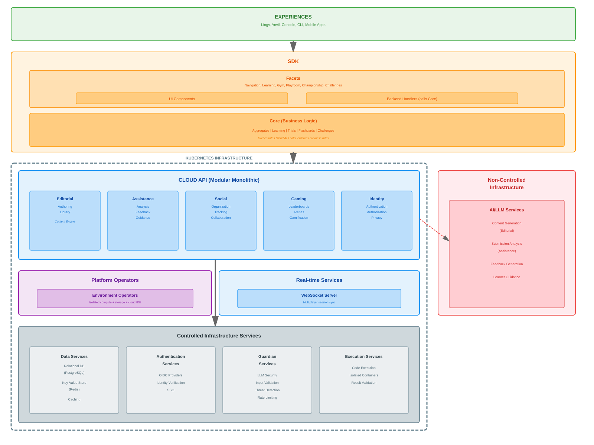
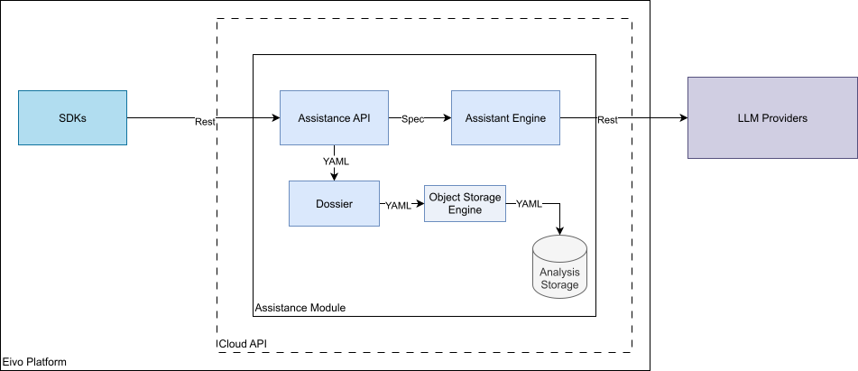
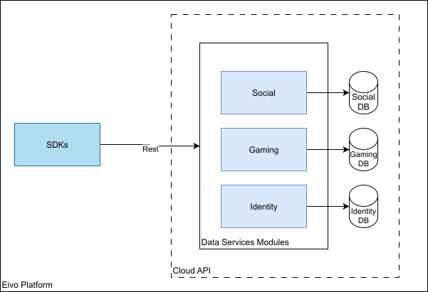
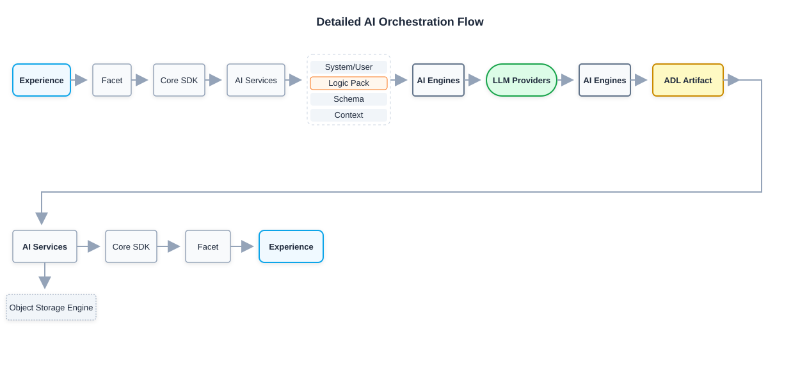
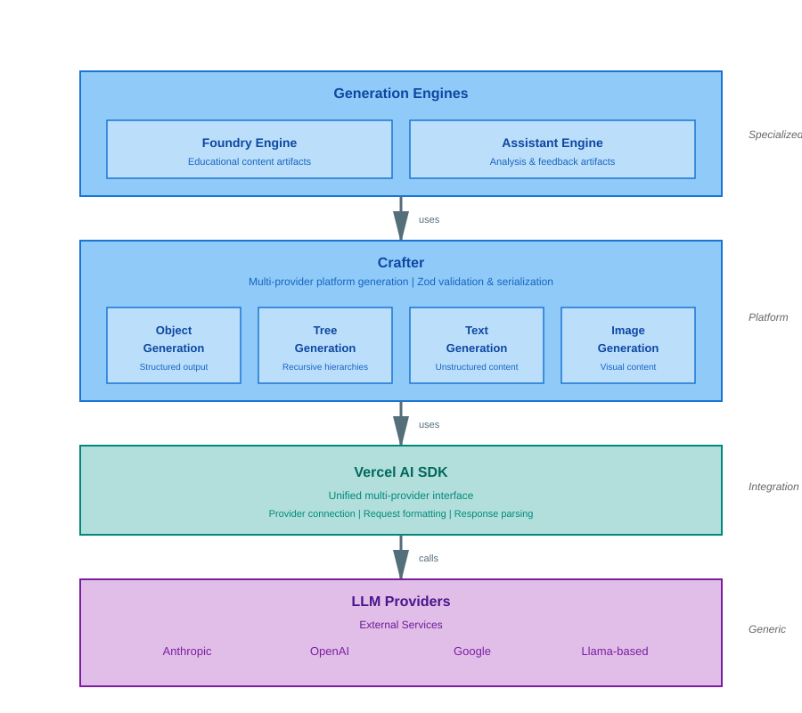
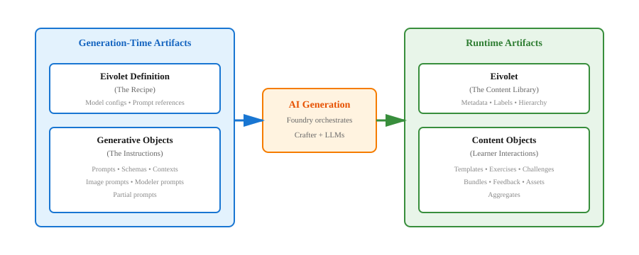
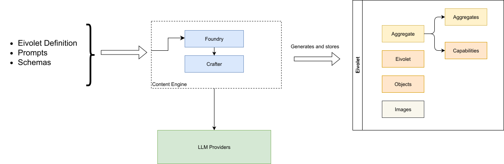
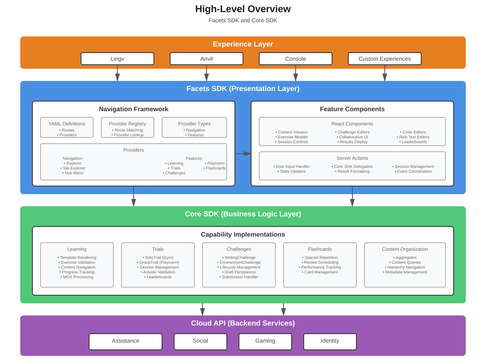
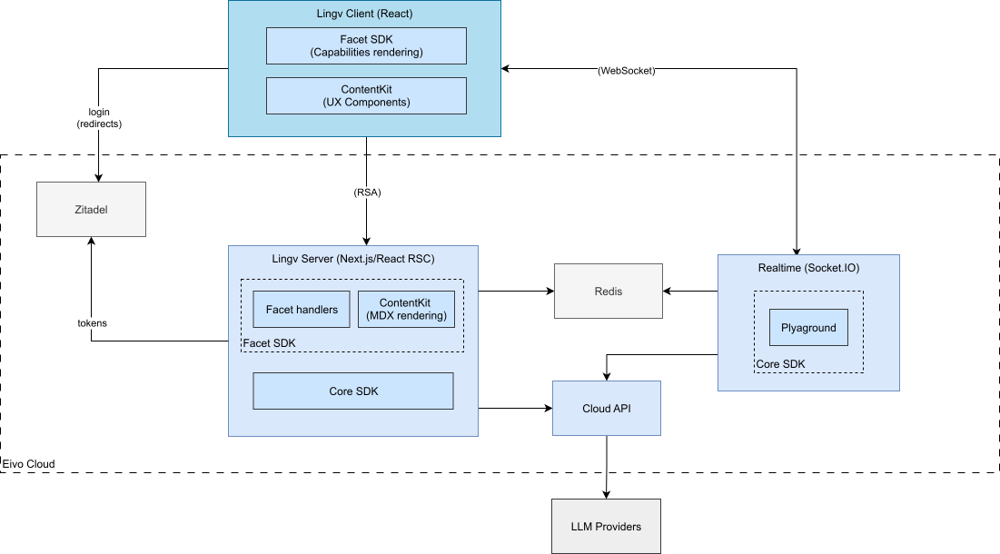
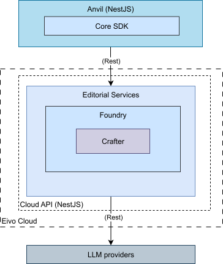

# Detailed Architecture

This section describes how components within each layer are structured
and interact, moving from infrastructure services up through the
application layers.



## The Eivo Cloud Overview

The Eivo Cloud consists of a Cloud API and controlled infrastructure
services, built on Kubernetes and leveraging cloud-native patterns for
scalability, resilience, and operational efficiency.

### Kubernetes Infrastructure

Kubernetes provides the orchestration infrastructure for deploying and
running platform components. It handles service deployment, scaling,
health monitoring, resource management, and operational consistency
across all components.

### Controlled Infrastructure Services

The controlled infrastructure layer provides foundational services that
are consumed by both Cloud API modules and the SDK as needed:

**Data Services** provide persistence and caching capabilities. Cloud
API modules access relational storage for structured data, key-value
storage for session state and caching, and distributed caching for
performance optimization. Modules consume these services based on their
specific requirements---not all modules need all data services.

**Authentication Services** provide identity verification through OpenID
Connect providers. Cloud API modules delegate authentication to these
services, receiving verified identity tokens that establish user
sessions.

**Guardian Services** provide security protection through request
validation, input sanitization, threat detection, and rate limiting.
Editorial and Assistance modules route LLM interactions through Guardian
to protect against prompt injection, jailbreaking, and unsafe outputs.
Guardian also provides general security controls including malicious
input filtering, DDoS protection, and API abuse prevention.

**Execution Services** provide code execution capabilities for
evaluating learner submissions. These services execute code in isolated
containers and return results to consuming services.

### Non-Controlled Infrastructure Services

Non-controlled infrastructure consists of external services accessed
through APIs. The platform depends on these services but does not deploy
or manage them.

#### AI/LLM Services

AI/LLM Services provide large language model capabilities through
third-party providers such as Anthropic (Claude), OpenAI (GPT), Google
(Gemini), and Llama-based offerings. Editorial modules consume these
services to generate educational materials, exercises, and challenges.
Assistance modules use these services to analyze learner submissions,
generate personalized feedback, and provide adaptive guidance. The
platform accesses AI/LLM services through standard API interfaces,
allowing integration with different providers without requiring
architectural changes to Cloud API modules.

### Cloud API Architecture

The Cloud API layer is designed as a modular monolith with a
Contract-First approach, exposing all functionality through REST APIs
and typed interfaces for internal communication.

**Modular Structure**: The system is organized into independent modules
(Editorial, Assistance, Social, Gaming, Identity), each encapsulating a
specific domain. Modules maintain clear boundaries with well-defined
interfaces. While packaged as a single deployable unit, modules are
developed and tested independently.

**Contract-First Design**: A central contract defines all capabilities,
generating both REST APIs for external access and typed interfaces for
internal use. This ensures uniform authentication, error handling, and
data formats. Modules integrate via these typed definitions, maintaining
strict schema compliance across all communication channels.

**Module Data Autonomy**: Each module maintains its own isolated data
infrastructure, utilizing storage technologies tailored to its specific
needs, such as relational databases, file systems, or Redis. Data access
is strictly encapsulated within the module boundary, preventing direct
cross-module database dependencies and ensuring infrastructure
independence.

**AI Integration**: Editorial and Assistance modules integrate with
external AI/LLM services for content generation and analysis. Editorial
uses LLM services to generate educational materials, exercises, and
assessments. Assistance uses LLM services to analyze learner
submissions, generate feedback, and provide personalized guidance. Both
modules abstract the LLM integration behind their APIs, allowing the
platform to work with different AI providers without affecting other
components.

**Service Integration**: Modules consume controlled infrastructure
services based on their needs. Social uses data services for tracking
and organization. Identity integrates with authentication services for
verification.

### Platform Operators

Platform operators are Kubernetes operators that provide orchestration
services within the platform.

**Environment Operators** provision ephemeral development environments
for coding activities like challenges. Each environment includes
isolated compute resources, persistent storage, and a cloud-based IDE,
enabling learners to write, test, and submit code directly within the
platform.

### Real-time Services

Real-time services provide WebSocket-based communication for group and
collaborative features. Facets uses these services to implement
Playroom sessions where multiple learners practice together
synchronously, with real-time visibility of progress and shared activity
state.

## SDK Architecture

The SDK layer provides the runtime and business logic that experiences
use to build applications. It is organized into two architectural
sub-layers with distinct responsibilities:

**Core Layer** implements the platform's business logic and orchestrates
interactions with Cloud API modules. Core provides APIs for Aggregates
(content organization), Learning (material delivery), Trials (practice
and championship sessions execution), Flashcards (spaced repetition),
and Challenges (evaluation workflows).

Core handles data validation, business rule enforcement, and
coordination across multiple Cloud API modules. When functionality is
requested, Core orchestrates the necessary Cloud API calls, manages
state transitions, and ensures business logic consistency. Core is
consumed primarily by the Facets backend handlers.

**Facets Layer** provides high-level APIs for building user interfaces
and managing user interactions. The Facets SDK includes Navigation
(aggregate-based content browsing), Learning (material presentation),
and activity management for Gym, Playroom, Championship, and
Challenges.

This SDK module consists of UI components and backend handlers. The UI
components provide interface patterns and presentation logic. The
backend handlers consume Core APIs to execute business logic and return
results to the UI. This separation enables experiences to use Facets'
pre-built UI patterns while maintaining clean architectural layering.

**Integration Pattern**: Experiences consume Facets APIs for both UI
components and request handling. Facets' backend handlers delegate to
Core for business logic execution. Core communicates with Cloud API
through REST APIs, maintaining clear architectural separation between
layers.

**Infrastructure Consumption**: The Core SDK directly interacts with
platform infrastructure for certain capabilities. It uses the Kubernetes
client to create and monitor Custom Resource Definitions (CRDs) for
development environment requests. The Facet SDK connects to Real-time
Services via WebSocket for group features.

**Distribution**: The SDK is distributed as a library that experiences
include in their applications. Both Facets and Core run in the
experience's runtime environment (browser for web apps, device for
mobile apps, terminal for CLI tools and the backend for handlers), not
as deployed services.

# Technical Implementation

This section describes how the Eivo platform is technically implemented,
organized by foundational technologies and platform components.

## Technical Foundation

### Technology Stack

The platform uses TypeScript as the primary language with Go for
Kubernetes infrastructure:

- **Languages**: TypeScript for SDK, Cloud API, and Experiences; Go for
  Platform Operators

- **Runtime**: Node.js for all TypeScript components

- **Package Management**: PNPM for dependency management and workspace
  coordination for the TypeScript infrastructure

### Codebase Structure

The majority of the TypeScript codebase is organized as a monorepo using
**pnpm workspaces**. This structure enables shared dependencies,
consistent versioning, and streamlined development workflows across SDK
packages, Cloud API modules, and Experiences.

Standalone components are integrated into the repository as **Git
submodules**. Because these components function as complete, independent
solutions with distinct build systems and tooling requirements, they are
excluded from the pnpm monorepo infrastructure. This separation ensures
they maintain their own package managers and dependency management
approaches while still residing within the central repository.

## Artifact Definition Language (ADL)

The YAML based Artifact Definition Language provides a universal pattern
for defining structured data across the Eivo platform. The language is
used in multiple contexts:

- **Content Generation**: Templates and Prompts for AI-generated content

- **Structured Data Objects Definitions**: Executable capability
  definitions consumed by the runtime

- **Application Configuration**: UI configurations and application
  settings

- **General Definitions**: Any structured content or configuration
  requiring metadata and typed definitions

The language provides consistency across all platform components through
uniform parsing and validation, consistent metadata handling,
standardized extensibility patterns, interoperability between
components, and artifact versioning.

### Structure

Artifacts are defined using YAML with three primary sections:

``` yaml
model: [resource-type]  
metadata:  
  name: [identifier]  
  namespace: [namespace]  
  uid: [unique-id]  
  kinds: [classification-types]  
  extra: [extensibility-fields]  
  createdBy: [creator]  
  createdAt: [timestamp]  
  updatedAt: [timestamp]  
def:  
  [capability-specific fields]  
```

**Resource Identity** (*model*) defines what type of artifact this
is---exercise, challenge, template, flashcard, or other platform
resources. The model determines how the artifact is processed by
platform runtimes.

**Metadata** provides organizational and audit information. The *name*
and *uid* fields uniquely identify the artifact. The *namespace* field
partitions artifacts into organizational boundaries, enabling
multi-tenancy and logical separation across organizations, projects, or
users. The kinds field supports classification for searching and
filtering. Audit fields (createdBy, createdAt, updatedAt) track artifact
lifecycle. The extra field enables custom extensibility for
domain-specific metadata.

**Definition** (*def*) contains the model-specific configuration. This
section varies by resource type and contains the functional
specification that runtimes can process.

#### Presentation and Categorization

Artifacts support optional presentation data for UI rendering and
content organization:

``` yaml
model: [resource-type]  
metadata: [...]  
labels:  
  - culture: [language-culture]  
    title: [display-title]  
    overview: [description]  
    tooltip: [help-text]  
    tags: [tag-list]  
tags: [general-purpose-tags]  
def: [...]  
```

*Labels* provide localized display information. Each label specifies a
culture (language and locale), along with *title*, *overview*,
*tooltip*, and *tags* for that cultural context. This enables the same
artifact to present appropriately across different languages and
regions.

Tags enable general-purpose categorization and taxonomy, supporting
content discovery and filtering independent of cultural context.

### Namespace

The *namespace* field provides data partitioning for artifacts. It
defines the organizational boundary to which an artifact belongs,
enabling logical separation of content across different contexts:

- **Isolation**: Separate artifacts between organizations, projects, or
  users

- **Organization**: Group related content within a logical boundary

- **Multi-tenancy**: Support multiple independent content spaces

### Examples

#### Content Generation

``` yaml
model: llmmaterial  
metadata:  
  name: frenchA1GreetingsFillBlankExercises  
  namespace: lingv  
  kinds:  
    - exercise  
    - fill_blank  
labels:  
  - culture: en-US  
    title: French A1 Greetings & Introductions - Fill in the Blank  
    overview: \>-  
      Fill-in-the-blank exercises to practice basic French greetings,  
      introductions, and common courtesy phrases.  
    tooltip: French Fill-in-the-Blank Exercises  
    tags:  
      - french  
      - a1  
      - fill_blank  
      - exercise  
def:  
  type: exercise  
  schema: fill_blank_schema  
  prompts:  
    \>-  
     Create 3 distinct fill-in-the-blank exercises for French A1 beginners  
     focusing on greetings and introductions. Each exercise should consist of  
     2-3 short, contextual paragraphs with 5-9 blanks. Blanks should test  
     knowledge of common greetings (Bonjour, Bonsoir, Salut), farewells (Au  
     revoir, À bientôt),   
…  
```

#### Capabilities

``` yaml
model: template  
metadata:  
  name: greetingsIntroductionsLesson  
  namespace: lingv  
  kinds:  
    - lesson  
labels:  
  - culture: en-US  
    title: 'Lesson: Greetings and Introductions'  
    overview: \>-  
     A foundational lesson on how to greet people and introduce yourself in  
     French.  
    tooltip: Greetings and Introductions Lesson  
    tags:  
      - lesson  
      - french  
      - a1  
def:  
  type: lesson  
  format: markdown  
  content:  
    - culture: en-US  
      body: \>-  
        ## Unit 1: Greetings and Introductions

        ### Introduction  
        Welcome to your first French lesson\! Learning how to greet people and  
        introduce yourself is fundamental to any conversation. Mastering these  
        basic phrases will build your confidence and open doors to communication  
        in French-speaking environments. Whether you're meeting someone for the  
        first time or engaging in everyday interactions, knowing these  
        expressions is key.

        ### Basic Greetings  
        Here are some common ways to greet someone in French:  
…  
```

#### UI Configuration

``` yaml
model: explorer  
metadata:  
  name: eivo_course_collection  
labels:  
  - culture: en-US  
    title: Eivo Course Collection  
    overview: \>-  
     Courses created by Eivo, an AI designed to make learning clear, fast, and structured — all in one        
     place.  
def:  
  route: /:namespace/learning  
  foundryModel: eivolet  
  routeModel: aggregate  
  childrenSpec: eivo_learning_courses_collection  
  provider: GridExplorerProvider  
  categories:  
    - model: category  
      metadata:  
        name: language  
      labels:  
        - culture: en-US  
          title: Languages  
          overview: \>-  
           Learn and practice world languages with interactive lessons.  
          tags:  
            - language  
    - model: category  
      metadata:  
        name: programming  
      labels:  
        - culture: en-US  
          title: Programming  
          overview: \>-  
           Master coding skills across different languages and frameworks.  
          tags:  
            - programming  
```

## Data Partitioning

Data partitioning is the practice of logically separating data into
isolated segments to enable organization, access control, and
multi-tenancy. It allows multiple users, organizations, or projects to
coexist within the same platform without interference.

### Benefits of Data Partitioning

- **Isolation**: Keep data separate between different contexts

- **Organization**: Group related resources together

- **Multi-tenancy**: Support multiple independent users or organizations

- **Access Control**: Define permission boundaries

- **Scalability**: Distribute data across systems

### Namespaces in Eivo

Eivo implements data partitioning through namespaces. A namespace is an
identifier that groups related platform resources. Every artifact and
resource in the platform belongs to a namespace, providing the
foundation for partitioned data management.

Specific namespace usage patterns are detailed in the relevant sections
throughout this documentation.

## Cloud API

The Cloud API is implemented as a modular monolithic application using
NestJS. The application is organized into independent modules that fall
into two architectural categories: **AI Services** and **Data
Services**. Each module manages its own data storage.

### AI Services

AI Services are NestJS modules that integrate with external LLM
providers for content generation and analysis. They use the Object
Storage Engine for storing artifacts and they use security controls for
LLM interactions.

###### *Key Dependencies*

The generation engines (Foundry and Assistant) are built using:

- Vercel AI SDK: LLM integration

- Zod: Schema validation

#### Editorial


The **Editorial API** module implements AI-powered content generation
and artifact management using the **Foundry Engine**. The module
provides **multi-provider LLM** integration, enabling content generation
through different AI services. It manages the complete artifact
lifecycle from generation through storage and retrieval by using the
Library API.

The **Library API** is implemented on top of the Storage Engine which
uses a pluggable storage abstraction that enables different storage
backend implementations. The current implementation persists artifacts
to **the file system**, storing content, and metadata.

##### Supported APIs

**Content Generation**: Calling this interface triggers the LLM-based
engine to produce artifacts from a given specification. The code routes
requests through a multi-provider abstraction---supporting Anthropic,
OpenAI, or Google---to execute generation workflows and return
Structured Data Objects(YAML).

**Artifact Management**: This contract exposes methods for the
persistence and retrieval of data. Executing these calls handles the
lifecycle of an artifact, including namespace-based scoping, and
metadata-driven queries within the module's storage.

**Aggregate Retrieval**: The retrieval interface performs tree traversal
across the content engine. When invoked, it filters by type and enforces
depth limits to resolve and return complex hierarchical structures as
defined by the contract schema.

#### Assistance



The Assistance module analyzes learner submissions and generates
personalized feedback using the Assistant Engine.

**Dossier API**\
This API is implemented on top of the Storage Engine which uses a
pluggable storage abstraction for analysis results and feedback
artifacts. The current implementation uses the **file system**, storing
content in JSON or YAML format.

##### Supported APIs

**Submission Analysis**: Accepts submissions (code, written responses,
exercises) along with evaluation criteria. Analyzes quality and
correctness using LLM-based analysis. Returns structured analysis
results identifying strengths, weaknesses, and areas for improvement.

**Feedback Generation**: Accepts submission analysis and learner
context. Generates personalized feedback tailored to the learner's level
and learning objectives. Returns formatted feedback content.

**Adaptive Guidance**: Accepts current learner activity and context.
Provides contextual hints and guidance during learning activities.
Returns guidance content appropriate to the learner's progress.

The module integrates with multiple LLM providers through the Content
Generation Engine for analysis and generation operations.

### Data Services Modules



Data services are NestJS modules that provide centralized data access
for user information and platform state. Each module maintains its own
Postgres schema for data isolation. Business logic resides out of the
modules in the SDK Core. They support shared caching capabilities.

###### *Key Dependencies*

- **TypeORM**: Database access and schema management

#### Gaming Module (Roadmap)

The Gaming module implements competitive features and gamification
mechanics across learning activities.

##### Supported APIs

**Leaderboard Management**: Creates and manages championship
leaderboards for different competitive contexts. Records scores and
updates rankings. Returns current standings and historical performance
data.

**Arena Management**: Configures competitive sessions with rules and
scoring criteria. Manages matchmaking and session lifecycle. Returns
arena configurations and active session state.

**Achievement System**: Tracks learning milestones and competitive
performance against configured criteria. Evaluates achievement
conditions and awards achievements. Returns achievement status and
history.

#### Social Module (Roadmap)

The Social module manages organizational structures and tracks learner
presence across the platform.

##### Supported APIs

**Organization Management**: Creates and manages hierarchical structures
(institutions, programs, courses, cohorts). Assigns roles (instructors,
coordinators, learners) within organizational contexts. Returns
organizational structures and membership data.

**Group Management**: Creates learning groups with configurable
membership rules. Manages group membership and lifecycle. Returns group
configurations and member lists.

**Activity Tracking**: Records learner participation, progress, and
performance across platform capabilities. Queries activity history and
performance metrics. Returns participant presence data for access
control, analytics, and personalization.

**Communication**: Manages messaging and collaboration within
organizational contexts. Routes messages between participants. Returns
communication history and thread data.

#### Identity Module

The Identity module manages user profiles, preferences, and privacy
settings.

##### Supported APIs

**Profile Management**: Creates and updates user profile data, learning
preferences, and account settings. Queries user profiles based on access
permissions. Returns user profile information.

**Privacy Controls**: Manages user privacy preferences and data access
permissions. Evaluates access requests against privacy rules. Returns
allowed data scope for requesting context.

**Session Management**: Maintains user session data for authentication
integration. Provides session information to the authentication layer.
Returns session state and user identity.

## Object Storage Engine

The Object Storage Engine provides pluggable storage capabilities for
organizing and persisting generated artifacts. The storage system uses a
hierarchical structure that mirrors the organizational relationships
between artifacts.

#### Storage Architecture

The Storage Engine uses a pluggable storage backend, allowing different
implementations (filesystem, database, object storage) without changing
the artifact model. The current implementation uses a
**filesystem-based** approach.

#### Hierarchical Organization for Eivolets

Artifacts are organized hierarchically following the Eivolet structure:

```text
**[namespace](#namespace)**/ 
└── **[eivolet-name]**/
├─── [eivolet].eivolet.yaml
├─── tags/
│ └── [tag-files]
├── [aggregate-name]/
│ ├── [aggregate].aggregate.yaml
│ ├── tags/
│ │ └── [tag-files]
│ ├── [nested-aggregate-or-capability]/
│ │ ├── [artifact].yaml
│ │ ├── [llmmaterial].llmmaterial.yaml
│ │ ├── [template].template.yaml\
│ │ └── tags/
│ │ └── [tag-files]
│ └── ...
└── ...
```

**Storage Conventions**

- **Root Directory**: Named after the Namespace

- **Artifact Files**: Named `[artifact-name].[model].yaml`

- **Tags Directory**: Contains individual files for each tag (enables
  tag-based queries)

- **Hierarchy**: Nested directories reflect Aggregate containment
  relationships

#### Example Structure

French A1 course storage layout:

```text
lingv
└── french language learning library/
├── french language learning library.eivolet.yaml
├── tags/
│ ├── french/
│ ├── language/
│ └── all-levels/
├── frencha1syllabus/
│ ├── frencha1syllabus.aggregate.yaml\
│ ├── frencha1essaychallenge.llmmaterial.yaml\
│ ├── tags/
│ │ ├── french/
│ │ ├── a1/
│ │ └── syllabus/
│ ├── unit1greetingsandintroductions/
│ │ ├── unit1greetingsandintroductions.aggregate.yaml
│ │ ├── tags/
│ │ │ ├── a1/
│ │ │ └── greetings/
│ │ └── frencha1unit1greetingsintroductions/
│ │ ├── frencha1unit1greetingsintroductions.aggregate.yaml
│ │ ├── greetingsintroductionslesson.template.yaml
│ │ ├── frencha1greetingsfillblankexercises.llmmaterial.yaml
│ │ ├── frencha1greetingsgrammarflashcards.llmmaterial.yaml
│ │ └── tags/
│ │ ├── lesson/
│ │ ├── exercise/
│ │ └── flashcard/
│ └── unit2presenttenseverbs/
│ └── ...
```
## Architecture of the The AI Pipeline

### Pipeline-Based Generation

The platform runtime implements an AI pipeline that orchestrates
artifact production through LLM services for generating ADL artifacts.
The flow operates on four inputs: user and system prompt templates,
contextual data, and an artifact schema.

Prompt templates define system and user instructions using template
syntax. Contextual data provides variables that populate these
templates, producing the final prompts sent to the LLM. The schema
defines the structure of the ADL artifact the LLM must generate.

The LLM receives the rendered prompts and schema, then produces a
complete ADL artifact---including resource model, metadata, definition
content, and optional presentation labels---conforming to the provided
schema. Generated artifacts can be immediately returned to the caller,
persisted for reuse, or both.

This pipeline abstracts the complexity of prompt rendering,
multi-provider LLM integration, artifact validation, and persistence
management. The SDK consumes generated artifacts to deliver business
logic while coordinating with platform services. Experiences layer UI
composition and user interaction on top of SDK functionality.



### Content Generation Architecture

The generation system is built on four levels of abstraction,
progressing from specialized domain-specific engines to generic LLM
integration libraries:

#### Foundry

At the highest level of specialization, Foundry implements
domain-specific generation logic for educational content. It
orchestrates the complete generation flow from content
specifications---extracting configuration, coordinating prompt
execution, and producing structured artifacts ready for platform
consumption. When the Editorial Services requests content generation,
Foundry extracts the necessary configuration (models, prompts, contexts)
and delegates it to Crafter.

#### Crafter

Crafter provides platform-level generation capabilities with
multi-provider support, built on Vercel AI SDK. It implements
schema-based generation using Zod for validation, ensuring generated
content conforms to defined structures. Crafter uses Mustache for prompt
templating and exposes four core capabilities: object generation
(structured output), tree generation (recursive hierarchical
structures), text generation (unstructured content), and image
generation (visual content). Crafter handles the conversion between LLM
responses and platform data structures.

#### Vercel AI SDK

Vercel AI SDK provides a unified interface to multiple LLM providers. It
abstracts provider-specific details, enabling consistent interaction
with different LLM services through a single API. This library handles
provider connection, request formatting, and response parsing.

#### LLM Providers

At the most generic level are external LLM services---Anthropic, OpenAI,
Google, and Llama-based providers. Each exposes its own API with
provider-specific protocols, authentication, and response formats.



## From Architecture to Execution: The Eivolet Ecosystem

The AI pipeline architecture---Editorial API, Foundry, and
Crafter---exists to transform educational specifications into executable
learning content. At the heart of this transformation is the
**Eivolet**: a complete, packaged educational content library organized
under a common theme.

An Eivolet represents what learners ultimately experience---a French
language course, a Python programming curriculum, or a data structures
learning path. But how does an Eivolet come into existence? How do
abstract specifications become concrete learning materials that students
interact with?

The answer lies in understanding the **Eivolet Ecosystem**---the
collection of artifacts that work together to enable content creation
and delivery.

### Understanding the Ecosystem

The ecosystem consists of two fundamental categories of artifacts, each
serving a distinct purpose in the content lifecycle:

- **Generation-Time Artifacts** exist solely to create content. These
  are the specifications and instructions that guide AI in producing
  educational materials. Once generation completes, these artifacts have
  served their purpose---learners never see them. This category
  includes:

  - **Eivolet Definition**: The recipe specifying what to generate,
    which AI models to use, and how to structure the content

  - **Generative Objects**: The detailed instructions (prompts, schemas,
    contexts, image specifications) that guide AI generation

- **Runtime Artifacts** are the actual educational content that learners
  interact with. These persist after generation and are delivered
  through experiences. This category includes:

  - **Eivolet**: The content library specification with metadata,
    labels, and hierarchical structure

  - **Content Objects**: The learning materials themselves (lessons,
    exercises, challenges, assessments, media)

The relationship between these categories is transformational:
Generation-Time Artifacts are consumed by the AI pipeline to produce
Runtime Artifacts.

#### Visualizing the Ecosystem



This diagram illustrates the complete ecosystem. On the left are
Generation-Time Artifacts---specifications that define what to create.
The center shows the AI Generation process where Editorial API's Foundry
and Crafter execute the transformation. On the right are Runtime
Artifacts---the actual content delivered to learners.

### How Generation Works

The transformation from specifications to content follows a coordinated
process:



Foundry receives an Eivolet Definition and loads all referenced
Generative Objects---the prompts that contain generation instructions,
the schemas that validate output structure, and the contexts that
provide shared variables. It reads the model configurations to determine
which LLMs to use for different content types.

With configuration complete, Foundry, using Crafter primitives, executes
generation through multiple coordinated phases. Modeler prompts generate
hierarchical structures recursively---a syllabus modeler creates units,
which trigger lesson modelers, which produce individual activities.
Object prompts generate specific content items like templates and LLM
materials. Image prompts create visual assets. The Eivolet prompt
produces the final specification with metadata and multilingual labels.

Generated artifacts can be persisted to **Editorial Services** storage
for reuse across multiple learners and sessions, or returned ephemerally
for immediate one-time use. The storage decision depends on the content
type and usage requirements.

This pipeline executes whenever content creation is triggered---through
**Anvil** for manual creation, through Lingv for web-based authoring, or
through future agent-driven systems for conversational generation.

### Core Concepts

The pipeline transforms specifications into learning experiences through
four key artifact types. This section provides high-level
definitions---detailed specifications, structures, and examples are
available in the **Eivolet Objects Definitions** reference document.

#### What is an Eivolet?

An Eivolet is a complete, packaged educational content library organized
under a common theme or domain. It represents a collection of learning
materials, practice activities, and assessments that can be delivered
through various platform experiences.

Eivolets are defined using the platform's YAML-based Artifact Definition
Language (ADL), which provides a universal pattern for structured
content across the Eivo platform. This declarative format ensures
consistent metadata handling, validation, and interoperability between
components.

**High-Level Structure:**

- **Metadata**: Identification, namespace, and references to the
  generating definition\
- **Labels**: Multilingual display information (title, overview,
  tooltip, tags)\
- **Content Reference**: Points to the hierarchical organization stored
  separately

##### Example

``` yaml
model: eivolet  
metadata:  
 name: French Language Learning Library  
 namespace: lingv  
 extra:  
   eivoletDefName: training_french  
tags: [language, french]  
labels:  
 - culture: en-US  
   title: French Language Learning  
   overview: A comprehensive library of French language courses  
   tooltip: Explore French courses  
```

An Eivolet is the **runtime artifact**---the actual content that
learners interact with through experiences like Lingv.

#### What is an Eivolet Definition?

An Eivolet Definition is a **specification** that orchestrates the
content generation process. It acts as the recipe that tells Foundry
what to generate, how to generate it, and what resources to use.

**What it Contains:**

**Model Configuration** - Specifies which LLM models to use for
generation, including default models and type-specific overrides (e.g.,
use a faster model for exercises, a more capable model for complex
content).

**Prompt References** - Points to the prompts that will generate
content:

- Tree prompts (modelers) for hierarchical structures\
- Object prompts for individual items\
- Image prompts for visual assets\
- System prompts for consistent context

**Context References** - Links to shared variables and data used across
all prompts during generation.

**Key Point:** The definition doesn't contain actual prompts or
content---it references them. This enables reusability: the same prompts
can be used across multiple Eivolet Definitions, and definitions can be
modified without rewriting prompts.

**Example snippet:**

``` yaml
model: eivoletdef  
metadata:  
 name: training_french  
def:  
 models:  
   object:  
     model:  
       id: gemini-2.5-flash-lite  
 prompts:  
   trees: [syllabusFrenchTest]  
   eivolet: eivolet_french  
 contexts: [context-for-eivolet]  
```

#### Generative Objects

Generative Objects are the **instructions and templates** that exist at
generation-time to guide AI in creating content. Learners never see
these---they're consumed by Foundry and Crafter during the generation
process.

Like all platform artifacts, Generative Objects are defined using the
Artifact Definition Language (ADL) in YAML format. This ensures
consistent structure, validation, and processing across the generation
pipeline.

**Example snippet (Modeler):**

``` yaml
model: modeler  
metadata:  
 name: syllabusFrenchTest  
def:  
 prompt:  
   content: |  
    Create a syllabus for French A1 with two units...  
   schema: syllabusFrench  
 children:  
   - model: modeler  
     metadata:  
       name: lessonLevelFrench  
     def:  
       prompt:  
         content: |  
          Generate lessons for unit '{{currentUnitLabel.title}}'...  
         schema: lessonFrench  
```

##### Object Types

Modelers - Generate hierarchical structures by recursively creating
nested content. A syllabus modeler might generate units, which trigger
lesson modelers, which create individual learning activities. Each level
can reference data from parent levels.

**Prompts** - Generate individual content items without hierarchical
nesting. These are straightforward instructions: "create a
fill-in-the-blank exercise about French greetings" or "generate an essay
challenge on climate change."

**Schemas** - Define and validate the structure of generated content
using Zod-compatible specifications. They ensure LLM output conforms to
expected formats and includes required fields.

**Contexts** - Provide shared variables accessible across all prompts
during generation (e.g., target proficiency level, topic focus, cultural
preferences). Referenced using Mustache template syntax: {{variable}}.

**Image Prompts** - Specify visual assets to generate, describing style,
subject matter, and technical requirements.

**Partial Prompts** - Reusable prompt components that compose into
complete system prompts, enabling modular prompt construction and
extension.

**Why They're Separate:** Keeping generation instructions separate from
generated content enables prompt reuse, versioning, and refinement
without regenerating all content. It also allows agent-driven generation
systems to modify prompts programmatically.

#### Content Objects

Content Objects are the actual **educational artifacts** that
**learners** interact with. These are generated from Generative Objects
and delivered through experiences.

Like Generative Objects, Content Objects are defined using ADL in YAML
format, ensuring consistent structure across all runtime artifacts.

**Example snippet Object (Template):**

``` yaml
model: template  
metadata:  
 name: greetingsLesson  
 kinds: [lesson]  
labels:  
 - culture: en-US  
   title: 'Lesson: Greetings'  
   overview: Basic French greetings  
def:  
 type: lesson  
 format: markdown  
 content:  
   - culture: en-US  
     body: |  
      ## Greetings  
      - **Bonjour**: Hello  
      - **Bonsoir**: Good evening  
```

##### Object Types

**Aggregates** - Organizational containers forming hierarchical
structure (syllabi, units, lessons). They don't contain content
directly---they reference other aggregates or content objects, similar
to directories in a file system.

**Templates** - Static instructional content in Markdown format with
embedded interactive components (exercises, diagrams, code examples).
Rendered at runtime via MDX to enable rich, interactive lessons.

**LLM Materials** - A hybrid artifact type that bridges generation-time
and runtime. At their core, LLM Materials are Generative Objects---they
contain prompts and schemas that instruct AI how to generate content.
However, unlike pure Generative Objects that exist only during Eivolet
generation, LLM Materials are persisted as Content Objects and
distributed throughout the Eivolet's content hierarchy. This enables
on-demand generation of fresh content at runtime: when a learner starts
a Gym session, the LLM Material generates new exercises; when beginning
a Challenge, it creates a unique assignment. This approach provides
infinite content variations without pre-generating and storing thousands
of artifacts.

**Exercises** - Interactive practice activities with immediate binary
validation (correct/incorrect). Generated from LLM Materials at runtime
or embedded in Templates. Include fill-in-the-blank, multiple choice,
and programming exercises.

**Challenges** - Extended multi-day assignments (essays, coding
projects) with comprehensive AI-powered evaluation. Unlike exercises
with binary feedback, challenges receive detailed assessment from
Assistance Services.

**Bundles** - Collections of files defining complete project structures.
Used for coding challenges to provide initial workspace setup
(configuration files, starter code, tests, documentation).

**Feedback** - AI-generated evaluations for challenge submissions,
providing summary assessments, identified strengths, and specific
improvement suggestions.

**Assets** - Media files (primarily images) stored as base64-encoded
data, used throughout educational content for visual enhancement.

### Future: Agent-Driven Eivolet Creation

The platform's architecture is designed to enable **conversational
AI-driven content creation**. Rather than manually authoring Eivolet
Definitions and Generative Objects in YAML, creators will describe their
educational vision through natural dialogue, and AI agents will
transform these descriptions into complete, executable specifications.

An agent-driven workflow would begin with conversation: a creator
describes learning objectives, target audience, desired activities, and
assessment preferences. The agent asks clarifying questions, then
generates the complete Eivolet Definition with all necessary Generative
Objects---prompts, schemas, contexts, and model configurations. The
creator reviews generated samples, provides feedback ("exercises are too
easy," "add more flashcards"), and the agent refines the specification
iteratively. Once approved, the agent triggers full generation through
the existing pipeline, producing a complete Eivolet ready for learners.

This architecture makes agent-driven creation feasible without
fundamental changes. Eivolet Definitions are declarative YAML
specifications---structured data that LLMs naturally produce. Generative
Objects are modular and composable, enabling agents to mix existing
components or create new ones. The separation between definitions and
content, combined with strong validation through ADL schemas, ensures
agent-generated specifications execute through the same Foundry/Crafter
pipeline as manually-authored ones. The platform wasn't just built to
permit agent-driven generation---it was designed with this capability as
an inherent future.

## SDK

The SDK layer provides the runtime and business logic that experiences
use to build applications. It is organized into two sub-layers with
distinct responsibilities: Core SDK implements business logic and
orchestrates platform services, while Facets SDK provides UI components
and navigation framework for building user interfaces.



### Core SDK

The Core SDK implements the platform's business logic and orchestrates
interactions with Cloud API modules. It provides the runtime foundation
that **experiences** use to deliver educational capabilities to
learners.

#### Architecture and Purpose

Core SDK sits between the Facets layer (which handles UI and user
interactions) and the Cloud API layer (which provides backend services).
Its primary responsibility is executing business logic---validating
data, enforcing rules, managing state, and coordinating calls across
multiple Cloud API modules to implement complete workflows.

The SDK is distributed as a TypeScript library that includes experiences
included in their applications.

#### Core Capabilities

**Content Organization** provides the foundation for structuring and
navigating educational content through aggregates. It manages
hierarchical content relationships, enabling experiences to query and
traverse content trees efficiently. The capability handles aggregate
metadata, supports tag-based filtering and categorization, and provides
APIs for retrieving content at any level of the hierarchy. By
abstracting the complexity of content organization, this capability
enables experiences to present structured learning paths while the
underlying content structure remains flexible and independently managed.

**Learning** - Delivers instructional content by managing template
rendering and learner progress. The Learning class retrieves template
artifacts from Editorial Services, coordinates with ContentKit to render
Markdown with embedded interactive components, tracks completion status,
and validates responses to inline exercises.

**Trials** - Manages practice session execution with binary validation.
The abstract Trials base class provides session management, exercise
sequencing, answer validation, and error tracking. Two concrete
implementations extend this foundation: SoloTrial for individual
practice sessions (Gym, Championship), and GroupTrial for real-time
collaborative sessions (Playroom). Session state persists in Redis,
enabling recovery and distributed management.

**Challenges** - Orchestrates extended multi-day assessment workflows.
Challenge classes manage the complete lifecycle from generation through
evaluation: creating challenge specifications via Editorial Services,
provisioning infrastructure when needed (coding environments through the
Environment Operator), managing learner work over multiple days,
collecting submissions, and coordinating comprehensive AI-powered
evaluation through Assistance Services.

#### Integration Patterns

Core SDK integrates with Cloud API through REST APIs and typed
interfaces. When functionality is requested, Core classes orchestrate
necessary API calls, manage state transitions, and ensure business logic
consistency. For example, a Gym session (SoloTrial) retrieves LLM
Material specifications from Editorial Services, requests exercise
generation, maintains a queue of pre-generated exercises in Redis,
validates learner responses, and tracks progress---all while enforcing
session rules like error limits and time constraints.

The SDK also integrates directly with platform infrastructure for
specific capabilities. It uses the Kubernetes client to create and
monitor Environment CRDs for coding challenges. It manages session state
in Redis for trials, challenge drafts, and exercise queues. It
coordinates with the Environment Operator for provisioning and cleanup
of isolated development environments.

#### State Management

Core SDK manages state across multiple storage layers based on
persistence requirements. Transient session state (trial progress,
exercise queues, challenge drafts) lives in Redis for fast access and
automatic expiration. Persistent data (completion records, performance
metrics, evaluation results) is stored via Cloud API modules in
PostgreSQL. The SDK coordinates between these layers, ensuring
consistency while optimizing for performance and scalability.

### Facets SDK

Facets SDK is a high-level framework for building Eivo learning
experiences. It provides declarative navigation, reusable UI components,
and seamless integration with platform capabilities, enabling developers
to create complete educational applications without implementing
low-level business logic.

#### Purpose

Facets serves as the presentation and interaction layer of the Eivo
platform. While Core SDK handles business logic and platform service
coordination, Facets focuses on what users see and interact
with---navigation structures, content presentation, activity interfaces,
and user workflows.

The framework enables experience developers to:

- Define navigation structures through YAML configurations

- Compose ready-made UI components for learning activities

- Build custom experiences tailored to specific audiences

- Leverage platform capabilities without managing technical complexity

#### Architecture

Facets follows a three-component architecture:

**Navigation Definitions** (YAML specifications):

- Declare routes and URL patterns

- Specify content organization and filtering

- Configure UI components and providers

- Define workflow actions and transitions

**Providers** (server-side handlers):

- Match routes to appropriate handlers

- Query Editorial Services for content

- Instantiate Core SDK capabilities

- Prepare data and props for components

**Feature Components** (React UI):

- Render learning interfaces

- Handle user interactions

- Manage UI state

- Call Server Actions for business operations

The flow: User action → Route match → Provider execution → Core SDK
delegation → Component rendering

#### Key Concepts

**Declarative Navigation**\
Navigation is defined through YAML files rather than coded imperatively.
Definitions describe what content to show, how to organize it, and where
to navigate next. The framework interprets these definitions at runtime,
querying platform services and rendering appropriate interfaces.

Example navigation flow: Category selection → Eivolet selection →
Content delivery

Each step is a separate definition specifying data queries, presentation
patterns, and next-level navigation.

**Provider Pattern**\
Providers implement the bridge between definitions and execution. When a
route matches, the framework invokes the corresponding provider, which:

1.  Retrieves relevant data from platform services

2.  Creates Core SDK instances for capability execution

3.  Prepares props for UI components

4.  Returns component specifications for rendering

Providers encapsulate the "how" while definitions specify the "what."

**Feature Components**\
Feature components are React components implementing platform
capabilities:

- **Learning**: Content viewers with embedded exercises

- **Trials**: Practice session interfaces (Gym, Playroom) and
  Evaluation (Championship)

- **Challenges**: Evaluation workflows with editors and environments

Components receive prepared data through props and delegate business
logic to Core SDK through Server Actions.

#### Integration with Core SDK

Facets maintains clean separation from business logic:

**Facets Responsibility**:

- Route matching and navigation

- UI component rendering

- User interaction handling

- Data presentation

**Core SDK Responsibility**:

- Business rule enforcement

- State management

- Platform service coordination

- Data validation and persistence

Feature components call Server Actions which delegate to Core SDK. Core
SDK executes business logic and coordinates with Cloud API. Results flow
back through the same chain to update the UI.

## Experiences

Experiences are the user-facing applications that learners interact
with. Built on top of the SDK layer, experiences provide the complete
learning interface---navigation, content presentation, interactive
components, and user workflows. Each experience is a web application
that integrates platform capabilities to deliver specific learning
contexts.

Experiences consume Facets SDK to access both UI components and backend
functionality. Facets provides ready-to-use React components for
learning interfaces---content viewers, exercise interfaces, challenge
editors, session controls. Experiences integrate these components into
their pages, creating cohesive learning environments. Behind these
components, Facets handlers consume Core SDK to implement business
logic, calling platform capabilities like Learning, Trials, and
Challenges.

Different experiences can be built to serve different audiences,
learning domains, or pedagogical approaches. Each experience defines its
own navigation structure, visual design, and user workflows while
leveraging the shared platform capabilities underneath. This
architecture enables the platform to power multiple distinct learning
applications from a common foundation.

### Lingv

Lingv is a Next.js-based reference implementation of the Eivo platform,
serving as the experimental application for demonstrating end-to-end
functional capabilities including UI integration, SDK consumption, and
agent-guided content creation. As a reference implementation, it
provides working examples of how experiences can integrate platform
capabilities to deliver complete learning workflows.

#### Architecture

Lingv follows a layered architecture that cleanly separates concerns. At
the presentation layer, the application provides the user
interface---navigation, page layouts, and visual design. The integration
layer consumes Facets SDK, using both Facets UI components for
interactive elements and Facets handlers for backend operations. Through
this integration, Lingv accesses all platform capabilities---Learning,
Trials, Challenges, and others---without implementing business logic
directly.



##### Authentication and Access

The application integrates with the platform's identity system using
Auth.js to connect with Zitadel. Auth.js manages the authentication
flow, session state, and token handling. Once authenticated, users gain
access to capability options based on their roles and permissions, with
secure access to learning activities maintained throughout the session.

##### Content Navigation and Delivery

Users navigate through structured learning paths organized around
capabilities. When a user selects a learning activity, Lingv retrieves
the corresponding Eivolet specification and content artifacts through
SDK APIs. The SDK transforms these specifications into interactive
experiences---rendered templates with embedded exercises for Learning
activities, trial sessions for Trials activities, or challenge
environments for Challenges activities. Facets components handle the
presentation of this interactive content, while Core SDK manages state,
validation, and coordination with platform services.

##### Agent-Guided Content Creation

Lingv serves as the testing ground for agent-guided content creation
workflows, demonstrating how conversational AI can assist users in
building learning experiences. These workflows integrate agentic
generation capabilities with the platform's UI layer, enabling users to
create and configure learning content through guided interactions.

#### Technical Implementation

Built with Next.js, Lingv leverages server-side rendering for initial
page loads and React for client-side interactivity. The application uses
Facets handlers as API routes, providing clean separation between
frontend and backend operations. Socket.IO Client enables real-time
communication with the platform's real-time server for live
collaborative features and session updates.

### Anvil

Anvil is a command-line tool built with NestJS that serves as the
reference implementation for the platform's agentic generation
capabilities. By providing a CLI interface, Anvil allows developers to
focus on the complex aspects of agent development---conversation flows,
generation logic, decision trees---without the overhead of building and
maintaining UI components.

#### Purpose and Scope

Anvil focuses on demonstrating and refining agentic
generation---conversational AI-guided processes for creating learning
content. The CLI interface strips away UI complexity, enabling rapid
iteration on agent behaviors, prompt engineering, and generation
workflows. Developers can test and perfect agent interactions in Anvil
before integrating those patterns into full web experiences like Lingv.

#### Architecture

Built with NestJS, Anvil consumes the SDK to trigger content generation
workflows. The tool coordinates with Editorial Services through Cloud
API, which provides generation capabilities with optional
persistence---artifacts can be generated ephemerally for immediate use
or generated and stored in a single operation. This architecture mirrors
how web-based experiences would integrate generation capabilities while
maintaining a minimal CLI interface.



#### Use Cases

Anvil serves two primary purposes:

- **Development and Testing**: Developers use Anvil to build and test
  agentic generation features. The command-line interface provides
  immediate feedback without requiring UI development, accelerating the
  iteration cycle for agent behaviors and content generation workflows.

- **Automation**: Anvil's CLI nature makes it ideal for automated
  content generation pipelines. Scripts can invoke Anvil to generate
  batches of content, populate artifact libraries, or execute scheduled
  generation tasks without human interaction.

- **As a reference implementation**: Anvil provides clear examples of
  implementing agentic generation that can be adapted for web-based
  experiences or integrated into automated workflows.
