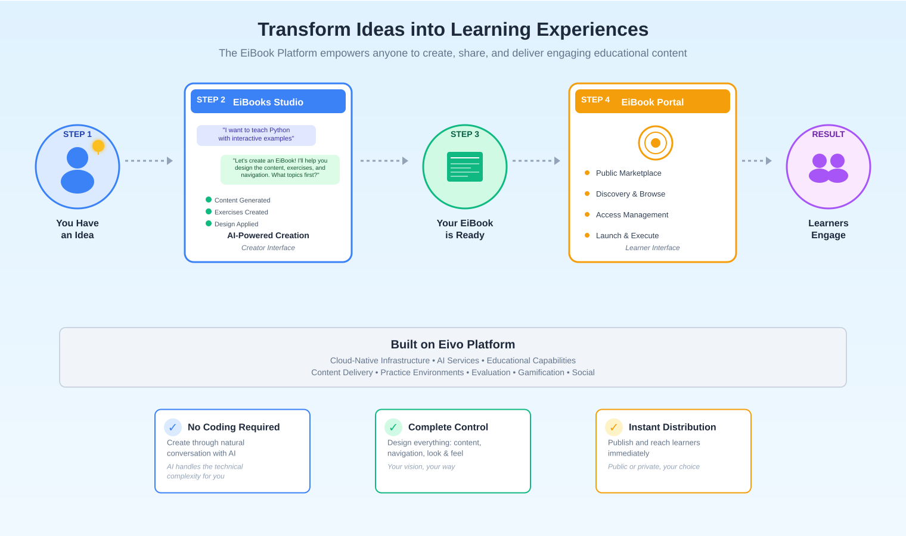

# Introduction

The EiBook Platform is a system for creating, distributing, and
executing user-designed learning experiences. It enables users to create
EiBooks---complete educational works that combine learning materials,
activities, and assessments with user-defined navigation and visual
design into a single packaged experience.

Like a book is a specific work with its own content and structure, an
EiBook is a specific learning experience where all elements---content,
exercises, navigation, visual design---are authored together as an
inseparable whole. Users don't create reusable templates; they create
complete didactic works tailored to specific learning outcomes.

Creation happens through an AI-agentic driven experience in EiBooks
Studio. Rather than using traditional visual design tools, creators
engage in conversational interaction with AI, describing their vision
and collaborating to build the complete experience. The AI acts as an
agentic partner, transforming user intent into functional learning
experiences.

EiBooks are packaged, distributable units that run on the platform's
infrastructure. They can be accessed through the EiBook Portal, where
users discover and launch published EiBooks, or accessed individually as
standalone experiences. Each EiBook leverages the Eivo Platform's
educational capabilities while maintaining the creator's design.

Targeted at Gen Z learners, EiBooks emphasize engagement, interactivity,
and dynamic learning journeys. They function as didactic
instruments---interactive tools for teaching and learning---rather than
passive content consumption.

Built on the Eivo Platform's cloud-native infrastructure, the EiBook
Platform provides AI-powered creation tools (EiBooks Studio) and
distribution mechanisms (EiBook Portal) specifically designed for
user-created learning experiences.

# EiBook

An EiBook is a complete educational work that users create, distribute,
and execute. At its core is a specification---the instruction set that
defines the complete learning experience including learning materials,
practice exercises, evaluation challenges, navigation structure, visual
design, interaction rules, gamification mechanics, and progression
logic.

Creators can incorporate the full range of platform capabilities into
their EiBook. Beyond content and activities, EiBooks can include
gamification rules (points, achievements, leaderboards), competitive
mechanics (arenas, rankings, tournaments), and social features (group
activities, peer interaction). Each element is defined specifically for
that EiBook, creating a cohesive learning experience.

Each EiBook runs on the Eivo Platform infrastructure, which provides the
runtime that executes the EiBook specification. The runtime renders
content, provides practice environments, runs evaluation systems,
manages gamification, and enables competitive and social features---all
according to the specification's instructions, delivering the learning
experience exactly as designed.

EiBooks can be distributed publicly through the EiBook Portal, where
users discover and launch them, or accessed individually as private or
public experiences.

# EiBooks Studio

EiBooks Studio is the creation and management environment where users
design, build, and oversee their EiBooks through conversational
interaction with AI. Rather than using traditional development tools or
visual designers, creators describe their educational vision and
collaborate with AI to author the complete EiBook specification.

The Studio functions as an AI-agentic experience. Creators engage in
dialogue---explaining their learning objectives, target audience,
content structure, desired activities, and presentation preferences. The
AI acts as a creative partner, transforming these descriptions into the
EiBook specification: generating learning materials, designing exercises
and challenges, defining navigation structures, creating visual layouts,
and establishing interaction rules.

Creation is iterative. Creators review what the AI generates, provide
feedback, request modifications, and refine elements until the EiBook
matches their vision. This collaborative process combines AI
capabilities with human expertise and pedagogical judgment, enabling
creators to build sophisticated learning experiences without technical
development skills.

Beyond creation, the Studio manages the complete EiBook lifecycle.
Creators control accessibility settings---publishing publicly, sharing
privately, or restricting access. They track EiBook usage through
analytics including reads, exercise completions, assessment results, and
user comments. This enables creators to understand how learners engage
with their work and refine their EiBooks based on real usage data.

The Studio leverages the Eivo Platform's capabilities---Editorial
Services for content generation, practice and evaluation systems for
activity design, and all supporting services---orchestrating them into
the complete EiBook specification. The output is a packaged, executable
EiBook ready for distribution.

# EiBook Portal

The EiBook Portal is the public marketplace where users discover and
access published EiBooks. It provides browsing, search, and discovery
capabilities for finding EiBooks across topics, subjects, and learning
objectives.

Users browse the Portal's catalog, view EiBook descriptions and
metadata, and launch experiences directly. The Portal handles access
management, ensuring only authorized users can access private EiBooks
while making public EiBooks freely available to all users.

The Portal provides the runtime environment where EiBooks execute. When
a user launches an EiBook, the Portal loads the specification and
provides the infrastructure to deliver the learning
experience---rendering content, enabling practice activities, running
evaluations, and managing all interactive features as defined by the
EiBook creator.

# The EiBook Journey

