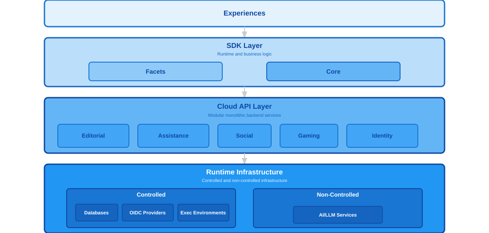
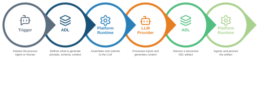

<!-- _header: "" -->
<!-- _footer: "" -->

# Eivo: Architecture & Implementation

Technical foundation and implementation details.

---

<!-- _header: "ARCHITECTURAL_PRINCIPLES" -->
<!-- _footer: "STRUCTURE → SCALE → EVOLUTION" -->

# Architectural Principles

Six foundational principles guide every design decision across the platform.

**Layered Design** — Three distinct tiers: Experiences, SDK, and Cloud

**Modular Design** — Independent components within each layer

**Multi-Tenancy** — Logical isolation across organizations

**Cloud-Native Infrastructure** — Kubernetes-based elastic scaling

**Multiple Experiences** — Diverse applications from shared capabilities

**Extensibility** — New features without breaking existing functionality

---

<!-- _header: "SYSTEM_ARCHITECTURE" -->
<!-- _footer: "EXPERIENCES → SDK → CLOUD" -->

# System Architecture

---

<!-- _header: "PLATFORM_COMPONENTS" -->
<!-- _footer: "EXPERIENCES → SDK → CLOUD → ADL → INFRASTRUCTURE" -->

# Platform Components

**Experiences** — User-facing applications built on top of the platform.

**SDK** — Two complementary layers form the runtime environment. Facets provides the UI framework and navigation, while Core implements the business logic.

**Cloud API** — Backend services organized into independent modules, each responsible for a specific platform capability. Editorial, Assistance, Social, Gaming, and Identity.

**Artifact Definition Language** — The universal specification language powering the platform. Content, generation workflows, and configurations are all ADL artifacts that feed **every platform component**.

**Runtime Infrastructure** — Controlled and non-controlled infrastructure supporting platform operations. Databases, authentication providers, execution environments, and AI/LLM services.

---

<!-- _header: "ARTIFACT_DEFINITION_LANGUAGE" -->
<!-- _footer: "GENERATIVE → CONTENT → PROVISIONING → NAVIGATION" -->

# Artifact Definition Language

ADL is a YAML-based specification language that defines four types of artifacts powering the platform.

**Generative Artifacts** instruct AI systems on content creation by defining generation workflows, prompts, and output schemas.

**Content Artifacts** are educational materials **produced by Generative Artifacts** that **Core SDK** consumes for rendering. Include lessons, exercises, and challenges.

**Provisioning Artifacts** specify infrastructure **required by Content Artifacts** through templates and parameters for coding challenges and interactive activities.

**Navigation Artifacts** define UI structure and flows through routes and configurations that **Facets SDK** interprets to build interfaces.

---

<!-- _header: "FACETS_SDK" -->
<!-- _footer: "NAVIGATION → PROVIDERS → CUSTOMIZATION" -->

# Facets SDK

A declarative framework for building learning experiences, abstracting UI complexity through ready-made components, navigation patterns, and backend handlers.

**Declarative Navigation** defines routes, content organization, and user workflows through ADL Navigation Artifacts.

**Providers** bridge navigation definitions to platform capabilities by querying services and preparing data for components.

**Customization** enables each experience to define its own visual identity while sharing the same underlying platform capabilities.

---

<!-- _header: "CORE_SDK" -->
<!-- _footer: "LEARNING → PRACTICE → EVALUATION" -->

# Core SDK

The business logic layer that implements all platform learning capabilities, orchestrating Cloud API services and managing session state throughout every learning activity.

**Learning** delivers instructional content with embedded interactive exercises, tracking learner progress through the material.

**Practice** supports exercise sessions and flashcard-based review with immediate feedback, covering individual and real-time collaborative activities across multiple exercise types.

**Evaluation** manages extended multi-day assignment workflows, from AI-powered content generation through submission, assessment, and feedback.

---

<!-- _header: "CLOUD_API" -->
<!-- _footer: "EDITORIAL → ASSISTANCE → SOCIAL → GAMING → IDENTITY" -->

# Cloud API

A modular monolithic backend delivering all platform capabilities through independent, domain-specific modules. Each module maintains its own data infrastructure and exposes functionality through a contract-first REST API.

**Editorial** generates and manages educational content artifacts using AI/LLM services.

**Assistance** provides AI-powered learning support, analyzing submissions and generating personalized feedback.

**Social** manages groups, cohorts, and collaborative learning activities.

**Gaming** enables competitions, leaderboards, and gamified learning experiences.

**Identity** handles authentication and authorization across the platform.

---

<!-- _header: "PLATFORM_SERVICES" -->
<!-- _footer: "OPERATORS → REAL-TIME" -->

# Platform Services

Two additional services extend Cloud API capabilities beyond the core modules.

**Platform Operators** are Kubernetes operators that provision ephemeral coding environments for challenges. Each environment provides isolated compute, persistent storage, and a cloud-based IDE.

**Real-time Services** provide WebSocket-based communication for collaborative activities, enabling multiple learners to practice together with shared session state and real-time progress visibility.

---

<!-- _header: "CONTROLLED_INFRASTRUCTURE" -->
<!-- _footer: "STORAGE → CACHE → IDENTITY → EXECUTION" -->

# Controlled Infrastructure

Platform services deployed and managed on Kubernetes alongside the application.

**PostgreSQL** provides relational storage for user data, content metadata, social, and gaming data, managed by the CloudNativePG operator.

**Redis** provides in-memory storage for session state, trial sessions, and challenge progress.

**Zitadel** handles user authentication and authorization through OpenID Connect.

**Judge0** executes learner-submitted code in isolated containers for programming exercises.

---

<!-- _header: "NON_CONTROLLED_INFRASTRUCTURE" -->
<!-- _footer: "EXTERNAL SERVICES → API INTEGRATION" -->

# Non-Controlled Infrastructure

External services integrated through their APIs. The platform depends on them but does not deploy or manage them.

**AI/LLM Services** provide large language model capabilities through third-party providers such as Anthropic, OpenAI, Google, and Llama. Used by Editorial for content generation and Assistance for learner feedback.

---

<!-- _header: "THE_AI_PIPELINE" -->
<!-- _footer: "TRIGGER → ADL → RUNTIME → LLM → ADL → RUNTIME" -->

# The AI Pipeline

A standardized pipeline that transforms ADL specifications into platform-ready content — generated on demand to deliver functionality or persisted for future consumption.

---

<!-- _header: "REFERENCE_IMPLEMENTATIONS" -->
<!-- _footer: "VALIDATE → DEMONSTRATE → EXPERIMENT" -->

# Reference Implementations

Fully functional applications built on top of the platform serving three purposes.

**Validation** exercises platform capabilities end-to-end, ensuring every component works together in real-world conditions.

**Demonstration** shows how experiences can be built on top of the SDK, providing concrete examples of platform integration patterns.

**Experimentation** provides a free artifact to explore new ideas, iterate rapidly, and learn without the constraints of a production product.

---

<!-- _header: "LINGV" -->
<!-- _footer: "REFERENCE IMPLEMENTATION" -->

# Lingv

A Next.js web application serving as the primary reference implementation. Lingv exercises all platform capabilities end-to-end, from content navigation and delivery to practice sessions, challenges, and real-time collaborative activities.

Built entirely on top of Facets and Core SDK, it demonstrates how a complete learning experience can be constructed without implementing any business logic directly.

---

<!-- _header: "ANVIL" -->
<!-- _footer: "REFERENCE IMPLEMENTATION" -->

# Anvil

A command-line tool serving as the reference implementation for agentic content generation. Anvil strips away UI complexity to focus entirely on conversational AI-guided workflows for creating learning content.

By isolating agent behaviors, prompt engineering, and generation workflows from UI concerns, Anvil enables rapid iteration on generation patterns before integrating them into full web experiences.

---

<!-- _header: "ARCHITECTURE_SUMMARY" -->
<!-- _footer: "EIVO PLATFORM" -->

# Architecture Summary

A composable platform designed to enable multiple learning experiences from shared capabilities.

**ADL** defines everything — content, generation workflows, navigation, and infrastructure.

**SDK** delivers capabilities through two complementary layers: Facets for UI, Core for business logic.

**Cloud API** provides modular backend services covering content, assistance, social, gaming, and identity.

**AI Pipeline** powers dynamic content generation and real-time interactions across the entire platform.

---
