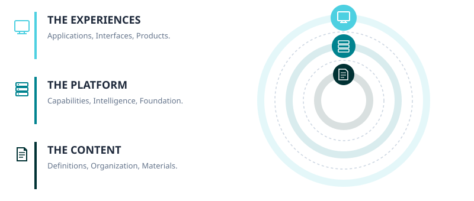
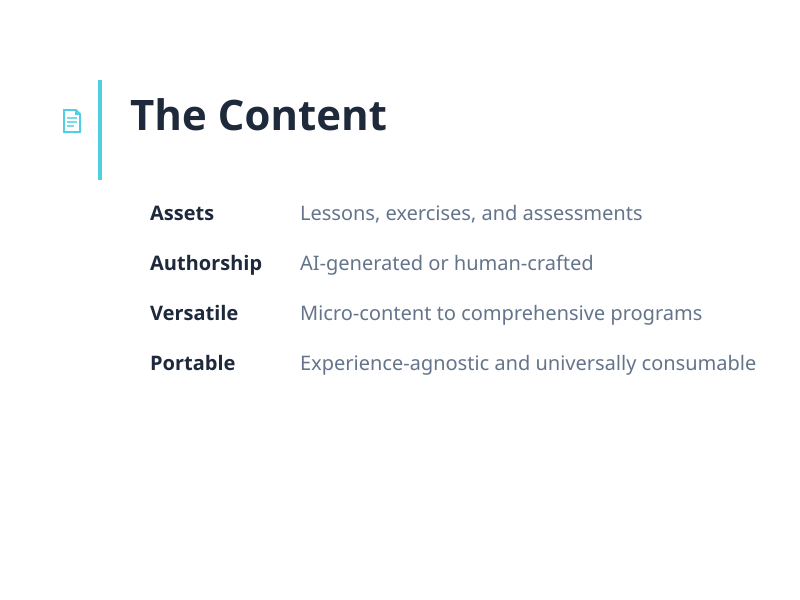
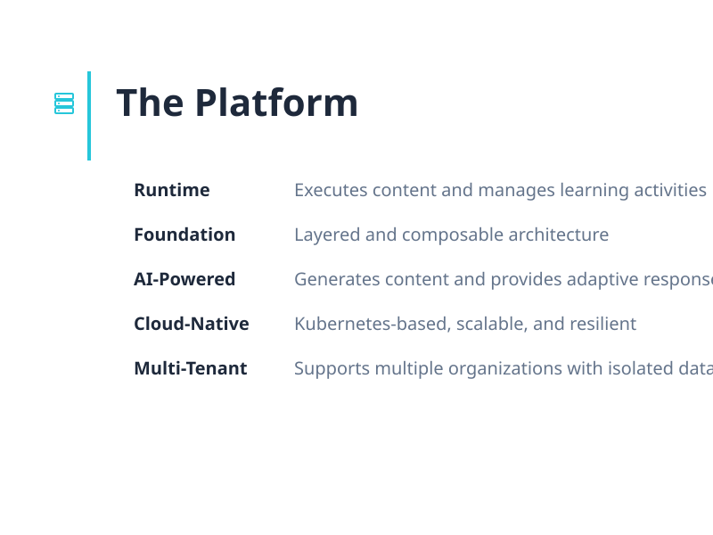
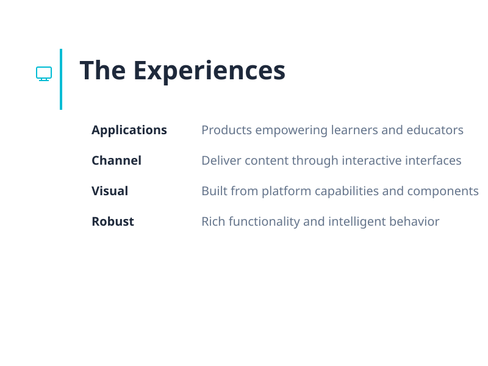
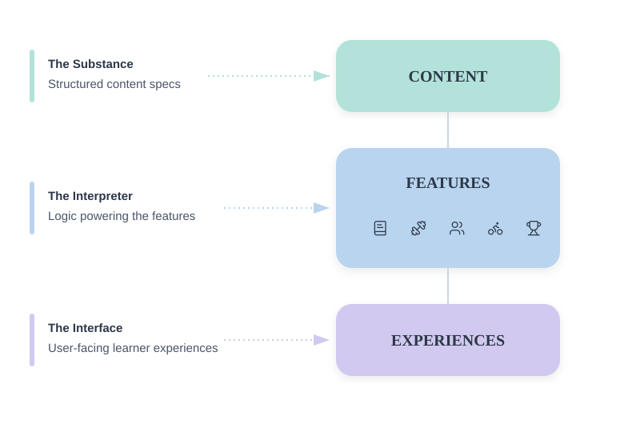
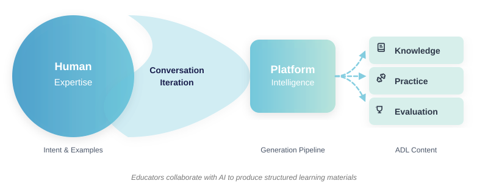
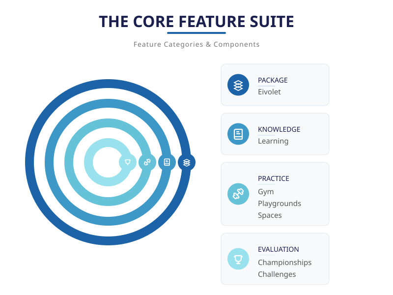
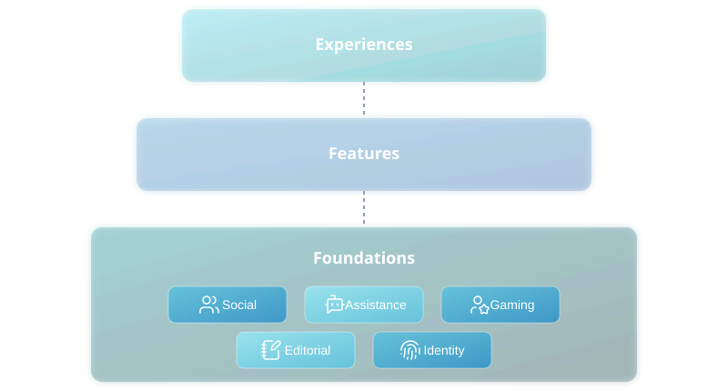
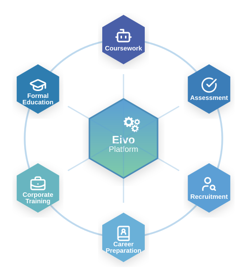

<!-- _header: "" -->
<!-- _footer: "" -->

# Eivo

A platform where AI empowers every learning experience.

---

<!-- _header: "SLIDE_01 // IDENTITY" -->
<!-- _footer: "AI_LEARNING_INFRASTRUCTURE – PLATFORM_EXPERIENCES" -->

# What is Eivo?

A cloud-native platform that delivers educational experiences through intelligent content generation, interactive learning environments, and adaptive assessment—built on scalable infrastructure that supports everything from compact modules to comprehensive curricula.

---

<!-- _header: "PLATFORM_FUNDAMENTALS" -->
<!-- _footer: "CONTENT → PLATFORM → EXPERIENCE" -->

# The Fundamentals

---

<!-- _header: "SLIDE_03 // PILLAR_01" -->
<!-- _footer: "DEFINITIONS_ORGANIZATION_MATERIALS" -->

---

<!-- _header: "SLIDE_04 // PILLAR_02" -->
<!-- _footer: "CAPABILITIES_INTELLIGENCE_FUNDAMENTALS" -->

---

<!-- _header: "PILLAR_03" -->
<!-- _footer: "APPLICATIONS_INTERFACES_PRODUCTS" -->

---

<!-- _header: "" -->
<!-- _footer: "" -->

# What Makes Eivo Work?

Eivo delivers learning through the alchemy of **Content** that provides the substance and **Features** that interpret it. Together they bring to life the **Experiences**.

---

# From Content to Experiences

---

<!-- _header: "CONTENT_FUNDAMENTALS" -->
<!-- _footer: "DEFINITIONS_ORGANIZATION_MATERIALS" -->

# Content Powers the Platform

Everything Eivo delivers begins with structured, portable content that enables all platform capabilities and experiences.

## Artifact Definition Language

Content is specified using the Artifact Definition Language: ADL. A structured YAML-based language that captures interactive learning materials, practice and evaluation activities, and generation instructions.

## The Stack Fuel

ADL provides a universal, portable specification layer that features interpret and experiences consume, enabling content to work across different contexts without modification.

---
# Content Generation: Collaborative by Design

---

<!-- _header: "CONTENT_FUNDAMENTALS" -->
<!-- _footer: "HUMAN_AI_COLLABORATION" -->

# Content Generation: Collaborative by Design

Eivo's content creation leverages agentic AI collaboration where educators and AI work together through natural conversation, combining human expertise with AI capabilities to produce structured, high-quality learning materials.

## Conversational Authoring

Educators describe their intent, provide examples, and refine content through dialogue. AI interprets requirements, generates specifications, and iterates based on feedback—turning instructional expertise into structured ADL.

## Unified Output Format

Regardless of the collaboration process, all content converges into ADL specifications. This ensures consistency across manually crafted, AI-generated, and collaboratively authored materials.

## Quality Through Iteration

The conversational approach enables rapid iteration. Educators review generated content, request adjustments, and refine specifications until they match their instructional vision—maintaining full creative control while leveraging AI efficiency.

---

<!-- _header: "" -->
<!-- _footer: "" -->

# Features: Building Blocks for Experiences

Features are the building blocks that experiences compose to deliver learning. They interpret ADL specifications and provide the functionality—learning, practice, evaluation—that applications surface to users.

---

<!-- _header: "FEATURES" -->
<!-- _footer: "RUNTIME_LOGIC_INTERPRETATION_DELIVERY" -->

---

<!-- _header: "FEATURES" -->
<!-- _footer: "LEARNING_GYM_PLAYROOM_CHAMPIONSHIP_CHALLENGES" -->

# Eivolet: Structuring the Learning Journey

An Eivolet is the top-level content unit on the Eivo Platform — the package that defines, organizes, and delivers a complete learning experience. It can be as focused as a single tutorial or as broad as a full curriculum.

## Flexible Structure

An Eivolet organizes content into hierarchical structures of any size. This flexibility allows modelling diverse materials, from simple tutorials to comprehensive syllabi.

## Content Composition

An Eivolet holds all the content that feeds the platform features — learning materials, practice activities, and evaluations — in whatever combination serves the learning goal.

## Discovery and Navigation

Each Eivolet includes localizable labels with title, description, and tags. This metadata drives how learners find and navigate content across the platform.

---

<!-- _header: "FEATURES" -->
<!-- _footer: "LEARNING_GYM_PLAYROOM_CHAMPIONSHIP_CHALLENGES" -->

# Learning: Where Understanding Begins

Learning is where learners engage with educational narratives that combine rich content, examples, and embedded interactive elements to build understanding.

## Rich Educational Content

ADL's expressive power enables delivery of diverse instructional materials—from simple explanations to sophisticated narratives with code, diagrams, and interactive elements.

## Learning Journey

All interactions and progress are preserved, enabling learners to continue their path seamlessly while providing creators with insights into engagement and comprehension.

## Embedded Interactivity

Interactive components are integrated into instructional content, providing both validation through exercises and deeper conceptual exploration through interactive features. New interaction types can be introduced as the system evolves.

---

<!-- _header: "FEATURES" -->
<!-- _footer: "LEARNING_GYM_PLAYROOM_CHAMPIONSHIP_CHALLENGES" -->

# Gym: Where Skills Are Forged

Gym is where learners build proficiency through unlimited practice activities—reinforcing skills and knowledge at their own pace.

## Configurable Sessions

Gym Sessions start with learner-selected constraints like time limits or maximum errors. The activity continues until constraints are met or runs indefinitely when no limits are configured.

## Unlimited Generation

Content is generated on-demand, providing an endless stream of practice items without exhausting material.

## Immediate Feedback

Learners receive instant validation on every response, with access to contextual tips when available, enabling immediate correction and reinforcement of understanding.

---

<!-- _header: "FEATURES" -->
<!-- _footer: "LEARNING_GYM_PLAYROOM_CHAMPIONSHIP_CHALLENGES" -->

# Gym Paths to Proficiency

Gym offers multiple practice modalities, allowing learners to choose the approach that best fits the skill they're developing

## Trial-Based Practice

Exercise sessions present varied challenges: fill-in-the-blank prompts and multiple-choice questions receive instant validation, while programming exercises demand functional code that must satisfy test cases. Each submission provides immediate feedback

## Flashcard Practice

Flashcard practice uses spaced repetition to build retention. Learners review prompts, self-assess recall, and the system schedules reviews based on performance: mastered items appear less often while challenging content returns sooner

---

<!-- _header: "FEATURES" -->
<!-- _footer: "LEARNING_GYM_PLAYROOM_CHAMPIONSHIP_CHALLENGES" -->

# Playroom: Where Learners Connect

Playroom transforms solo practice into shared sessions where multiple learners tackle matching exercises at the same time, each working individually but progressing together.

## Exercise Types

Sessions feature fill-blank, multiple-choice, and programming exercises, all generated on-demand to provide fresh challenges throughout the session.

## Group Sessions

Hosts establish sessions with time or quantity limits plus security codes. Sessions conclude automatically when constraints are satisfied.

## Shared Journey

Participants progress through timed exercises, advancing collectively when time expires. Live leaderboards display rankings throughout.

---

<!-- _header: "FEATURES" -->
<!-- _footer: "LEARNING_GYM_PLAYROOM_SPACES_CHAMPIONSHIP_CHALLENGES" -->

# Spaces: Where Skills Are Practiced

Spaces provide persistent environments for open-ended experimentation and skill development. Learners practice without evaluation or submission requirements.

## Integration with Learning

Spaces complement instructional content by providing environments where learners apply concepts through hands-on practice.

## Space Types

Spaces adapt to different learning domains through specialized formats.

## Programming Spaces

Development environments with configured runtimes and tools. Learners explore frameworks, languages, and technical domains through direct experimentation.

---

<!-- _header: "FEATURES" -->
<!-- _footer: "LEARNING_GYM_PLAYROOM_CHAMPIONSHIP_CHALLENGES" -->

# Championship: Where Performance Is Tested

Championship transforms practice into competitive evaluation, where learners perform under strict time constraints while their results are measured and ranked.

## Exercise Types

Championships use fill-blank, multiple-choice, and programming exercises, all generated on-demand to ensure fresh content for every competitive session.

## Difficulty Tiers

Championships offer multiple difficulty tiers with distinct time constraints and scoring parameters. Learners select their tier and compete within that level for rankings.

## Persistent Rankings

Performance results are recorded in persistent leaderboards. Learners track their standings over time and compare achievement across attempts.

---

<!-- _header: "FEATURES" -->
<!-- _footer: "LEARNING_GYM_PLAYROOM_CHAMPIONSHIP_CHALLENGES" -->

# Challenges: Where Mastery Is Proven

Challenges provide extended timeframes for learners to produce substantial work and receive detailed AI-powered feedback.

## Essay Assignments

These challenges evaluate writing proficiency within suggested limits such as word count ranges. Learners compose and polish work demonstrating understanding.

## Programming Assignments

These activities evaluate coding proficiency by creating software artifacts. Learners work in isolated environments with complete tooling, writing code that demonstrates their thinking.

## Comprehensive Evaluation

AI evaluation analyzes approach, identifies strengths, and suggests improvements. Detailed feedback covers what works well and areas for enhancement.

---

<!-- _header: "" -->
<!-- _footer: "" -->

# Foundations: Building Blocks for Features

Features deliver the core functionality, but building complete products requires more. Foundations provide essential supporting services—collaboration, intelligence, engagement—that enable full-fledged Experiences.

---

<!-- _header: "FOUNDATIONS" -->
<!-- _footer: "" -->

# The Foundations Layer

---

<!-- _header: "FOUNDATIONS" -->
<!-- _footer: "EDITORIAL_SOCIAL_ASSISTANCE_GAMING_IDENTITY" -->

# Editorial: Content Generation Foundation

Editorial is the AI-powered foundation that generates educational materials. Experiences use Editorial to enable conversational content creation where educators describe their vision and receive complete learning materials.

## Generation Capabilities

Produces static content (text, diagrams, audio) and interactive elements (exercises, multimedia experiences). Generates everything from simple exercises to complete curricula with assessments.

## Library

Manages storage, versioning, and discovery for all generated content. Usage statistics and community ratings surface valuable materials through collective wisdom.

## Integration

Learning requests instructional materials from Editorial. Practice requests exercise sets. Evaluation requests challenges. All generated content flows through Library for persistence and discovery.

---

<!-- _header: "FOUNDATIONS" -->
<!-- _footer: "EDITORIAL_SOCIAL_ASSISTANCE_GAMING_IDENTITY" -->

# Identity: Access Control Foundation

Identity manages authentication and authorization across the platform, verifying user identity and controlling what users can access and perform throughout all capabilities and experiences.

## Authentication

Verify user identity through credential validation, session management, multi-factor authentication support, and single sign-on integration. Maintain authenticated sessions and ensure only authorized users access the system.

## Authorization

Control access through role-based permissions (learner, educator, administrator), resource-level permissions for content and groups, action-based permissions, and context-specific access based on enrollment and membership.

## Platform Integration

All capabilities and experiences use Identity for authentication checks and access control. Social enforces role-based permissions within groups. Evaluation and Practice associate activity data with authenticated users.

---

<!-- _header: "FOUNDATIONS" -->
<!-- _footer: "EDITORIAL_SOCIAL_ASSISTANCE_GAMING_IDENTITY" -->

# Social: Where Learners Connect

Social provides infrastructure for collaboration and organization, transforming individual learning into shared experiences where learners work together, join communities, and progress as cohorts.

## Organizational Structure

Enable cohort formation and group management. Structure learners into programs, classes, and communities that reflect institutional hierarchies or organic groupings.

## Collective Progress

Track activity and achievement across participants. Provide visibility into group performance, engagement patterns, and completion that supports coordinated learning.

## Collaborative Infrastructure

Enable interaction and shared experiences. Provide the foundation for communication, group activities, and community formation around learning goals.

---

<!-- _header: "FOUNDATIONS" -->
<!-- _footer: "EDITORIAL_SOCIAL_ASSISTANCE_GAMING_IDENTITY" -->

# Assistance: Where Intelligence Guides

Assistance provides intelligent evaluation and adaptive support, transforming assessment into understanding by analyzing learner work and generating guidance that responds to individual learning patterns.

## Intelligent Analysis

Move beyond validation to understanding. Evaluate approach, reasoning, and execution to provide insights into how learners think and where they struggle.

## Personalized Guidance

Generate adaptive feedback that addresses individual needs. Respond to demonstrated patterns with targeted support rather than generic responses.

## Adaptive Learning

Enable experiences that evolve based on learner performance. Build intelligence about individual progress that informs content, difficulty, and support over time.

---

<!-- _header: "FOUNDATIONS" -->
<!-- _footer: "EDITORIAL_SOCIAL_ASSISTANCE_GAMING_IDENTITY" -->

# Gaming: Where Competition Motivates

Gaming provides competitive and motivational infrastructure, transforming practice into engaging challenges where learners compete, track progress, and earn recognition for achievement.

## Performance Rankings

Enable competition through leaderboards and comparative metrics. Learners track their standing and compete within meaningful contexts—global, group-based, or time-bound.

## Competitive Engagement

Provide structured competitive experiences that motivate sustained practice. Transform routine activities into compelling challenges through direct competition and achievement recognition.

## Motivational Mechanics

Drive engagement through achievement systems and progress rewards. Create incentive structures that recognize accomplishment and sustain long-term participation.

---

<!-- _header: "" -->
<!-- _footer: "" -->

# Experiences: Complete Learning Products

Platform Capabilities and Features compose into complete Experiences—full-fledged learning products that deliver value to learners and institutions. Each Experience combines core functionality with supporting services to create cohesive, purposeful learning environments.

---

<!-- _header: "" -->
<!-- _footer: "" -->

# Experiences

---

<!-- _header: "EXPERIENCES" -->
<!-- _footer: "COURSEWORK" -->

# Coursework

Our flagship experience—the one that fully embodies the Eivo vision. Coursework unites content creation, practice, and evaluation into a comprehensive learning environment where creators and learners work together seamlessly.

## Creator Collaboration

Creators work with AI to generate content at any scale—from quick tutorials to complete curricula. Every piece integrates knowledge materials, practice exercises, and assessments in whatever combination serves the learning goal.

## Learner Journeys

Learners follow curated paths or build personalized progressions. Interactive materials, practice sessions, and assessments compose into unified experiences that adapt based on performance and engagement.

---

<!-- _header: "EXPERIENCES" -->
<!-- _footer: "COURSEWORK" -->

# What Makes Coursework Different

Coursework distinguishes itself through AI-powered creation, unified foundations, and structural flexibility that serves educational intent rather than technological constraints.

## AI-First Creation

Teaching intent drives content generation. The platform produces interactive materials at any scale—tutorials, lessons with exercises, or complete courses—without manual assembly.

## Unified Foundation

Knowledge, practice, and evaluation integrate as seamless experiences. No separate systems or disconnected tools. Every piece works together through unified content.

## Flexible Scope

Content adapts to need—standalone tutorials, focused summaries, or comprehensive courses. No forced templates or predetermined structures dictate what creators build.

---

<!-- _header: "" -->
<!-- _footer: "" -->

# Vertical Experiences: Industry-Targeted Solutions

Different industries have fundamentally different educational contexts, objectives, and learner experiences. The flexible architecture of the Eivo Platform allows Vertical Experiences to address these fundamental differences—combining Platform Capabilities and Features in configurations optimized for specific sectors.

---

<!-- _header: "EXPERIENCES" -->
<!-- _footer: "VERTICAL EXPERIENCES" -->

# Beyond Coursework: Industry Applications

The platform's flexible architecture enables industry-specific experiences by recombining Features and Platform Capabilities.

## Formal Education

Institutional learning platform organizing departments, programs, and courses. Learning delivers lectures, Gym assigns homework, Challenges administer exams. Social forms cohorts, Gaming enables class competition.

## Corporate Training

Enterprise learning system with role-specific paths and certifications. Learning delivers compliance content, Gym reinforces skills, Challenges validate competency. Tracks completion across workforce.

## Assessment & Recruitment

Candidate evaluation platform measuring technical skills through timed challenges. Gaming ranks performance, Assistance analyzes solution quality. Analytics inform hiring decisions.

---

  <h1>Backup</h1>

---

<!-- _header: "CONTENT_FOUNDATION" -->
<!-- _footer: "DEFINITIONS_ORGANIZATION_MATERIALS" -->

# ADL by Design

ADL is architected with extensibility and flexibility at its core, providing a solid foundation that adapts to evolving needs and diverse contexts.

## Authoring Independence

ADL specifications remain consistent regardless of how they're created—whether hand-crafted, AI-generated, or collaboratively authored—ensuring uniform structure and behavior.

## Static and Dynamic Content

Content specifications can contain pre-authored materials ready for immediate use or generation instructions that create fresh interactive activities on demand.

## Multilingual Support

ADL supports multiple languages through localized specifications, enabling content to serve global audiences.

---

<!-- _header: "CONTENT_FOUNDATION" -->
<!-- _footer: "DEFINITIONS_ORGANIZATION_MATERIALS" -->

# ADL Richness

ADL allows authoring everything from simple learning materials to comprehensive educational experiences with deep structure and engagement.

## Extensible Content Types

The language enables creators to produce a wide range of content types—lessons, exercises, challenges, assessments—and supports defining new ones as the platform evolves.

## Hierarchical Organization

Specifications can express hierarchical structures that reflect natural educational relationships like courses, modules, lessons, and activities.

## Rich Material Specification

A single specification can contain explanatory text, syntax-highlighted code blocks, visual diagrams, and embedded exercises that learners complete without leaving the instructional context.

---

<!-- _header: "CONTENT_FOUNDATION" -->
<!-- _footer: "GENERATION_PIPELINE" -->

# From Conversation to Content

The generation pipeline transforms natural dialogue into structured learning materials through specialized AI agents that understand educational context and ADL specifications.

## Domain-Specific Intelligence

AI agents are specialized by subject matter and content type, bringing domain expertise to content generation. This specialization ensures appropriate difficulty levels, accurate terminology, and contextually relevant examples.

## Specification Generation

Agents translate instructional requirements into valid ADL specifications, handling the technical complexity of YAML structure, metadata requirements, and content type constraints.

## Multi-Provider Support

The platform integrates multiple AI providers through a unified interface, enabling flexibility in model selection based on content requirements, cost considerations, and quality needs.

---

<!-- _header: "" -->
<!-- _footer: "" -->

  <h1>Authoring Tools</h1>

---

<!-- _header: "AUTHORING" -->
<!-- _footer: "BUILDER_EDITOR" -->

# Authoring an Eivolet

Eivolets are authored through two dedicated tools that work in sequence.

## The Builder

Where the Eivolet definition is created — objective, structure, and content configuration. The platform uses this definition to generate the Eivolet.

## The Editor

Where the generated Eivolet is reviewed, refined, and expanded.

---

<!-- _header: "AUTHORING" -->
<!-- _footer: "BUILDER_EDITOR" -->

# The Builder

The Builder guides creators through defining an Eivolet from scratch. EiBot leads the conversation across three phases — Definitions, Structure, and Content — capturing everything the platform needs to generate the Eivolet.

## Two Paths

Creators choose how EiBot participates. In the AI-proposed path, EiBot drives the entire structure. In the manual path, the creator builds it with EiBot available on demand.

---

<!-- _header: "AUTHORING" -->
<!-- _footer: "BUILDER_EDITOR" -->

# The Editor

The Editor is where creators work on the generated Eivolet. Every element is visible in a tree and fully editable — add, remove, reorder, and refine any part at any time.

## EiBot on Demand

EiBot is available for any element in the tree — to define, regenerate, or expand. Elements the creator edits directly are locked and EiBot will not override them.
